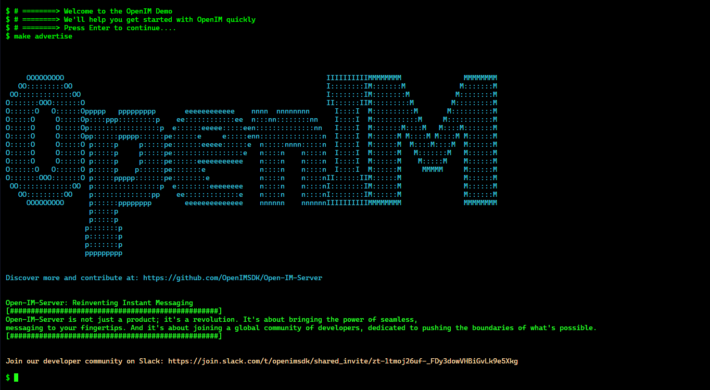

#  Contributing to Open-IM-Server

So, you want to hack on Open-IM-Server? Yay!

First of all, thank you for considering contributing to our project! We appreciate your time and effort, and we value any contribution, whether it's reporting a bug, suggesting a new feature, or submitting a pull request.



> Use `make demo` start contributing fast.

This document provides guidelines and best practices to help you contribute effectively.

## 📇Topics

- [Contributing to Open-IM-Server](#contributing-to-open-im-server)
  - [📇Topics](#topics)
  - [What we expect of you](#what-we-expect-of-you)
  - [Code of ConductCode of Conduct](#code-of-conductcode-of-conduct)
      - [Code and doc contribution](#code-and-doc-contribution)
      - [Where should I start?](#where-should-i-start)
      - [Design documents](#design-documents)
  - [Getting Started](#getting-started)
  - [Style and Specification](#style-and-specification)
      - [Reporting security issues](#reporting-security-issues)
      - [Reporting general issues](#reporting-general-issues)
      - [Commit Rules](#commit-rules)
      - [PR Description](#pr-description)
      - [Docs Contribution](#docs-contribution)
  - [Engage to help anything](#engage-to-help-anything)
  - [Release version](#release-version)
  - [Contact Us](#contact-us)

## What we expect of you

We hope that anyone can join Open-IM-Server , even if you are a student, writer, translator

Please meet the minimum version of the Go language published in [go.mod](./go.mod). If you want to manage the Go language version, we provide tools to install [gvm](https://github.com/moovweb/gvm) in our [Makefile](./Makefile)

You'd better use Linux OR WSL as the development environment, Linux with [Makefile](./Makefile) can help you quickly build and test Open-IM-Server project.

If you are familiar with [Makefile](./Makefile) , you can easily see the clever design of the Open-IM-Server Makefile. Storing the necessary tools such as golangci in the `/tools` directory can avoid some tool version issues.

The [Makefile](./Makefile) is for every developer, even if you don't know how to use the Makefile tool, don't worry, we provide two great commands to get you up to speed with the Makefile architecture, `make help` and `make help-all`, it can reduce problems of the developing environment.

In accordance with the naming conventions adopted by OpenIM and drawing reference from the Google Naming Conventions as per the guidelines available at https://google.github.io/styleguide/go/, the following expectations for naming practices within the project are set forth: 

+ https://github.com/openimsdk/open-im-server/blob/main/docs/contrib/code-conventions.md
+ https://github.com/openimsdk/open-im-server/blob/main/docs/contrib/go-code.md


## Code of ConductCode of Conduct

#### Code and doc contribution

Every action to make project Open-IM-Server better is encouraged. On GitHub, every improvement for Open-IM-Server could be via a [PR](https://github.com/openimsdk/open-im-server/pulls) (short for pull request).

+ If you find a typo, try to fix it!
+ If you find a bug, try to fix it!
+ If you find some redundant codes, try to remove them!
+ If you find some test cases missing, try to add them!
+ If you could enhance a feature, please **DO NOT** hesitate!
+ If you find code implicit, try to add comments to make it clear!
+ If you find code ugly, try to refactor that!
+ If you can help to improve documents, it could not be better!
+ If you find document incorrect, just do it and fix that!
+ ...

#### Where should I start?

+ If you are new to the project, don't know how to contribute Open-IM-Server, please check out the [good first issue](https://github.com/openimsdk/open-im-server/issues?q=is%3Aopen+label%3A"good+first+issue"+sort%3Aupdated-desc) label.
+ You should be good at filtering the Open-IM-Server issue tags and finding the ones you like, such as [RFC](https://github.com/openimsdk/open-im-server/issues?q=is%3Aissue+is%3Aopen+RFC+label%3ARFC) for big initiatives, features for [feature](https://github.com/openimsdk/open-im-server/issues?q=is%3Aissue+label%3Afeature) proposals, and [bug](https://github.com/openimsdk/open-im-server/issues?q=is%3Aissue+label%3Abug+) fixes.
+ If you are looking for something to work on, check out our [open issues](https://github.com/openimsdk/open-im-server/issues?q=is%3Aissue+is%3Aopen+sort%3Aupdated-desc).
+ If you have an idea for a new feature, please [open an issue](https://github.com/openimsdk/open-im-server/issues/new/choose), and we can discuss it.

#### Design documents

For any substantial design, there should be a well-crafted design document. This document is not just a simple record, but also a detailed description and manifestation, which can help team members better understand the design thinking and grasp the design direction. In the process of writing the design document, we can choose to use tools such as `Google Docs` or `Notion`, and even mark RFC in [issues](https://github.com/openimsdk/open-im-server/issues?q=is%3Aissue+is%3Aopen+RFC+label%3ARFC) or [discussions](https://github.com/openimsdk/open-im-server/discussions) for better collaboration. Of course, after completing the design document, we should also add it to our [Shared Drive](https://drive.google.com/drive/) and notify the appropriate working group to let everyone know of its existence. Only by doing so can we maximize the effectiveness of the design document and provide strong support for the smooth progress of the project.

Anybody can access the shared Drive for reading. To get access to comment. Once you've done that, head to the [shared Drive](https://drive.google.com/) and behold all the docs.

In addition to that, we'd love to invite you to [join our Slack](https://join.slack.com/t/openimsdk/shared_invite/zt-22720d66b-o_FvKxMTGXtcnnnHiMqe9Q) where you can play with your imagination, tell us what you're working on, and get a quick response.

When documenting a new design, we recommend a 2-step approach:

1. Use the short-form RFC template to outline your ideas and get early feedback.
2. Once you have received sufficient feedback and consensus, you may use the longer-form design doc template to specify and discuss your design in more details.

In order to contribute a feature to Open-IM-Server you'll need to go through the following steps:

+ Discuss your idea with the appropriate [working groups](https://join.slack.com/t/openimsdk/shared_invite/zt-22720d66b-o_FvKxMTGXtcnnnHiMqe9Q) on the working group's Slack channel.
+ Once there is general agreement that the feature is useful, create a GitHub issue to track the discussion. The issue should include information about the requirements and use cases that it is trying to address.
+ Include a discussion of the proposed design and technical details of the implementation in the issue.

But keep in mind that there is no guarantee of it being accepted and so it is usually best to get agreement on the idea/design before time is spent coding it. However, sometimes seeing the exact code change can help focus discussions, so the choice is up to you.

## Getting Started

To propose PR for the Open-IM-Server item, we assume you have registered a GitHub ID. Then you could finish the preparation in the following steps:

1. Fork the repository(Open-IM-Server)

2. **CLONE** your own repository to main locally. Use `git clone https://github.com/<your-username>/Open-IM-Server.git` to clone repository to your local machine. Then you can create new branches to finish the change you wish to make.

3. **Set Remote** upstream to be `https://github.com/openimsdk/open-im-server.git` using the following two commands:

   ```bash
   ❯ git remote add upstream https://github.com/openimsdk/open-im-server.git
   ❯ git remote set-url --push upstream no-pushing
   ```

   With this remote setting, you can check your git remote configuration like this:

   ```bash
   ❯ git remote -v
   origin     https://github.com/<your-username>/Open-IM-Server.git (fetch)
   origin     https://github.com/<your-username>/Open-IM-Server.git (push)
   upstream   https://github.com/openimsdk/open-im-server.git (fetch)
   upstream   no-pushing (push)
   ```

   Adding this, we can easily synchronize local branches with upstream branches.

4. Create a new branch for your changes (use a descriptive name, such as `fix-bug-123` or `add-new-feature`).

   ```bash
   ❯ cd Open-IM-Server
   ❯ git fetch upstream
   ❯ git checkout upstream/main
   ```

   Create a new branch: 

   ```bash
   ❯ git checkout -b <new-branch>
   ```

   Make any change on the `new-branch` then use [Makefile](./Makefile) build and test your codes.

5. **Commit your changes** to your local branch, lint before committing and commit with sign-off

   ```bash
   ❯ git rebase upstream/main
   ❯ make lint	  # golangci-lint run -c .golangci.yml
   ❯ git add -A  # add changes to staging
   ❯ git commit -a -s -m "message for your changes" # -s adds a Signed-off-by trailer
   ```

6. **Push your branch**  to your forked repository, it is recommended to have only one commit for a PR.

   ```bash
   # sync up with upstream
   ❯ git fetch upstream main
   ❯ git rebase upstream/main
   ❯ 
   ❯ git rebase -i	<commit-id> # rebase with interactive mode to squash your commits into a single one
   ❯ git push # push to the remote repository, if it's a first time push, run git push --set-upstream origin <new-branch># sync up with upstream
   ❯ git fetch upstream main
   git rebase upstream/main
   
   ❯ git rebase -i	<commit-id> # rebase with interactive mode to squash your commits into a single one
   ❯ git push # push to the remote repository, if it's a first time push, run git push --set-upstream origin <new-branch>
   ```

   You can also use `git commit -s --amend && git push -f` to update modifications on the previous commit.

   If you have developed multiple features in the same branch, you should create PR separately by rebasing to the main branch between each push:

   ```bash
   # create new branch, for example git checkout -b feature/infra
   ❯ git checkout -b <new branch>
   # update some code, feature1
   ❯ git add -A
   ❯ git commit -m -s "feat: feature one"
   ❯ git push # if it's first time push, run git push --set-upstream origin <new-branch>
   # then create pull request, and merge
   # update some new feature, feature2, rebase main branch first.
   ❯ git rebase upstream/main # rebase the current branch to upstream/main branch
   ❯ git add -A
   ❯ git commit -m -s "feat: feature two"
   # then create pull request, and merge
   ```

7. **Open a pull request** to `openimsdk/open-im-server:main`

   It is recommended to review your changes before filing a pull request. Check if your code doesn't conflict with the main branch and no redundant code is included.

## Style and Specification

We divide the problem into security and general problems:

#### Reporting security issues

Security issues are always treated seriously. As our usual principle, we discourage anyone to spread security issues. If you find a security issue of Open-IM-Server, please do not discuss it in public and even do not open a public issue.

Instead we encourage you to send us a private email to info@openim.io to report this.

#### Reporting general issues

To be honest, we regard every user of Open-IM-Serveras a very kind contributor. After experiencing Open-IM-Server, you may have some feedback for the project. Then feel free to open an issue via [NEW ISSUE](https://github.com/openimsdk/open-im-server/issues/new/choose).

Since we collaborate project Open-IM-Server in a distributed way, we appreciate **WELL-WRITTEN**, **DETAILED**, **EXPLICIT** issue reports. To make the communication more efficient, we wish everyone could search if your issue is an existing one in the searching list. If you find it existing, please add your details in comments under the existing issue instead of opening a brand new one.

To make the issue details as standard as possible, we setup an [ISSUE TEMPLATE](https://github.com/OpenIMSDK/.github/tree/main/.github/ISSUE_TEMPLATE) for issue reporters. You can find three kinds of issue templates there: question, bug report and feature request. Please **BE SURE** to follow the instructions to fill fields in template.

**There are a lot of cases when you could open an issue:**

+ bug report
+ feature request
+ Open-IM-Server performance issues 
+ feature proposal
+ feature design
+ help wanted
+ doc incomplete
+ test improvement
+ any questions on Open-IM-Server project 
+ and so on 

Also, we must be reminded when submitting a new question about Open-IM-Server, please remember to remove the sensitive data from your post. Sensitive data could be password, secret key, network locations, private business data and so on.

#### Commit Rules

Actually in Open-IM-Server, we take two rules serious when committing:

**🥇 Commit Message:**

Commit message could help reviewers better understand what the purpose of submitted PR is. It could help accelerate the code review procedure as well. We encourage contributors to use **EXPLICIT** commit message rather than ambiguous message. In general, we advocate the following commit message type:

We use [Semantic Commits](https://www.conventionalcommits.org/en/v1.0.0/) to make it easier to understand what a commit does and to build pretty changelogs. Please use the following prefixes for your commits:

+ `docs: xxxx`. For example, "docs: add docs about storage installation".
+ `feature: xxxx`.For example, "feature: make result show in sorted order".
+ `bugfix: xxxx`. For example, "bugfix: fix panic when input nil parameter".
+ `style: xxxx`. For example, "style: format the code style of Constants.java".
+ `refactor: xxxx.` For example, "refactor: simplify to make codes more readable".
+ `test: xxx`. For example, "test: add unit test case for func InsertIntoArray".
+ `chore: xxx.` For example, "chore: integrate travis-ci". It's the type of mantainance change.
+ other readable and explicit expression ways.

On the other side, we discourage contributors from committing message like the following ways:

+ ~~fix bug~~
+ ~~update~~
+ ~~add doc~~

**🥈 Commit Content:**

Commit content represents all content changes included in one commit. We had better include things in one single commit which could support reviewer's complete review without any other commits' help.

In another word, contents in one single commit can pass the CI to avoid code mess. In brief, there are two minor rules for us to keep in mind:

1. avoid very large change in a commit.
2. complete and reviewable for each commit.
3. words are written in lowercase English, not uppercase English or other languages such as Chinese.

No matter what the commit message, or commit content is, we do take more emphasis on code review.

An example for this could be:

```bash
❯ git commit -a -s -m "docs: add a new section to the README"
```

#### PR Description

PR is the only way to make change to Open-IM-Server project files. To help reviewers better get your purpose, PR description could not be too detailed. We encourage contributors to follow the [PR template](https://github.com/OpenIMSDK/.github/tree/main/.github/PULL_REQUEST_TEMPLATE.md) to finish the pull request.

You can find some very formal PR in [RFC](https://github.com/openimsdk/open-im-server/issues?q=is%3Aissue+is%3Aopen+RFC+label%3ARFC) issues and learn about them.

**📖 Opening PRs:**

+ As long as you are working on your PR, please mark it as a draft
+ Please make sure that your PR is up-to-date with the latest changes in `main`
+ Mention the issue that your PR is addressing (Fix: #{ID_1}, #{ID_2})
+ Make sure that your PR passes all checks

**🈴 Reviewing PRs:**

+ Be respectful and constructive 
+ Assign yourself to the PR (comment `/assign`)
+ Check if all checks are passing
+ Suggest changes instead of simply commenting on found issues
+ If you are unsure about something, ask the author
+ If you are not sure if the changes work, try them out
+ Reach out to other reviewers if you are unsure about something
+ If you are happy with the changes, approve the PR
+ Merge the PR once it has all approvals and the checks are passing

**⚠️ DCO check:**

We have a DCO check that runs on every pull request to ensure code quality and maintainability. This check verifies that the commit has been signed off, indicating that you have read and agreed to the provisions of the Developer Certificate of Origin. If you have not yet signed off on the commit, you can use the following command to sign off on the last commit you made:

```bash
❯ git commit --amend --signoff
```

Please note that signing off on a commit is a commitment that you have read and agreed to the provisions of the Developer Certificate of Origin. If you have not yet read this document, we strongly recommend that you take some time to read it carefully. If you have any questions about the content of this document, or if you need further assistance, please contact an administrator or relevant personnel.

You can also automate signing off your commits by adding the following to your `.zshrc` or `.bashrc`:

```go
git() {
  if [ $# -gt 0 ] && [[ "$1" == "commit" ]] ; then
     shift
     command git commit --signoff "$@"
  else
     command git "$@"
  fi
}
```


#### Docs Contribution

The documentation for Open-IM-Server includes:

+ [README.md](https://github.com/openimsdk/open-im-server/blob/main/README.md): This file includes the basic information and instructions for getting started with Open-IM-Server.
+ [CONTRIBUTING.md](https://github.com/openimsdk/open-im-server/blob/main/CONTRIBUTING.md): This file contains guidelines for contributing to Open-IM-Server's codebase, such as how to submit issues, pull requests, and code reviews.
+ [Official Documentation](https://doc.rentsoft.cn/): This is the official documentation for Open-IM-Server, which includes comprehensive information on all of its features, configuration options, and troubleshooting tips.

Please obey the following rules to better format the docs, which would greatly improve the reading experience.

1. Please do not use Chinese punctuations in English docs, and vice versa.
2. Please use upper case letters where applicable, like the first letter of sentences / headings, etc.
3. Please specify a language for each Markdown code blocks, unless there's no associated languages.
4. Please insert a whitespace between Chinese and English words.
5. Please use the correct case for technical terms, such as using `HTTP` instead of http, `MySQL` rather than mysql, `Kubernetes` instead of kubernetes, etc.
6. Please check if there's any typos in the docs before submitting PRs.

## Engage to help anything

We choose GitHub as the primary place for Open-IM-Server to collaborate. So the latest updates of Open-IM-Server are always here. Although contributions via PR is an explicit way to help, we still call for any other ways.

+ reply to other's [issues](https://github.com/openimsdk/open-im-server/issues?q=is%3Aissue+is%3Aopen+sort%3Aupdated-desc) if you could;
+ help solve other user's problems;
+ help review other's [PR](https://github.com/openimsdk/open-im-server/pulls?q=is%3Apr+is%3Aopen+sort%3Aupdated-desc) design; 
+ discuss about Open-IM-Server to make things clearer;
+ advocate [Open-IM-Server](https://google.com/search?q=Open-IM-Server) technology beyond GitHub;
+ write blogs on Open-IM-Server and so on.

In a word, **ANY HELP IS CONTRIBUTION.**

## Release version

Releases of Open-IM-Server are done using [Release Please](https://github.com/googleapis/release-please) and [GoReleaser](https://goreleaser.com/). The workflow looks like this:

🎯 A PR is merged to the `main` branch:

+ Release please is triggered, creates or updates a new release PR
+ This is done with every merge to main, the current release PR is updated every time

🎯 Merging the 'release please' PR to `main`:

+ Release please is triggered, creates a new release and updates the changelog based on the commit messages
+ GoReleaser is triggered, builds the binaries and attaches them to the release
+ Containers are created and pushed to the container registry

With the next relevant merge, a new release PR will be created and the process starts again

**👀 Manually setting the version:**

If you want to manually set the version, you can create a PR with an empty commit message that contains the version number in the commit message. For example:

Such a commit can get produced as follows: 

````bash
❯ git commit --allow-empty -m "chore: release 0.0.3" -m "Release-As: 0.0.3
````

## Contact Us

We value close connections with our users, developers, and contributors here at Open-IM-Server. With a large community and maintainer team, we're always here to help and support you. Whether you're looking to join our community or have any questions or suggestions, we welcome you to get in touch with us.

Our most recommended way to get in touch is through [Slack](https://join.slack.com/t/openimsdk/shared_invite/zt-22720d66b-o_FvKxMTGXtcnnnHiMqe9Q). Even if you're in China, Slack is usually not blocked by firewalls, making it an easy way to connect with us. Our Slack community is the ideal place to discuss and share ideas and suggestions with other users and developers of Open-IM-Server. You can ask technical questions, seek help, or share your experiences with other users of Open-IM-Server.

In addition to Slack, we also offer the following ways to get in touch:

+ <a href="https://join.slack.com/t/openimsdk/shared_invite/zt-22720d66b-o_FvKxMTGXtcnnnHiMqe9Q" target="_blank"></a>:  We also have Slack channels for you to communicate and discuss. To join, visit https://slack.com/ and join our [👀 Open-IM-Server slack](https://join.slack.com/t/openimsdk/shared_invite/zt-22720d66b-o_FvKxMTGXtcnnnHiMqe9Q) team channel.
+ <a href="https://mail.google.com/mail/u/0/?fs=1&tf=cm&to=4closetool3@gmail.com" target="_blank"></a>: Get in touch with us on [Gmail](info@openim.io). If you have any questions or issues that need resolving, or any suggestions and feedback for our open source projects, please feel free to contact us via email.
+ <a href="https://doc.rentsoft.cn/" target="_blank"></a>: Read our [blog](https://doc.rentsoft.cn/). Our blog is a great place to stay up-to-date with Open-IM-Server projects and trends. On the blog, we share our latest developments, tech trends, and other interesting information.
+ <a href="https://github.com/OpenIMSDK/OpenIM-Docs/blob/main/docs/images/WechatIMG20.jpeg" target="_blank"></a>: Add [Wechat](https://github.com/OpenIMSDK/OpenIM-Docs/blob/main/docs/images/WechatIMG20.jpeg) and indicate that you are a user or developer of Open-IM-Server. We will process your request as soon as possible.

Whether you're looking to join our community or have any questions or suggestions, we welcome you to get in touch with us.
