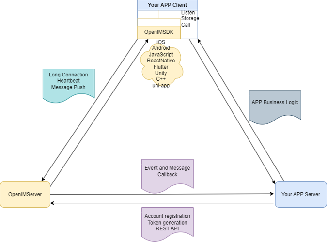

<p align="center">
    <a href="https://openim.io">
        
    </a>
</p>

<h3 align="center" style="border-bottom: none">
    ⭐️  Open source Instant Messaging Server ⭐️ <br>
<h3>


<p align=center>
<a href="https://goreportcard.com/report/github.com/openimsdk/open-im-server"></a>
<a href="https://github.com/openimsdk/open-im-server/issues?q=is%3Aissue+is%3Aopen+sort%3Aupdated-desc+label%3A%22good+first+issue%22"></a>
<a href="https://github.com/openimsdk/open-im-server"></a>
<a href="https://join.slack.com/t/openimsdk/shared_invite/zt-22720d66b-o_FvKxMTGXtcnnnHiMqe9Q"></a>
<a href="https://github.com/openimsdk/open-im-server/blob/main/LICENSE"></a>
<a href="https://golang.org/"></a>
</p>

</p>

<p align="center">
    <a href="./README.md"><b> English </b></a> •
    <a href="./README-zh_CN.md"><b> 简体中文 </b></a> •
    <a href="https://openim.io/en"><b> Docs </b></a>
</p>


</p>

## 🟢 扫描微信进群交流


## Ⓜ️ 关于 OpenIM

OpenIM 不仅仅是一个开源的即时消息组件，它是你的应用程序生态系统的一个不可或缺的部分。查看下面的图表，了解 AppServer、AppClient、OpenIMServer 和 OpenIMSDK 是如何交互的。



## 🚀 关于 OpenIMSDK

**OpenIMSDK** 无缝集成到您的应用中，提供丰富、实时的消息体验，无需复杂的 UI 集成。它提供：

+ **本地存储**：用于快速数据检索和消息同步。
+ **监听器回调**：确保实时消息交互性。
+ **API 封装**：简化开发流程。
+ **连接管理**：保证可靠的消息传递。

它使用 Golang 构建，并支持跨平台部署，确保在所有平台上提供一致的消息体验。

👉 **[探索 GO SDK](https://github.com/openimsdk/openim-sdk-core)**

## 🌐 关于 OpenIMServer

精心用 Golang 开发的 **OpenIMServer** 通过多重方式确保了卓越的即时消息服务器能力：

+ **模块组成**：它由多个模块组成，例如网关和多个 RPC 服务，提供一个多功能的消息环境。
+ **微服务架构**：支持集群模式，确保出色的性能和可伸缩性，以有效管理各个实例间的通信。
+ **多样的部署选项**：适应你的操作偏好，通过源代码、Kubernetes 或 Docker 提供部署选项。

### 增强的业务功能：

+ **REST API**：OpenIMServer 为业务系统提供 REST API，旨在通过后端接口为您的操作提供附加功能，如群组创建和消息推送。
+ **回调**：为了扩展其在各种业务形式中的实用性，OpenIMServer 提供了回调能力。即，在事件发生之前或之后，它向业务服务器发送请求，比如发送消息，丰富通信过程中的交互和数据交换流。

👉 **[了解更多](https://doc.rentsoft.cn/guides/introduction/product)**

## :rocket: 快速开始

你只需要一个简单的命令，就可以快速学习 OpenIM 的工程解决方案：

```
bashCopy code
$ make demo
```

🤲 为了方便用户体验，我们提供了多种部署解决方案，您可以根据下面的列表选择自己的部署方法：

+ **[源代码部署指南](https://doc.rentsoft.cn/guides/gettingStarted/imSourceCodeDeployment)**
+ **[Docker 部署指南](https://doc.rentsoft.cn/guides/gettingStarted/dockerCompose)**
+ **[Kubernetes 部署指南](https://github.com/openimsdk/open-im-server/tree/main/deployments)**

## :hammer_and_wrench: 开始开发 OpenIM

OpenIM 我们的目标是建立一个顶级的开源社区。我们有一套标准，在[社区仓库](https://github.com/OpenIMSDK/community)中。

如果你想为这个 Open-IM-Server 仓库做贡献，请阅读我们的[贡献者文档](https://github.com/openimsdk/open-im-server/blob/main/CONTRIBUTING.md)。

在开始之前，请确保你的更改是有需求的。最好的方法是创建一个[新的讨论](https://github.com/openimsdk/open-im-server/discussions/new/choose) 或 [Slack 通信](https://join.slack.com/t/openimsdk/shared_invite/zt-22720d66b-o_FvKxMTGXtcnnnHiMqe9Q)，或者如果你发现一个问题，首先[报告它](https://github.com/openimsdk/open-im-server/issues/new/choose)。

+ [代码标准](https://github.com/openimsdk/open-im-server/blob/main/docs/contrib/go-code.md)

+ [Docker 镜像标准](https://github.com/openimsdk/open-im-server/blob/main/docs/contrib/images.md)

+ [目录标准](https://github.com/openimsdk/open-im-server/blob/main/docs/contrib/directory.md)

+ [提交标准](https://github.com/openimsdk/open-im-server/blob/main/docs/contrib/commit.md)

+ [版本控制标准](https://github.com/openimsdk/open-im-server/blob/main/docs/contrib/version.md)

+ [接口标准](https://github.com/openimsdk/open-im-server/blob/main/docs/contrib/interface.md)

+ [OpenIM配置和环境变量设置](https://github.com/openimsdk/open-im-server/blob/main/docs/contrib/environment.md)

> **Note**
> 针对中国的用户，阅读我们的 [Docker 镜像标准](https://github.com/openimsdk/open-im-server/blob/main/docs/contrib/images.md) 以便使用国内 aliyun 的镜像地址。OpenIM 也有针对中国的 gitee 同步仓库，你可以在 [gitee.com](https://gitee.com/openimsdk) 上找到它。

## :link: 链接

  + **[完整文档](https://doc.rentsoft.cn/)**
  + **[更新日志](https://github.com/openimsdk/open-im-server/blob/main/CHANGELOG.md)**
  + **[FAQ](https://github.com/openimsdk/open-im-server/blob/main/FAQ.md)**
  + **[代码示例](https://github.com/openimsdk/open-im-server/blob/main/examples)**

## :handshake: 社区

  + **[GitHub Discussions](https://github.com/openimsdk/open-im-server/discussions)**
  + **[Slack 通信](https://join.slack.com/t/openimsdk/shared_invite/zt-22720d66b-o_FvKxMTGXtcnnnHiMqe9Q)**
  + **[GitHub Issues](https://github.com/openimsdk/open-im-server/issues)**

  您可以加入这些平台，讨论问题，提出建议，或分享您的成功故事！

## :writing_hand: 贡献

  我们欢迎任何形式的贡献！请确保在提交 Pull Request 之前阅读我们的[贡献者文档](https://github.com/openimsdk/open-im-server/blob/main/CONTRIBUTING.md)。

  + **[报告 Bug](https://github.com/openimsdk/open-im-server/issues/new?assignees=&labels=bug&template=bug_report.md&title=)**
  + **[提出新特性](https://github.com/openimsdk/open-im-server/issues/new?assignees=&labels=enhancement&template=feature_request.md&title=)**
  + **[提交 Pull Request](https://github.com/openimsdk/open-im-server/pulls)**

  感谢您的贡献，我们一起打造一个强大的即时通信解决方案！

## :closed_book: 许可证

  OpenIMSDK 在 Apache License 2.0 许可下可用。查看[LICENSE 文件](https://github.com/openimsdk/open-im-server/blob/main/LICENSE)了解更多信息。

## 🔮 Thanks to our contributors!

<a href="https://github.com/openimsdk/open-im-server/graphs/contributors">
  
</a>
