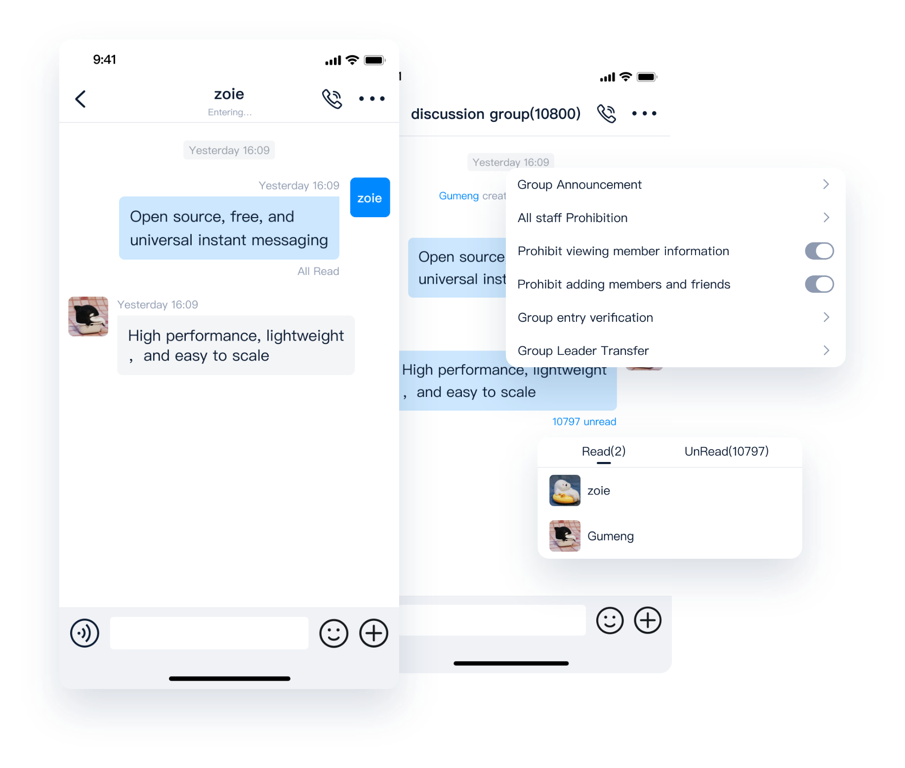
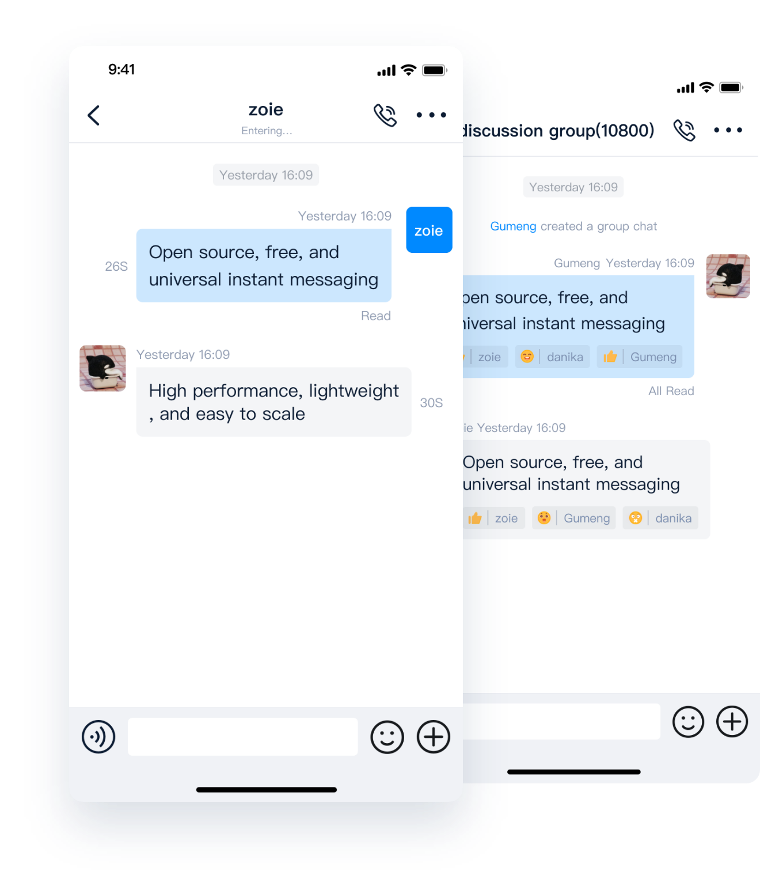

<p align="center">
    <a href="https://www.openim.online">
        
    </a>
</p>

<h3 align="center" style="border-bottom: none">
    ⭐️  Open source Instant Messaging Server ⭐️ <br>
<h3>


<p align=center>
<a href="https://goreportcard.com/report/github.com/openimsdk/open-im-server"></a>
<a href="https://github.com/openimsdk/open-im-server/issues?q=is%3Aissue+is%3Aopen+sort%3Aupdated-desc+label%3A%22good+first+issue%22"></a>
<a href="https://github.com/openimsdk/open-im-server"></a>
<a href="https://join.slack.com/t/openimsdk/shared_invite/zt-22720d66b-o_FvKxMTGXtcnnnHiMqe9Q"></a>
<a href="https://github.com/openimsdk/open-im-server/blob/main/LICENSE"></a>
<a href="https://golang.org/"></a>
<a href="https://pkg.go.dev/github.com/openimsdk/open-im-server/v3"></a>
</p>

</p>

<p align="center">
    <a href="./README.md"><b> English </b></a> •
    <a href="./README-zh_CN.md"><b> 简体中文 </b></a> •
    <a href="https://www.openim.online/en"><b> Docs </b></a>
</p>


</p>

## ✨ About OpenIM

Open-IM-Server, meticulously developed in pure Golang, is a powerful instant messaging server. Its distinct communication method, employing pb+websocket, views every interaction as a message, streamlining customization without altering server code. Built on a microservice architecture, it offers deployment through clusters for outstanding performance and scalability.

Open-IM-Server is more than an instant messaging server; it's a powerful tool for incorporating real-time networking into your applications, positioning itself as your premier choice for integration! 🚀

Please be aware that Open-IM-Server does not function as a standalone product and does not offer built-in account registration or login services. To ease your implementation process, we've open-sourced the [chat repository](https://github.com/OpenIMSDK/chat), which comprises these features. Deploying this chat business server in conjunction with Open-IM-Server expedites the setup of a comprehensive chat product. 👥

Further enhancing your experience, we also provide an SDK client, wherein most complex logics are implemented. The [SDK repository](https://github.com/OpenIMSDK/openim-sdk-core) can be found at [this link](https://github.com/OpenIMSDK/openim-sdk-core). The [chat repository](https://github.com/OpenIMSDK/chat) is our business server while the 'core' represents the high-level encapsulation of the SDK, synergistically working together to deliver superior results. ✨

## :star2: Why OpenIM

**🔍 Function screenshot display**

<div align="center">

|            💻🔄📱 Multi Terminal Synchronization 🔄🖥️             |                  📅⚡ Efficient Meetings 🚀💼      |
| :----------------------------------------------------------: | :---------------------------------------------------------: |
|  |  |
|             📲🔄 **One-to-one and Group Chats** 👥🗣️             |        🎁💻 **Special Features - Custom Messages** ✉️🎨|
|                   |         |

</div>

1. **Comprehensive Message Type Support :speech_balloon:**

   ✅ Supports almost all types of messages, including text, images, emojis, voice, video, geographical location, files, quotes, business cards, system notifications, custom messages and more

   ✅ Supports one-on-one and multi-person audio and video calls

   ✅ Provides terminal support for multiple platforms such as iOS, Android, Flutter, uni-app, ReactNative, Electron, Web, H5 

2. **Efficient Meetings Anytime, Anywhere :earth_americas:**

   ✅ Based on IM (Instant Messaging) with 100% reliable forced signaling capabilities, it paves the way for IM systems, deeply integrated with chat applications 

   ✅ Supports hundreds of people in a single meeting, with subscription numbers reaching thousands, and server-side audio and video recording 

3. **One-on-one and Group Chats for Various Social Scenarios :busts_in_silhouette:**

   ✅ OpenIM has four roles: application administrator, group owner, group administrator, and regular member 

   ✅ Powerful group features such as muting, group announcements, group validation, unlimited group members, and loading group messages as needed 

4. **Unique Features :star2:**

   ✅ Supports read-and-burn private chats, customizable duration

   ✅ Message editing function broadens social scenarios, making instant communication more diverse and interesting

5. **Open Source :open_hands:**

   ✅ The code of OpenIM is open source, self-controlled data, aimed at building a globally leading [IM open source community](https://github.com/OpenIMSDK), including [client SDK](https://github.com/openimsdk/openim-sdk-core) and server 

   ✅ Based on open source Server, many excellent open source projects have been developed, such as [OpenKF](https://github.com/OpenIMSDK/OpenKF) (Open source AI customer service system) 

6. **Easy to Expand :wrench:**

   ✅ The OpenIM server is implemented in Golang, introducing an innovative "everything is a message" communication model, simplifying the implementation of custom messages and extended features 

7. **High Performance :racing_car:**

   ✅ OpenIM supports a hierarchical governance architecture in the cluster, tested by a large number of users, and abstracts the storage model of online messages, offline messages, and historical messages 

8. **Full Platform Support :tv:**

   ✅ Supports native iOS, Android; cross-platform Flutter, uni-app, ReactNative; major web front-end frameworks such as React, Vue; applets; and PC platforms supported by Electron

9. **The ultimate deployment experience 🤖** 

   ✅  Supports [cluster deployment](https://github.com/openimsdk/open-im-server/edit/main/deployments/README.md)

   ✅  Supports multi-architecture mirroring, our Docker images are hosted not only on GitHub but also on Alibaba Cloud and Docker Hub supporting multiple architectures. Visit [our GitHub packages](https://github.com/orgs/OpenIMSDK/packages?repo_name=Open-IM-Server) and read our [version management document](https://github.com/openimsdk/open-im-server/blob/main/docs/conversions/version.md) for more information.

11. **A large ecosystem of open source communities 🤲**

    ✅  We have tens of thousands of users and many solutions to problems.

    ✅  We have a large open source community called [OpenIMSDK](https://github.com/OpenIMSDK) that runs the core modules, we have an open source community called [openim-sigs](https://github.com/openim-sigs) to explore more IM-based infrastructure products.

## :rocket: Quick Start

You can quickly learn OpenIM engineering solutions, all it takes is one simple command:

```bash
$ make demo
```

🤲 In order to facilitate the user experience, we have provided a variety of deployment solutions, you can choose your own deployment method according to the list below:

<details> <summary>Deploying with Docker Compose</summary>

It is recommended to use Docker Compose for deployment, which can easily and quickly deploy the entire OpenIM service on a single node

+ [https://github.com/openimsdk/openim-docker](https://github.com/openimsdk/openim-docker)


> **Note**
>
> If you don't know OpenIM's versioning policy, 📚Read our release policy: https://github.com/openimsdk/open-im-server/blob/main/docs/conversions/version.md


</details> 

<details>  <summary>Compile from Source</summary>


Ur need `Go 1.18` or higher version, and `make`.


```bash
go version && make --version || echo "Error: One of the commands failed."
```

Version Details: https://github.com/openimsdk/open-im-server/blob/main/docs/conversions/version.md

You can get the version number from the command below or from [github releases](https://github.com/openimsdk/open-im-server/tags).

```bash
$ curl --silent "https://api.github.com/repos/openimsdk/open-im-server/releases" | jq -r '.[].tag_name'
```

We have our own version management policy, if you are interested in our version management, I recommend reading [📚 OpenIM Version](https://github.com/openimsdk/open-im-server/blob/main/docs/conversions/version.md), We recommend using stable versions such as `v3.3.0` and `v3.2.0` whenever possible. `v3.1.1-alpha.3` as well as `v3.3.0-beta.0` and `v3.2.0-rc.0` are pre-release or beta versions and are not recommended.

Set `OPENIM_VERSION` environment variables for the latest `OPENIM_VERSION` number, or replace the `OPENIM_VERSION` for you to install the OpenIM-Server `OPENIM_VERSION`:

```bash
$ OPENIM_VERSION=`curl -s https://api.github.com/repos/openimsdk/open-im-server/releases/latest | grep -oE '"tag_name": "[^"]+"' | head -n1 | cut -d'"' -f4`
# OPENIM_VERSION=v3.3.0
```

Deploy basic components at the click of a command:

```bash
# install openim dependency
$ git clone https://github.com/openimsdk/open-im-server openim/openim-server && export openim=$(pwd)/openim/openim-server && cd $openim/openim-server && git checkout $OPENIM_VERSION
$ make init && docker compose -f basic-openim-server-dependency.yml up -d && make start && make check
```

> `make help` to help you see the instructions supported by OpenIM.


You can use the `make help-all` see OpenIM in action.

</details>

<details>  <summary>Component Configuration Instructions</summary>

Read: Configuration center document：https://github.com/openimsdk/open-im-server/blob/main/docs/contrib/environment.md

</details>


<details>  <summary>Deployed with kubernetes</summary>


Read: https://github.com/openimsdk/open-im-server/blob/main/deployments/README.md

</details> 

<details>  <summary>Open IM and Chat Ports</summary>

+ oepnim-server warehouse: https://github.com/openimsdk/open-im-server 

| TCP Port  | Description                                                  | Operation                                             |
| --------- | ------------------------------------------------------------ | ----------------------------------------------------- |
| TCP:10001 | ws protocol, message port such as message sending, pushing etc, used for client SDK | Port release or nginx reverse proxy, and firewall off |
| TCP:10002 | api port, such as user, friend, group, message interfaces.   | Port release or nginx reverse proxy, and firewall off |
| TCP:10005 | Required when choosing minio storage (openIM uses minio storage by default) | Port release or nginx reverse proxy, and firewall off |


+ chat warehouse: https://github.com/OpenIMSDK/chat 

| TCP Port  | Description                                         | Operation                                             |
| --------- | --------------------------------------------------- | ----------------------------------------------------- |
| TCP:10008 | Business system, such as registration, login etc    | Port release or nginx reverse proxy, and firewall off |
| TCP:10009 | Management backend, such as statistics, banning etc | Port release or nginx reverse proxy, and firewall off |

</details>


## :link: Relationship Between APP and OpenIM

OpenIM isn't just an open-source instant messaging component, it's an integral part of your application ecosystem. Check out this diagram to understand how AppServer, AppClient, Open-IM-Server, and Open-IM-SDK interact.


## :building_construction: Overall Architecture

Delve into the heart of Open-IM-Server's functionality with our architecture diagram.


## :hammer_and_wrench: To start developing OpenIM

OpenIM Our goal is to build a top-level open source community. We have a set of standards, in the [Community repository](https://github.com/OpenIMSDK/community).

If you'd like to contribute to this Open-IM-Server repository, please read our [contributor documentation](https://github.com/openimsdk/open-im-server/blob/main/CONTRIBUTING.md).

Before you start, please make sure your changes are in demand. The best for that is to create a [new discussion](https://github.com/openimsdk/open-im-server/discussions/new/choose) OR [Slack Communication](https://join.slack.com/t/openimsdk/shared_invite/zt-22720d66b-o_FvKxMTGXtcnnnHiMqe9Q), or if you find an issue, [report it](https://github.com/openimsdk/open-im-server/issues/new/choose) first.

- [Code Standards](https://github.com/openimsdk/open-im-server/blob/main/docs/conversions/go_code.md)
- [Docker Images Standards](https://github.com/openimsdk/open-im-server/blob/main/docs/conversions/images.md)
- [Directory Standards](https://github.com/openimsdk/open-im-server/blob/main/docs/conversions/directory.md)
- [Commit Standards](https://github.com/openimsdk/open-im-server/blob/main/docs/conversions/commit.md)
- [Versioning Standards](https://github.com/openimsdk/open-im-server/blob/main/docs/conversions/version.md)
- [Interface Standards](https://github.com/openimsdk/open-im-server/blob/main/docs/conversions/api.md)
- [Log Standards](https://github.com/openimsdk/open-im-server/blob/main/docs/conversions/logging.md)
- [Error Code Standards](https://github.com/openimsdk/open-im-server/blob/main/docs/conversions/error_code.md)

## :busts_in_silhouette: Community

+ 📚 [OpenIM Community](https://github.com/OpenIMSDK/community)
+ 💕 [OpenIM Interest Group](https://github.com/Openim-sigs)
+ 🚀 [Join our Slack community](https://join.slack.com/t/openimsdk/shared_invite/zt-22720d66b-o_FvKxMTGXtcnnnHiMqe9Q)
+ :eyes: [Join our wechat (微信群)](https://openim-1253691595.cos.ap-nanjing.myqcloud.com/WechatIMG20.jpeg)

## :calendar: Community Meetings

We want anyone to get involved in our community and contributing code, we offer gifts and rewards, and we welcome you to join us every Thursday night.

Our conference is in the [OpenIM Slack](https://join.slack.com/t/openimsdk/shared_invite/zt-22720d66b-o_FvKxMTGXtcnnnHiMqe9Q) 🎯, then you can search the Open-IM-Server pipeline to join

We take notes of each [biweekly meeting](https://github.com/orgs/OpenIMSDK/discussions/categories/meeting) in [GitHub discussions](https://github.com/openimsdk/open-im-server/discussions/categories/meeting), Our historical meeting notes, as well as replays of the meetings are available at [Google Docs :bookmark_tabs:](https://docs.google.com/document/d/1nx8MDpuG74NASx081JcCpxPgDITNTpIIos0DS6Vr9GU/edit?usp=sharing).

## :eyes: Who are using OpenIM

Check out our [user case studies](https://github.com/OpenIMSDK/community/blob/main/ADOPTERS.md) page for a list of the project users. Don't hesitate to leave a [📝comment](https://github.com/openimsdk/open-im-server/issues/379) and share your use case.

## :page_facing_up: License

OpenIM is licensed under the Apache 2.0 license. See [LICENSE](https://github.com/openimsdk/open-im-server/tree/main/LICENSE) for the full license text.

The OpenIM logo, including its variations and animated versions, displayed in this repository [OpenIM](https://github.com/openimsdk/open-im-server) under the [assets/logo](./assets/logo) and [assets/logo-gif](assets/logo-gif) directories, are protected by copyright laws.

## 🔮 Thanks to our contributors!

<a href="https://github.com/openimsdk/open-im-server/graphs/contributors">
  
</a>
