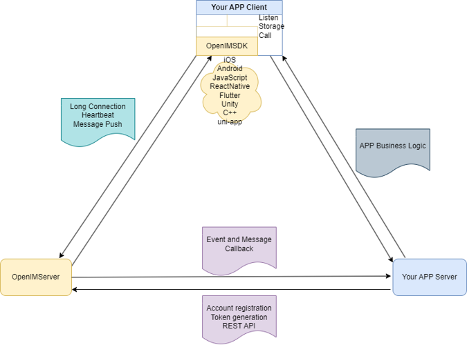

<p align="center">
    <a href="https://openim.io">
        
    </a>
</p>

<h3 align="center" style="border-bottom: none">
    ⭐️  Open source Instant Messaging Server ⭐️ <br>
<h3>


<p align=center>
<a href="https://goreportcard.com/report/github.com/openimsdk/open-im-server"></a>
<a href="https://github.com/openimsdk/open-im-server/issues?q=is%3Aissue+is%3Aopen+sort%3Aupdated-desc+label%3A%22good+first+issue%22"></a>
<a href="https://github.com/openimsdk/open-im-server"></a>
<a href="https://join.slack.com/t/openimsdk/shared_invite/zt-22720d66b-o_FvKxMTGXtcnnnHiMqe9Q"></a>
<a href="https://github.com/openimsdk/open-im-server/blob/main/LICENSE"></a>
<a href="https://golang.org/"></a>
<a href="https://pkg.go.dev/github.com/openimsdk/open-im-server/v3"></a>
</p>

</p>

<p align="center">
    <a href="./README.md"><b> English </b></a> •
    <a href="./README-zh_CN.md"><b> 简体中文 </b></a> •
<a href="https://openim.io/en"><b> Docs </b></a>
</p>

</p>

## Ⓜ️ About OpenIM

OpenIM isn't just an open-source instant messaging component, it's an integral part of your application ecosystem. Check out this diagram to understand how AppServer, AppClient, OpenIMServer, and OpenIMSDK interact.



## 🚀 About OpenIMSDK

**OpenIMSDK** seamlessly integrates into your application, delivering a rich, real-time messaging experience without requiring intricate UI integration. It provides:

+ **Local Storage**: For quick data retrieval and message synchronization.
+ **Listener Callbacks**: Ensuring real-time message interactivity.
+ **API Encapsulation**: Streamlining development processes.
+ **Connection Management**: Guaranteeing reliable message delivery.

It's crafted in Golang and supports cross-platform deployment, ensuring a coherent messaging experience across all platforms.

👉 **[Explore GO SDK](https://github.com/openimsdk/openim-sdk-core)**

## 🌐 About OpenIMServer

**OpenIMServer**, meticulously developed in Golang, ensures a stellar instant messaging server capability with a multifold approach:

+ **Modular Composition**: It's comprised of several modules, such as the gateway and multiple RPC services, offering a versatile messaging environment.
+ **Microservices Architecture**: Supporting cluster modes, it assures outstanding performance and scalability to manage communication effectively across various instances.
+ **Diverse Deployment Options**: Adapts to your operational preferences, offering deployment via source code, Kubernetes, or Docker.

### Enhanced Business Functionalities:

+ **REST API**: OpenIMServer provides REST API for business systems, aiming to empower your operations with additional functionalities like group creation and message push via backend interfaces.
+ **Callbacks**: To expand its utility across varied business forms, OpenIMServer offers callback capabilities. That is, it sends a request to the business server before or after an event occurs, such as sending a message, enriching the interaction and data exchange flow in the communication processes.

👉 **[Learn More](https://docs.openim.io/guides/introduction/product)**

<!--

## :star2: Why OpenIM

**🔍 Function screenshot display**

<div align="center">

|            💻🔄📱 Multi Terminal Synchronization 🔄🖥️             |                  📅⚡ Efficient Meetings 🚀💼      |
| :----------------------------------------------------------: | :---------------------------------------------------------: |
|  |  |
|             📲🔄 **One-to-one and Group Chats** 👥🗣️             |        🎁💻 **Special Features - Custom Messages** ✉️🎨|
|                   |         |

</div>

**OpenIM** offers a powerful and reliable instant messaging platform, ensuring versatile communication across multiple platforms with the following key features:

✅ **Versatile Messaging:** Support for text, images, emojis, voice, video, and more, alongside one-on-one and multi-person audio/video calls.

✅ **Robust Chat Capabilities:** Including roles (application administrator, group owner, etc.) and features like muting, group announcements, and dynamic message loading.

✅ **Unique Interaction Features:** Offering read-and-burn private chats and a message editing function to broaden social scenarios.

✅ **Open Source:** The code of OpenIM is open source and aims to build a leading global IM open source community. [GitHub Repository](https://github.com/OpenIMSDK)

✅ **Extensibility:** Implemented in Golang, OpenIM introduces an "everything is a message" communication model, simplifying custom messages and feature extension.

✅ **High Performance:** Supports a hierarchical governance architecture tested and abstracts the storage model of various message types.

✅ **Full Platform Support:** Native support for iOS, Android, Flutter, uni-app, ReactNative, Electron, and Web.

-->


## :rocket: Quick Start

You can quickly learn OpenIM engineering solutions, all it takes is one simple command:

```bash
$ make demo
```

🤲 In order to facilitate the user experience, we have provided a variety of deployment solutions, you can choose your own deployment method according to the list below:

<!--
<details> <summary>Deploying with Docker Compose</summary>

It is recommended to use Docker Compose for deployment, which can easily and quickly deploy the entire OpenIM service on a single node

+ [https://github.com/openimsdk/openim-docker](https://github.com/openimsdk/openim-docker)


> **Note**
>
> If you don't know OpenIM's versioning policy, 📚Read our release policy: https://github.com/openimsdk/open-im-server/blob/main/docs/conversions/version.md


</details> 

<details>  <summary>Compile from Source</summary>


Ur need `Go 1.20` or higher version, and `make`.


```bash
go version && make --version || echo "Error: One of the commands failed."
```

Version Details: https://github.com/openimsdk/open-im-server/blob/main/docs/conversions/version.md

You can get the version number from the command below or from [github releases](https://github.com/openimsdk/open-im-server/tags).

```bash
$ curl --silent "https://api.github.com/repos/openimsdk/open-im-server/releases" | jq -r '.[].tag_name'
```

We have our own version management policy, if you are interested in our version management, I recommend reading [📚 OpenIM Version](https://github.com/openimsdk/open-im-server/blob/main/docs/conversions/version.md), We recommend using stable versions such as `v3.3.0` and `v3.2.0` whenever possible. `v3.1.1-alpha.3` as well as `v3.3.0-beta.0` and `v3.2.0-rc.0` are pre-release or beta versions and are not recommended.

Set `OPENIM_VERSION` environment variables for the latest `OPENIM_VERSION` number, or replace the `OPENIM_VERSION` for you to install the OpenIM-Server `OPENIM_VERSION`:

```bash
$ OPENIM_VERSION=`curl -s https://api.github.com/repos/openimsdk/open-im-server/releases/latest | grep -oE '"tag_name": "[^"]+"' | head -n1 | cut -d'"' -f4`
# OPENIM_VERSION=v3.3.0
```

Deploy basic components at the click of a command:

```bash
# install openim dependency
$ git clone https://github.com/openimsdk/open-im-server openim/openim-server && export openim=$(pwd)/openim/openim-server && cd $openim/openim-server && git checkout $OPENIM_VERSION
$ make init && docker compose up -d && make start && make check
```

> `make help` to help you see the instructions supported by OpenIM.


You can use the `make help-all` see OpenIM in action.

</details>

<details>  <summary>Component Configuration Instructions</summary>

Read: Configuration center document：https://github.com/openimsdk/open-im-server/blob/main/docs/contrib/environment.md

</details>


<details>  <summary>Deployed with kubernetes</summary>

+ https://github.com/openimsdk/open-im-server/blob/main/deployments/README.md

</details> 
-->

+ **[Source Code Deployment Guide](https://docs.openim.io/guides/gettingStarted/imSourceCodeDeployment)**
+ **[Production deployment of Linux systems](https://github.com/openimsdk/open-im-server/blob/main/docs/contrib/install-openim-linux-system.md)**
+ **[Docker Deployment Guide](https://docs.openim.io/guides/gettingStarted/dockerCompose)**
+ **[Kubernetes Deployment Guide](https://github.com/openimsdk/open-im-server/tree/main/deployments)**

<!-- 
## :link: OpenIM and your application

OpenIM isn't just an open-source instant messaging component, it's an integral part of your application ecosystem. Check out this diagram to understand how AppServer, AppClient, OpenIMServer, and OpenIMSDK interact.


## :building_construction: Overall Architecture

Delve into the heart of Open-IM-Server's functionality with our architecture diagram.

 -->

## :hammer_and_wrench: To start developing OpenIM

OpenIM Our goal is to build a top-level open source community. We have a set of standards, in the [Community repository](https://github.com/OpenIMSDK/community).

If you'd like to contribute to this Open-IM-Server repository, please read our [contributor documentation](https://github.com/openimsdk/open-im-server/blob/main/CONTRIBUTING.md).

Before you start, please make sure your changes are in demand. The best for that is to create a [new discussion](https://github.com/openimsdk/open-im-server/discussions/new/choose) OR [Slack Communication](https://join.slack.com/t/openimsdk/shared_invite/zt-22720d66b-o_FvKxMTGXtcnnnHiMqe9Q), or if you find an issue, [report it](https://github.com/openimsdk/open-im-server/issues/new/choose) first.

- [Code Standards](https://github.com/openimsdk/open-im-server/blob/main/docs/conversions/go_code.md)
- [Docker Images Standards](https://github.com/openimsdk/open-im-server/blob/main/docs/conversions/images.md)
- [Directory Standards](https://github.com/openimsdk/open-im-server/blob/main/docs/conversions/directory.md)
- [Commit Standards](https://github.com/openimsdk/open-im-server/blob/main/docs/conversions/commit.md)
- [Versioning Standards](https://github.com/openimsdk/open-im-server/blob/main/docs/conversions/version.md)
- [Interface Standards](https://github.com/openimsdk/open-im-server/blob/main/docs/conversions/api.md)
- [Log Standards](https://github.com/openimsdk/open-im-server/blob/main/docs/conversions/logging.md)
- [Error Code Standards](https://github.com/openimsdk/open-im-server/blob/main/docs/conversions/error_code.md)
- [OpenIM configuration and environment variable Settings](https://github.com/openimsdk/open-im-server/blob/main/docs/contrib/environment.md)


## :busts_in_silhouette: Community

+ 📚 [OpenIM Community](https://github.com/OpenIMSDK/community)
+ 💕 [OpenIM Interest Group](https://github.com/Openim-sigs)
+ 🚀 [Join our Slack community](https://join.slack.com/t/openimsdk/shared_invite/zt-22720d66b-o_FvKxMTGXtcnnnHiMqe9Q)
+ :eyes: [Join our wechat (微信群)](https://openim-1253691595.cos.ap-nanjing.myqcloud.com/WechatIMG20.jpeg)

## :calendar: Community Meetings

We want anyone to get involved in our community and contributing code, we offer gifts and rewards, and we welcome you to join us every Thursday night.

Our conference is in the [OpenIM Slack](https://join.slack.com/t/openimsdk/shared_invite/zt-22720d66b-o_FvKxMTGXtcnnnHiMqe9Q) 🎯, then you can search the Open-IM-Server pipeline to join

We take notes of each [biweekly meeting](https://github.com/orgs/OpenIMSDK/discussions/categories/meeting) in [GitHub discussions](https://github.com/openimsdk/open-im-server/discussions/categories/meeting), Our historical meeting notes, as well as replays of the meetings are available at [Google Docs :bookmark_tabs:](https://docs.google.com/document/d/1nx8MDpuG74NASx081JcCpxPgDITNTpIIos0DS6Vr9GU/edit?usp=sharing).

## :eyes: Who are using OpenIM

Check out our [user case studies](https://github.com/OpenIMSDK/community/blob/main/ADOPTERS.md) page for a list of the project users. Don't hesitate to leave a [📝comment](https://github.com/openimsdk/open-im-server/issues/379) and share your use case.

## :page_facing_up: License

OpenIM is licensed under the Apache 2.0 license. See [LICENSE](https://github.com/openimsdk/open-im-server/tree/main/LICENSE) for the full license text.

The OpenIM logo, including its variations and animated versions, displayed in this repository [OpenIM](https://github.com/openimsdk/open-im-server) under the [assets/logo](./assets/logo) and [assets/logo-gif](assets/logo-gif) directories, are protected by copyright laws.

## 🔮 Thanks to our contributors!

<a href="https://github.com/openimsdk/open-im-server/graphs/contributors">
  
</a>
