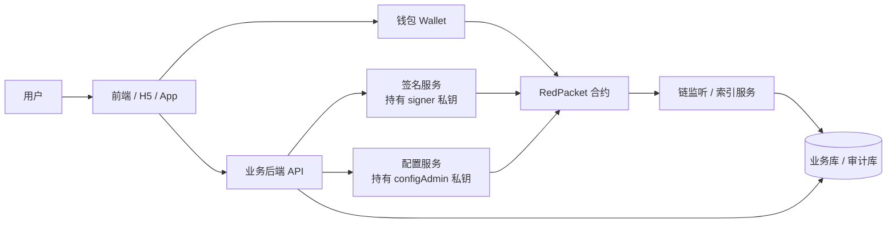
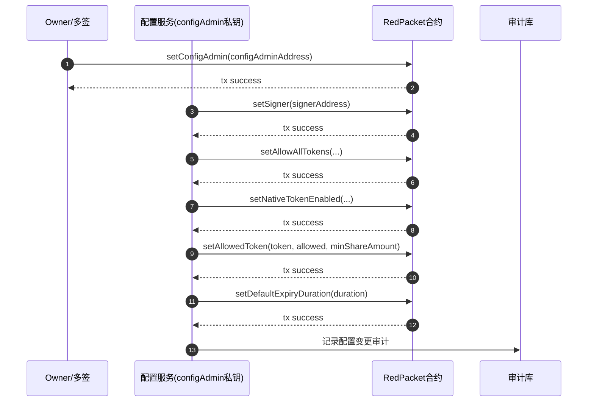
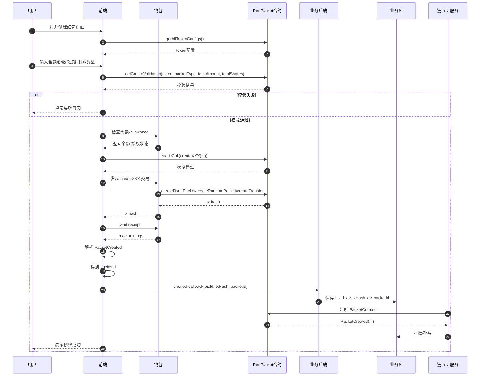
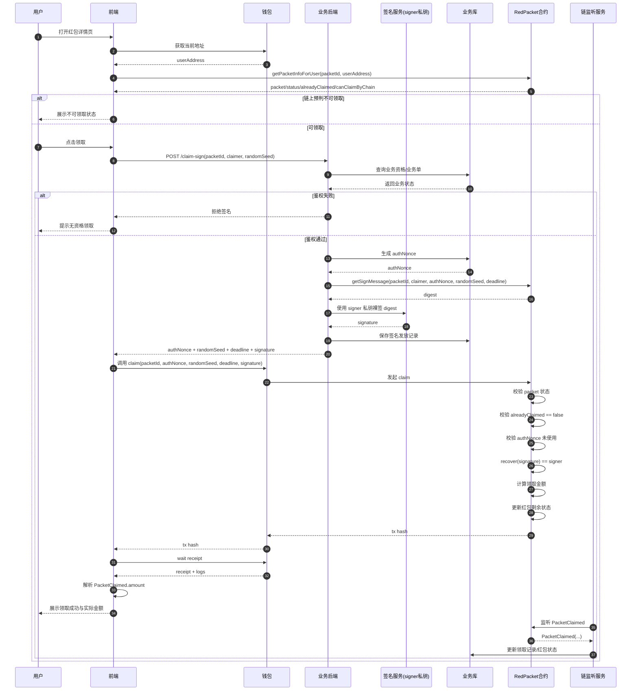
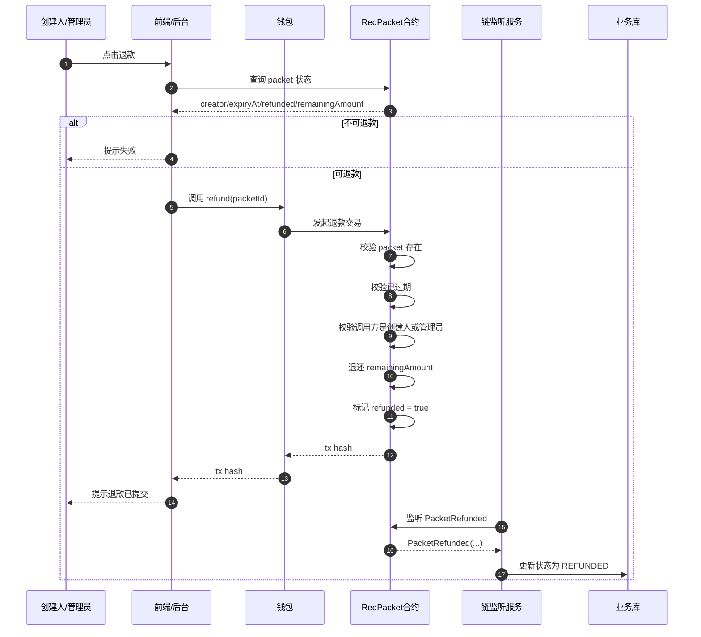

# RedPacket Web3 接入设计文档

## 1. 文档目标

本文档用于指导 `RedPacket` 红包系统的 Web3 接入落地，覆盖：

- 整体架构设计
- 前端 / 钱包 / 后端 / 合约 / 监听服务 的职责划分
- 初始化与配置流程
- 创建红包流程
- 领取红包流程
- 退款流程
- 关键接口定义
- 关键数据流与安全边界

本文档基于当前 `RedPacket` 合约规则整理：

- 链上 `packetId` 由合约自增生成，创建成功后通过 `PacketCreated` 事件回传。fileciteturn1file1
- `claim` 必须携带后端签名，签名消息绑定 `packetId + claimer + authNonce + randomSeed + deadline`，并与 `msg.sender` 强绑定。fileciteturn1file1
- `createTransfer` 创建时不传 `recipient`，实际可领取人由后端签名中的 `claimer` 决定。fileciteturn1file1
- 建议后端通过 `getSignMessage(...)` 获取 digest 后做裸签名，避免 `signMessage` 前缀导致链上验签失败。fileciteturn1file4

---

## 2. 设计目标

### 2.1 业务目标

支持以下红包能力：

- 普通红包（固定金额）
- 拼手气红包（随机金额）
- 待领取转账（创建时不传接收地址，领取时由后端鉴权）fileciteturn1file1

### 2.2 安全目标

系统需明确区分两类链上信任地址：

1. **参数配置地址（configAdmin）**
   - 用于调用配置类函数
   - 例如：`setSigner`、`setAllowAllTokens`、`setNativeTokenEnabled`、`setAllowedToken`、`setDefaultExpiryDuration`。fileciteturn1file4

2. **业务签名地址（signer）**
   - 用于后端签发领取授权
   - 合约 `claim` 时通过验签校验是否为可信签名地址

### 2.3 工程目标

- 前端只负责钱包连接、读链、发交易、展示状态
- 后端负责业务鉴权、nonce 管理、签名发放、审计落库
- 合约负责最终状态机、权限控制、验签、防重放
- 监听服务负责链上事件消费、对账与最终一致性

---

## 3. 总体架构

## 3.1 架构图

## 3.2 模块职责

### 前端 / H5 / App

负责：

- 连接钱包
- 获取当前链地址
- 读取红包状态
- 创建红包前预校验
- 发起创建交易
- 调后端获取领取签名
- 发起领取交易
- 解析交易回执与事件

### 钱包

负责：

- 用户签名交易
- 广播创建 / 领取 / 退款交易
- 提供当前地址与网络信息

### 业务后端 API

负责：

- 业务单管理
- 创建结果落库
- 领取资格鉴权
- 签名发放接口
- 配置管理接口
- 审计与风控

### 签名服务

负责：

- 使用 `signer` 私钥对领取摘要做裸签名
- 不参与链上参数修改
- 不应持有配置类权限

### 配置服务

负责：

- 使用 `configAdmin` 私钥调用配置类交易
- 负责 `signer` 轮换与 token 配置变更
- 不参与高频 claim 签名发放

### RedPacket 合约

负责：

- 红包状态管理
- 红包 ID 自增
- 创建 / 领取 / 退款规则执行
- claim 验签
- nonce 防重放
- 事件输出

### 链监听 / 索引服务

负责：

- 监听 `PacketCreated / PacketClaimed / PacketRefunded`
- 解析事件并更新数据库
- 做对账与最终一致性

---

## 4. 合约角色与权限模型

## 4.1 推荐角色

建议合约维护以下 3 类地址：

- `owner`：最高权限，建议多签控制
- `configAdmin`：参数配置地址
- `signer`：后端业务签名地址

## 4.2 权限建议

| 角色 | 用途 | 是否高频 | 建议托管方式 |
|---|---|---:|---|
| `owner` | 设置 `configAdmin`、兜底治理 | 否 | 多签 / 冷钱包 |
| `configAdmin` | 修改 `signer`、token 配置、默认过期时间 | 低频 | KMS / HSM / 运维专用钱包 |
| `signer` | 签发 claim 授权 | 高频 | 独立签名服务 |

## 4.3 合约与服务端的鉴权方式

链上无法识别“某个后端进程”，只能识别两种身份：

1. **交易发送者地址**
   - 用于配置类操作
   - 通过 `msg.sender` 校验

2. **消息签名者地址**
   - 用于领取授权
   - 通过 `ECDSA.recover(signature)` 校验

因此：

- 配置鉴权依赖 `msg.sender == configAdmin` 或 `owner`
- claim 鉴权依赖 `recover(signature) == signer`

---

## 5. 关键业务规则

### 5.1 红包 ID 规则

- 链上红包 ID 由 `nextPacketId` 自增生成。fileciteturn1file1
- 前端和后端都不能自己猜 `packetId`。
- 创建成功后必须从 `PacketCreated` 事件中解析 `packetId`。fileciteturn1file0

### 5.2 待领取转账规则

- `createTransfer` 不接收 `recipient` 参数。fileciteturn1file1
- 实际领取人由后端签名中的 `claimer` 决定。fileciteturn1file1

### 5.3 claim 鉴权规则

`claim` 必须携带后端签名，签名字段绑定：

- `packetId`
- `claimer`
- `authNonce`
- `randomSeed`
- `deadline` fileciteturn1file1

并且签名应与 `msg.sender` 强绑定，不能被其他地址复用。fileciteturn1file1

### 5.4 过期规则

- 红包过期后不可继续领取。fileciteturn1file1
- 过期后可调用 `refund(packetId)` 退回剩余金额。fileciteturn1file1
- 允许创建人或管理员调用退款。fileciteturn1file4

### 5.5 最小份额规则

不同 token 可在 `setAllowedToken(token, allowed, minShareAmount)` 中配置最小份额。fileciteturn1file1

创建校验：

- 固定红包：`totalAmount / totalShares >= minShareAmount`
- 拼手气红包：`totalAmount >= totalShares * minShareAmount`
- 转账：`amount >= minShareAmount` fileciteturn1file1

---

## 6. 关键交互时序图

## 6.1 初始化与配置流程

### 图意概述

该流程用于完成合约上线后的初始参数配置与权限分层。`owner` 负责设置 `configAdmin`，而日常配置由 `configAdmin` 地址发起。`signer` 地址由配置服务设置，用于后续领取签名验证。

### 边界条件

- `signer` 与 `configAdmin` 必须是不同地址，避免签名服务被攻破后直接具备配置权限。
- `owner` 建议使用多签地址，不建议使用个人热钱包。
- 所有配置写操作都应带链上事件与业务侧审计单。

### 异常路径与回退

- 如果配置交易失败，前端/后台应展示链上 revert 原因。
- 如果设置 `signer` 失败，旧 `signer` 应继续有效，避免线上 claim 全量失败。
- 如果 token 配置更新失败，前端仍应以链上真实配置为准。

### 性能与容量假设

- 配置操作为低频操作，可接受链上确认延迟。
- 配置写入频率极低，因此可优先保障安全性而非吞吐。

### 版本与兼容性

- 若后续扩展角色（如 `pauser` / `upgrader`），建议继续沿用分权设计。
- 配置事件建议保持向后兼容，便于监听服务稳定消费。

---

## 6.2 创建红包流程

### 图意概述

创建红包流程分为：读配置、权威校验、余额与授权检查、链上模拟、正式创建、事件解析、后端落库。`packetId` 的唯一可信来源是 `PacketCreated` 事件。fileciteturn1file0

### 边界条件

- 原生币需额外预留 gas，不应把余额全部作为 `totalAmount`。
- ERC20 创建前需检查 `allowance >= totalAmount`。
- `expiryAt == 0` 时由合约使用默认过期时间。fileciteturn1file4

### 异常路径与回退

- `getCreateValidation(...)` 返回 `passed == false` 时，应直接用 `code` 透传失败原因。fileciteturn1file3
- `staticCall` 成功并不保证正式交易 100% 成功，链上配置变化、余额变化都可能导致最终失败。fileciteturn1file3
- 若前端回传 `packetId` 失败，可由监听服务通过 `txHash` 和事件补写。

### 性能与容量假设

- 创建链路以用户交互为主，整体延迟由钱包签名和链确认决定。
- `getAllTokenConfigs()` 适合页面初始化时缓存，减少重复读链。fileciteturn1file3

### 版本与兼容性

- 创建页应优先依赖聚合只读接口，避免未来 token 规则变化导致前端多处改动。
- 若未来扩展红包类型，建议继续复用 `getCreateValidation(...)` 做统一校验出口。

---

## 6.3 领取红包流程

### 图意概述

领取链路是整个系统最核心的链路。前端只能做链上预判，最终是否允许领取由后端业务鉴权 + 后端签名 + 合约验签三者共同决定。`claim` 不是纯前端直连模式，而是“前端 + 后端签名服务 + 合约”三方联动。fileciteturn1file1

### 边界条件

- `authNonce` 必须对每个 `claimer` 唯一，不可重复。fileciteturn1file4
- `deadline` 建议短时有效，如 5~30 分钟。fileciteturn1file4
- `claimer` 应严格使用当前连接钱包地址，避免签给 A 地址却由 B 地址调用。
- 拼手气红包最终领取金额必须以链上 `PacketClaimed.amount` 为准，前端不要本地复算。fileciteturn1file2

### 异常路径与回退

- 后端鉴权失败：直接拒绝签名。
- `invalid signature`：签名人错误、参数不一致、`claimer` 被篡改、摘要计算不一致。fileciteturn1file1
- `claim nonce used`：同地址重复使用 `authNonce`。fileciteturn1file1
- `packet expired`：红包过期。fileciteturn1file1

### 性能与容量假设

- claim 为高频路径，签名服务应尽量轻量，避免承担复杂配置职责。
- 建议签名接口短链路完成，仅依赖必要的业务状态查询与 nonce 生成。
- 监听服务需具备幂等更新能力，防止事件重复消费。

### 版本与兼容性

- 若签名结构变更，应同步升级合约 `CLAIM_TYPEHASH`、后端签名逻辑与前端参数组装。
- 若未来切换 signer 地址，保留 `setSigner(...)` 即可平滑轮换。fileciteturn1file4

---

## 6.4 过期退款流程

### 图意概述

退款链路只允许在红包过期后执行，且调用方必须是创建人或管理员。成功后需通过 `PacketRefunded` 事件更新业务状态。fileciteturn1file4

### 边界条件

- 退款前必须确认 `refunded == false`。
- 已领取完的红包理论上剩余金额为 0，退款交易应仍保持一致性处理。
- 管理员退款与创建人退款都应有审计落库。

### 异常路径与回退

- 未过期调用应直接 revert。
- 非创建人/管理员调用应直接拒绝。
- 如果退款交易已提交但后端未更新，可由监听服务补偿。

### 性能与容量假设

- 退款为低频操作，对吞吐要求低。
- 事件驱动回写可以接受秒级到分钟级延迟。

### 版本与兼容性

- 若未来增加自动退款策略，可在不改变 `refund(packetId)` 主接口的前提下扩展调度能力。

---

## 7. 关键接口表

## 7.1 合约接口表

| 分类 | 接口 | 参数 | 返回 | 说明 |
|---|---|---|---|---|
| 创建 | `createFixedPacket` | `token, totalAmount, totalShares, expiryAt` | `packetId` / tx receipt | 创建固定金额红包。fileciteturn1file4 |
| 创建 | `createRandomPacket` | `token, totalAmount, totalShares, expiryAt` | `packetId` / tx receipt | 创建拼手气红包。fileciteturn1file4 |
| 创建 | `createTransfer` | `token, amount, expiryAt` | `packetId` / tx receipt | 创建待领取转账，不传 recipient。fileciteturn1file1turn1file4 |
| 领取 | `claim` | `packetId, authNonce, randomSeed, deadline, signature` | tx receipt | 必须携带后端签名。fileciteturn1file1turn1file4 |
| 退款 | `refund` | `packetId` | tx receipt | 红包过期后退款。fileciteturn1file4 |
| 管理 | `setSigner` | `signer` | tx receipt | 设置验签地址。fileciteturn1file4 |
| 管理 | `setAllowAllTokens` | `allowAllTokens` | tx receipt | 设置是否允许所有 token。fileciteturn1file4 |
| 管理 | `setNativeTokenEnabled` | `enabled` | tx receipt | 设置原生币开关。fileciteturn1file4 |
| 管理 | `setAllowedToken` | `token, allowed, minShareAmount` | tx receipt | 设置 token 白名单与最小份额。fileciteturn1file1turn1file4 |
| 管理 | `setDefaultExpiryDuration` | `duration` | tx receipt | 设置默认过期时间。fileciteturn1file4 |
| 只读 | `getSignMessage` | `packetId, claimer, authNonce, randomSeed, deadline` | `bytes32 digest` | 后端获取摘要再裸签名。fileciteturn1file4 |
| 只读 | `getPacketInfoForUser` | `packetId, user` | `packet, status, alreadyClaimed, canClaimByChain` | 前端聚合查询红包状态。fileciteturn1file3 |
| 只读 | `getAllTokenConfigs` | - | token 配置聚合结果 | 页面初始化时获取 token 配置。fileciteturn1file3 |
| 只读 | `getCreateValidation` | `token, packetType, totalAmount, totalShares` | `passed/code/...` | 创建前权威校验。fileciteturn1file3 |

## 7.2 后端 API 接口表

| 分类 | 接口 | 方法 | 关键入参 | 关键出参 | 说明 |
|---|---|---|---|---|---|
| 创建 | `/api/redpacket/create-order` | `POST` | 业务发红包参数 | `bizId` | 创建业务单，链前预落库 |
| 创建回写 | `/api/redpacket/created-callback` | `POST` | `bizId, txHash, packetId` | `ok` | 创建交易成功后回写链上 `packetId` |
| 详情 | `/api/redpacket/detail` | `GET` | `packetId` | 红包业务详情 | 返回分享页需要的业务信息 |
| 领取签名 | `/api/redpacket/claim-sign` | `POST` | `packetId, claimer, randomSeed` | `authNonce, deadline, signature` | 业务鉴权 + 发放 claim 授权 |
| 领取回写 | `/api/redpacket/claim-result` | `POST` | `packetId, txHash` | `ok` | 可选，最终仍以监听服务为准 |
| 配置 | `/admin/redpacket/set-signer` | `POST` | `newSigner` | `txHash` | 变更 signer |
| 配置 | `/admin/redpacket/set-token` | `POST` | `token, allowed, minShareAmount` | `txHash` | 更新 token 配置 |
| 配置 | `/admin/redpacket/set-expiry` | `POST` | `duration` | `txHash` | 更新默认过期时间 |

## 7.3 事件表

| 事件 | 字段 | 用途 |
|---|---|---|
| `PacketCreated` | `packetId, creator, packetType, token, totalAmount, totalShares, expiryAt` | 创建成功后的唯一 `packetId` 来源。fileciteturn1file0turn1file1 |
| `PacketClaimed` | `packetId, claimer, amount, remainingAmount, remainingShares, authNonce` | 领取成功与实际领取金额来源。fileciteturn1file2 |
| `PacketRefunded` | `packetId, operator, refundTo, amount` | 退款确认与状态同步。fileciteturn1file4 |

---

## 8. 关键数据表建议

## 8.1 红包主表 `red_packet`

| 字段 | 说明 |
|---|---|
| `id` | 自增主键 |
| `biz_id` | 业务单号 |
| `packet_id` | 链上红包 ID |
| `chain_id` | 链 ID |
| `contract_address` | 合约地址 |
| `creator_user_id` | 发红包业务用户 ID |
| `creator_wallet` | 发红包钱包地址 |
| `packet_type` | 红包类型 |
| `token` | token 地址 |
| `total_amount` | 总金额 |
| `total_shares` | 总份数 |
| `expiry_at` | 过期时间 |
| `tx_hash` | 创建交易哈希 |
| `status` | 业务状态 |
| `created_at` | 创建时间 |

## 8.2 领取授权表 `red_packet_claim_auth`

| 字段 | 说明 |
|---|---|
| `id` | 主键 |
| `packet_id` | 红包 ID |
| `claimer_wallet` | 领取地址 |
| `auth_nonce` | 授权 nonce |
| `random_seed` | 随机参数 |
| `deadline` | 过期时间 |
| `signature` | 后端签名 |
| `used` | 是否已使用 |
| `user_id` | 业务用户 ID |
| `created_at` | 创建时间 |

## 8.3 领取记录表 `red_packet_claim`

| 字段 | 说明 |
|---|---|
| `id` | 主键 |
| `packet_id` | 红包 ID |
| `claimer_wallet` | 领取地址 |
| `auth_nonce` | 使用的 nonce |
| `claim_tx_hash` | 领取交易哈希 |
| `claimed_amount` | 实际领取金额 |
| `block_number` | 区块号 |
| `status` | 状态 |
| `created_at` | 创建时间 |

## 8.4 退款记录表 `red_packet_refund`

| 字段 | 说明 |
|---|---|
| `id` | 主键 |
| `packet_id` | 红包 ID |
| `refund_tx_hash` | 退款交易哈希 |
| `refund_to` | 退款目标地址 |
| `amount` | 退款金额 |
| `status` | 状态 |
| `created_at` | 创建时间 |

---

## 9. 前端接入建议

## 9.1 创建页

推荐顺序：

1. 调 `getAllTokenConfigs()` 初始化页面配置。fileciteturn1file3
2. 用户输入金额/份数后调 `getCreateValidation(...)`。fileciteturn1file3
3. 检查余额 / allowance。
4. 调 `staticCall` 做链上模拟。fileciteturn1file3
5. 发创建交易。
6. 从 `PacketCreated` 解析 `packetId`。fileciteturn1file0
7. 回传后端落库。

## 9.2 详情页 / 领取页

推荐顺序：

1. 调 `getPacketInfoForUser(packetId, userAddress)`。fileciteturn1file3
2. 若链上预判可领，展示领取按钮。
3. 点击领取后先调后端 `/claim-sign`。
4. 拿到 `authNonce + deadline + signature` 后再发 `claim(...)`。
5. 从 `PacketClaimed.amount` 获取真实领取金额。fileciteturn1file2

---

## 10. 安全设计建议

## 10.1 分权

必须分离：

- `configAdmin` 私钥
- `signer` 私钥

不要使用同一把私钥同时做：

- 配置交易
- claim 签名

## 10.2 防重放

- `authNonce` 必须唯一，建议按 `claimer` 维度发号。fileciteturn1file4
- claim 成功后链上立即标记 nonce 已使用。

## 10.3 签名规范

- 推荐通过 `getSignMessage(...)` 获取 digest。fileciteturn1file4
- 后端对 digest 做裸签名。
- 不要使用 `signMessage`，否则会添加前缀导致验签失败。fileciteturn1file4

## 10.4 审计与对账

- 所有配置变更写审计单
- 所有签名发放写记录
- 所有链上事件由监听服务落最终状态
- `txHash -> packetId`、`packetId -> claim records` 都要可追溯。fileciteturn1file0

---

## 11. 常见失败原因

| 错误 | 含义 |
|---|---|
| `invalid signature` | 签名不匹配、签名人错误、claimer 不匹配、参数被篡改。fileciteturn1file1 |
| `claim nonce used` | 同地址重复使用授权 nonce。fileciteturn1file1 |
| `packet expired` | 红包已过期。fileciteturn1file1 |
| `random packet amount too small` | 拼手气总额不满足最小份额。fileciteturn1file1 |
| `fixed packet amount too small` | 固定红包单份金额小于最小份额。fileciteturn1file1 |
| `transfer amount too small` | 转账金额小于最小份额。fileciteturn1file1 |
| `token not allowed` | token 未开放或被禁用。fileciteturn1file3 |
| `native token disabled` | 原生币红包未开放。fileciteturn1file3 |

---

## 12. 落地建议

推荐按以下顺序推进：

1. **先完成合约分权改造**
   - 增加 `configAdmin`
   - 保留 `setSigner`
   - claim 使用 `signer` 验签

2. **再完成后端两类服务拆分**
   - 配置服务
   - 签名服务

3. **再接前端创建与领取流程**
   - 创建页
   - 红包详情页
   - claim 签名获取接口

4. **最后补监听与审计**
   - 事件消费
   - 对账补偿
   - 配置与签名审计

---

## 13. 一句话总结

这套红包 Web3 接入的核心不是“前端直接调合约”，而是：

> **前端负责发交易与展示，后端负责业务鉴权与签名发放，合约负责最终状态机与验签，监听服务负责最终一致性。**

