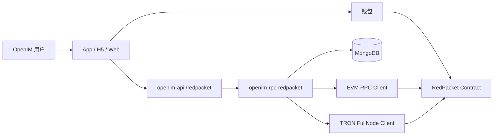
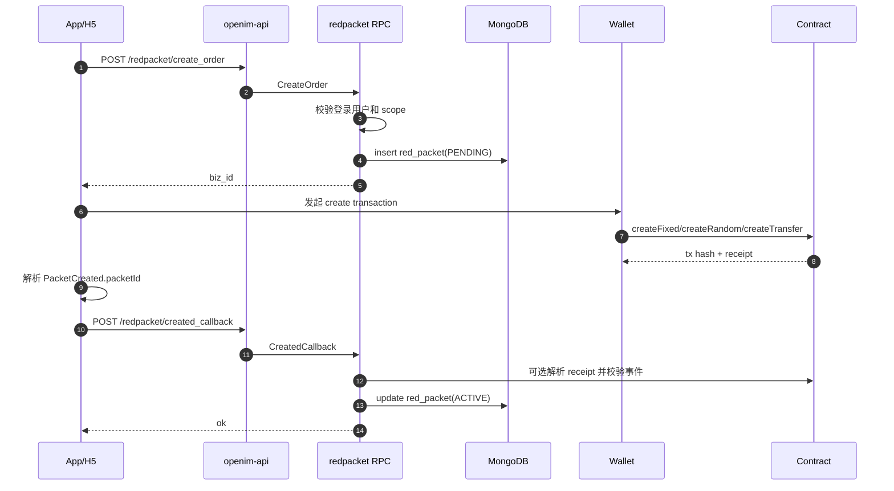
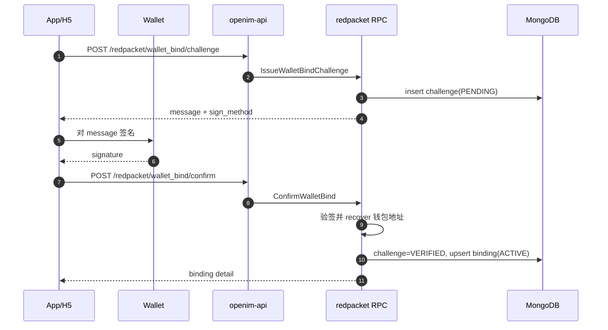
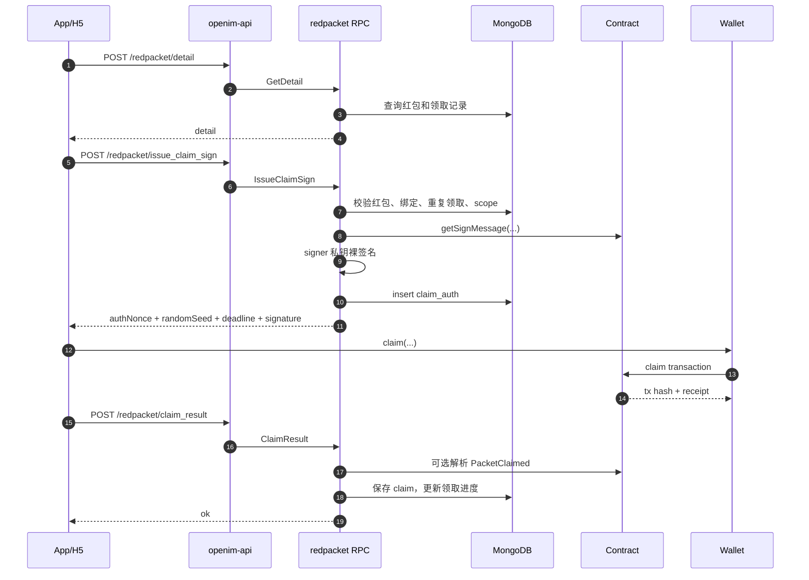

# RedPacket Web3 接入设计文档

本文档描述红包系统在当前 OpenIM 架构中的 Web3 接入设计。内容以当前代码为准，覆盖前端、钱包、API 网关、RPC 服务、MongoDB、EVM/TRON 合约交互与事件回写。

## 1. 设计目标

业务目标：

- 支持固定红包、拼手气红包、待领取转账
- 支持 EVM 链红包创建、领取签名、事件解析
- 支持 TRON 链配置预留与部分管理交易能力
- 支持用户钱包绑定，领取前强制校验“OpenIM 用户 ID + 钱包地址”的绑定关系
- 通过 API 网关对外提供 HTTP 接口，内部保持标准 OpenIM gRPC 服务形态

安全目标：

- 钱包归属必须先绑定后领取
- claim 授权必须绑定 `packetId + claimer + authNonce + randomSeed + deadline`
- 同一用户、同一钱包对同一红包都不能重复领取
- signer 私钥只用于 claim 授权，不用于合约配置
- 管理类交易与高频签名职责分离

工程目标：

- RPC 服务接入 OpenIM 的配置、服务发现、日志和 MongoDB 体系
- HTTP API 只做参数解析和 RPC 转发
- MongoDB 保存业务状态、签名授权、领取记录和钱包绑定关系
- 链上事件作为最终一致性的依据

## 2. 当前系统边界

已经实现：

- `openim-rpc-redpacket` 标准 RPC 入口
- `/redpacket/*` API 网关路由
- MongoDB 存储模型和 DAO
- EVM claim digest 获取、裸签名、事件解析
- EVM 钱包绑定验签
- TRON 钱包绑定 challenge 生成
- TRON admin transaction 调用框架
- 创建回写、领取回写、详情查询

仍需补齐：

- EVM admin 写链当前是 mock
- TRON 钱包绑定签名验签未实现
- TRON 交易事件解析未完整实现
- refund API 当前未对外暴露，仅有退款模型与事件预留
- 管理接口未做独立管理员鉴权
- 自动 indexer loop 当前只是配置和代码结构预留，主要回写仍依赖 callback / parse

## 3. 总体架构



模块职责：

- App/H5/Web：连接钱包、发起链上交易、调用后端接口、展示红包状态
- 钱包：签名交易、签名绑定 challenge、广播交易
- openim-api：解析 HTTP 请求、注入登录用户上下文、调用 gRPC client
- openim-rpc-redpacket：业务鉴权、签名、存储、链上 receipt 解析
- MongoDB：保存业务状态和审计数据
- RedPacket 合约：维护链上红包状态、验签、防重放、转账结算
- EVM/TRON client：链上读写、事件解析、管理交易预留

## 4. 核心数据模型

### 4.1 红包主记录

collection: `red_packet`

保存内容：

- `biz_id`: 后端业务单号，唯一
- `chain_type`: `EVM` 或 `TRON`
- `packet_id`: 链上红包 ID
- `chain_id`: 链 ID
- `contract_address`: 合约地址
- `creator_user_id`: OpenIM 发红包用户 ID
- `creator_wallet`: 发红包钱包地址
- `group_id`: 群红包所属群
- `scope_type`: `GROUP`、`DIRECT`、`PUBLIC`
- `receiver_user_id` / `receiver_user_ids`: 转账红包目标用户
- `packet_type`: `0` 固定、`1` 拼手气、`2` 转账
- `token`: token 地址
- `total_amount` / `total_shares`: 总金额与总份数
- `claimed_amount` / `claimed_shares`: 已领取进度
- `expiry_at`: 过期时间
- `tx_hash`: 创建交易 hash
- `status`: `PENDING`、`ACTIVE`、`COMPLETED`、`REFUNDED`

### 4.2 领取授权

collection: `red_packet_claim_auth`

保存每次签名发放：

- `packet_id`
- `claimer`
- `auth_nonce`
- `random_seed`
- `deadline`
- `signature`
- `used`
- `created_at`

`auth_nonce` 建唯一索引，用于防止重复授权 nonce。

### 4.3 领取记录

collection: `red_packet_claim`

保存链上领取回写结果：

- `packet_id`
- `user_id`
- `claimer_wallet`
- `auth_nonce`
- `claim_tx_hash`
- `claimed_amount`
- `block_number`
- `status`

重复领取判断同时检查：

- `packet_id + user_id`
- `packet_id + claimer_wallet`

### 4.4 钱包绑定

collection:

- `wallet_binding_challenge`
- `wallet_binding`

绑定流程先保存 challenge，验签通过后 upsert active binding。领取签名前必须存在 `ACTIVE` 绑定。

## 5. 创建红包流程



关键规则：

- `biz_id` 由后端生成，链上没有该字段
- `packet_id` 的可信来源是 `PacketCreated`
- 业务单先落 `PENDING`，链上确认后更新为 `ACTIVE`
- 如果 EVM client 可用，后端会校验 receipt 事件与业务单参数是否一致
- `creator_user_id` 从 token 上下文获取，不能由前端传入

scope 规则：

- `PUBLIC`: 公开红包，不要求 `group_id`
- `GROUP`: 群红包，必须传 `group_id`
- `DIRECT`: 指定用户红包，必须传 `receiver_user_id` 或 `receiver_user_ids`

## 6. 钱包绑定流程



EVM 绑定：

- 使用 SIWE 风格 message
- `sign_method=personal_sign`
- 后端使用 Ethereum Signed Message 前缀 recover 地址
- recover 地址必须等于 challenge 的 `wallet_address`

TRON 绑定：

- 当前仅生成 challenge
- `sign_method=signMessageV2`
- confirm 阶段尚未实现验签

安全边界：

- challenge 默认 10 分钟过期
- challenge 只能从 `PENDING` 确认一次
- 领取签名前必须查询到 active binding

## 7. 领取红包流程



领取前后端校验：

- 登录用户存在
- 红包存在
- 红包状态为 `ACTIVE`
- 红包未过期
- 当前用户绑定了 `claimer` 钱包
- 当前用户未领取
- 当前钱包未领取
- 群红包必须有关联群
- 转账红包必须匹配指定接收用户

claim 签名字段：

- `packetId`
- `claimer`
- `authNonce`
- `randomSeed`
- `deadline`

前端必须原样把后端返回的参数传给合约 `claim(...)`。任一字段变化都会导致验签失败。

## 8. 管理配置流程

管理员接口位于：

```text
/redpacket/admin/*
```

当前对外接口：

- `set_signer`
- `set_token`
- `set_expiry`
- `set_allow_all_tokens`
- `set_native_token_enabled`
- `parse_tx_events`

设计分权：

- owner / 多签：最高权限
- config admin：低频参数配置
- signer：高频 claim 授权签名

当前实现边界：

- EVM 管理接口是 mock，只返回成功 message
- TRON 管理接口会尝试通过 FullNode 发交易
- API 层未做独立管理员角色校验，生产必须补齐

## 9. 事件与最终一致性

核心事件：

- `PacketCreated`: 创建成功，获得链上 `packetId`
- `PacketClaimed`: 领取成功，获得真实领取金额
- `PacketRefunded`: 退款成功，获得退款目标与金额

当前一致性策略：

- 创建阶段由 `created_callback` 回写，并在 EVM client 可用时解析 receipt 校验
- 领取阶段由 `claim_result` 先保存 `PENDING`，能解析 receipt 时立即确认
- 后续 indexer 可基于 `indexer.pollInterval` 扩展为后台轮询与补偿

幂等建议：

- 以 `tx_hash` 做领取回写幂等
- 以 `biz_id` 做创建业务单幂等
- 以 `packet_id + user_id` 和 `packet_id + claimer_wallet` 做重复领取判断
- 事件重复消费时，只允许状态向前推进，不回退已确认状态

## 10. API 设计摘要

用户侧：

- `POST /redpacket/create_order`: 创建业务单
- `POST /redpacket/created_callback`: 创建交易回写
- `POST /redpacket/detail`: 查询红包详情
- `POST /redpacket/issue_claim_sign`: 领取签名发放
- `POST /redpacket/claim_result`: 领取交易回写
- `POST /redpacket/wallet_bind/challenge`: 钱包绑定 challenge
- `POST /redpacket/wallet_bind/confirm`: 钱包绑定确认
- `POST /redpacket/wallet_bind/detail`: 查询当前用户的钱包绑定

管理员侧：

- `POST /redpacket/admin/set_signer`
- `POST /redpacket/admin/set_token`
- `POST /redpacket/admin/set_expiry`
- `POST /redpacket/admin/set_allow_all_tokens`
- `POST /redpacket/admin/set_native_token_enabled`
- `POST /redpacket/admin/parse_tx_events`

## 11. 前端接入建议

创建页：

1. 用户选择红包类型、金额、份数、过期时间和链
2. 调用 `create_order`
3. 钱包发起链上创建交易
4. 从 receipt 解析 `PacketCreated.packetId`
5. 调用 `created_callback`
6. 展示分享页或详情页

领取页：

1. 查询 `detail`
2. 检查当前钱包是否已绑定
3. 未绑定则先走 wallet bind
4. 调用 `issue_claim_sign`
5. 钱包发起 `claim(...)`
6. 调用 `claim_result`
7. 刷新 `detail`

钱包绑定页：

1. 获取当前钱包地址和 chain type
2. 调用 `wallet_bind/challenge`
3. 按 `sign_method` 调钱包签名
4. 调用 `wallet_bind/confirm`
5. 调用 `wallet_bind/detail` 验证绑定状态

## 12. 风险与待办

必须尽快处理：

- 修复 `protocol/redpacket/redpacket.proto` 与当前 `internal/api` / `internal/rpc` 使用的 protobuf 类型不一致问题
- 补充管理员接口的 OpenIM 管理员权限校验
- 移除或保护 placeholder signature 降级路径
- EVM admin 从 mock 改为真实交易或明确只允许前端钱包管理

按业务优先级处理：

- 补齐 TRON 绑定验签
- 补齐 TRON 事件解析
- 增加 refund HTTP/RPC 接口
- 增加后台 indexer loop 与事件补偿
- 增加管理员操作审计 collection

上线检查：

- API 网关能发现 `redPacket` RPC 服务
- MongoDB 索引创建成功
- signer 地址与合约 signer 一致
- EVM RPC 能稳定获取 receipt
- claim 签名在测试链可通过合约验签
- 钱包绑定 recover 地址与实际钱包一致

## 13. 总结

当前 RedPacket 的核心链路是：

```text
OpenIM 登录身份
  -> 钱包绑定
  -> 业务鉴权
  -> 后端 signer 裸签 claim digest
  -> 前端钱包发 claim 交易
  -> 链上事件回写 MongoDB
```

这条链路把“谁是 OpenIM 用户”“谁控制钱包”“谁有资格领取”“链上是否最终成功”分成四层校验，后端只签发授权，不直接替用户领取，从而保持用户资产操作仍由钱包确认。
