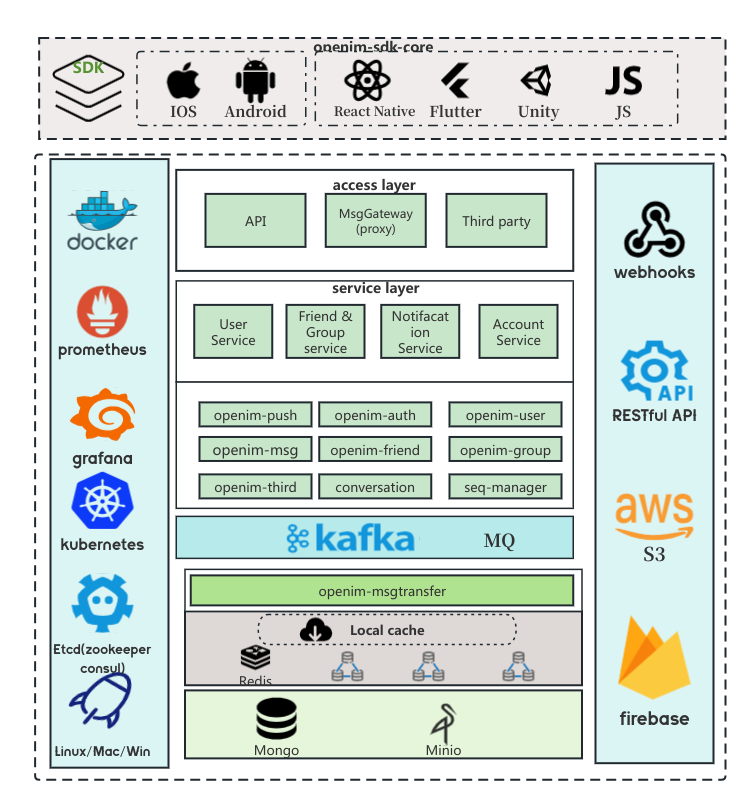

    

  <a href="../../README.md">English</a> · 
  <a href="../../README_zh_CN.md">中文</a> · 
  <a href="./README_uk.md">Українська</a> · 
  <a href="./README_cs.md">Česky</a> · 
  <a href="./README_hu.md">Magyar</a> · 
  <a href="./README_es.md">Español</a> · 
  <a href="./README_fa.md">فارسی</a> · 
  <a href="./README_fr.md">Français</a> · 
  <a href="./README_de.md">Deutsch</a> · 
  <a href="./README_pl.md">Polski</a> · 
  <a href="./README_id.md">Indonesian</a> · 
  <a href="./README_fi.md">Suomi</a> · 
  <a href="./README_ml.md">മലയാളം</a> · 
  <a href="./README_ja.md">日本語</a> · 
  <a href="./README_nl.md">Nederlands</a> · 
  <a href="./README_it.md">Italiano</a> · 
  <a href="./README_ru.md">Русский</a> · 
  <a href="./README_pt_BR.md">Português (Brasil)</a> · 
  <a href="./README_eo.md">Esperanto</a> · 
  <a href="./README_ko.md">한국어</a> · 
  <a href="./README_ar.md">العربي</a> · 
  <a href="./README_vi.md">Tiếng Việt</a> · 
  <a href="./README_da.md">Dansk</a> · 
  <a href="./README_el.md">Ελληνικά</a> · 
  <a href="./README_tr.md">Türkçe</a>

## Ⓜ️ OpenIM について

OpenIM は、アプリケーション内でチャット、音声通話、通知、AI チャットボットなどの通信機能を統合するために特別に設計されたサービスプラットフォームです。一連の強力な API と Webhooks を提供することで、開発者はアプリケーションに簡単にこれらの通信機能を統合できます。OpenIM 自体は独立したチャットアプリではなく、アプリケーションにサポートを提供し、豊富な通信機能を実現するプラットフォームです。以下の図は、AppServer、AppClient、OpenIMServer、OpenIMSDK 間の相互作用を示しています。

## 🚀 OpenIMSDK について

**OpenIMSDK**は、**OpenIMServer**用に設計された IM SDK で、クライアントアプリケーションに組み込むためのものです。主な機能とモジュールは以下の通りです：

- 🌟 主な機能：

  - 📦 ローカルストレージ
  - 🔔 リスナーコールバック
  - 🛡️ API のラッピング
  - 🌐 接続管理

  ## 📚 主なモジュール：

  1. 🚀 初初期化とログイン
  2. 👤 ユーザー管理
  3. 👫 友達管理
  4. 🤖 グループ機能
  5. 💬 会話処理

Golang を使用して構築され、クロスプラットフォームの導入をサポートし、すべてのプラットフォームで一貫したアクセス体験を提供します。

👉 **[GO SDK を探索する](https://github.com/openimsdk/openim-sdk-core)**

## 🌐 OpenIMServer について

- **OpenIMServer** には以下の特徴があります：
  - 🌐 マイクロサービスアーキテクチャ：クラスターモードをサポートし、ゲートウェイ（gateway）と複数の rpc サービスを含みます。
  - 🚀 多様なデプロイメント方法：ソースコード、kubernetes、または docker でのデプロイメントをサポートします。
  - 海量ユーザーサポート：十万人規模の超大型グループ、千万人のユーザー、および百億のメッセージ

### 強化されたビジネス機能：

- **REST API**：OpenIMServer は、ビジネスシステム用の REST API を提供しており、ビジネスにさらに多くの機能を提供することを目指しています。たとえば、バックエンドインターフェースを通じてグループを作成したり、プッシュメッセージを送信したりするなどです。
- **Webhooks**：OpenIMServer は、より多くのビジネス形態を拡張するためのコールバック機能を提供しています。コールバックとは、特定のイベントが発生する前後に、OpenIMServer がビジネスサーバーにリクエストを送信することを意味します。例えば、メッセージ送信の前後のコールバックなどです。

👉 **[もっと詳しく知る](https://docs.openim.io/guides/introduction/product)**

## :building_construction: 全体のアーキテクチャ

Open-IM-Server の機能の核心に迫るために、アーキテクチャダイアグラムをご覧ください。

## :rocket: クイックスタート

iOS/Android/H5/PC/Web でのオンライン体験：

👉 **[OpenIM online demo](https://www.openim.io/zh/commercial)**

🤲 ユーザー体験を容易にするために、私たちは様々なデプロイメントソリューションを提供しています。以下のリストから、ご自身のデプロイメント方法を選択できます：

- **[ソースコードデプロイメントガイド](https://docs.openim.io/guides/gettingStarted/imSourceCodeDeployment)**
- **[Docker デプロイメントガイド](https://docs.openim.io/guides/gettingStarted/dockerCompose)**
- **[Kubernetes デプロイメントガイド](https://docs.openim.io/guides/gettingStarted/k8s-deployment)**
- **[Mac 開発者向けデプロイメントガイド](https://docs.openim.io/guides/gettingstarted/mac-deployment-guide)**

## :hammer_and_wrench: OpenIM の開発を始める

OpenIM 私たちの目標は、トップレベルのオープンソースコミュニティを構築することです。[コミュニティリポジトリ](https://github.com/OpenIMSDK/community)には一連の基準があります。

この Open-IM-Server リポジトリに貢献したい場合は、[貢献者ドキュメントをお読みください](https://github.com/openimsdk/open-im-server/blob/main/CONTRIBUTING.md)。

始める前に、変更に必要があることを確認してください。最良の方法は、[新しいディスカッション](https://github.com/openimsdk/open-im-server/discussions/new/choose)や[Slack](https://join.slack.com/t/openimsdk/shared_invite/zt-2ijy1ys1f-O0aEDCr7ExRZ7mwsHAVg9A)での通信を作成すること、または問題を発見した場合は、まずそれを[報告](https://github.com/openimsdk/open-im-server/issues/new/choose)することです。

- [OpenIM API リファレンス](https://github.com/openimsdk/open-im-server/tree/main/docs/contrib/api.md)
- [OpenIM Bash ロギング](https://github.com/openimsdk/open-im-server/tree/main/docs/contrib/bash-log.md)
- [OpenIM CI/CD アクション](https://github.com/openimsdk/open-im-server/tree/main/docs/contrib/cicd-actions.md)
- [OpenIM コード規約](https://github.com/openimsdk/open-im-server/tree/main/docs/contrib/code-conventions.md)
- [OpenIM コミットガイドライン](https://github.com/openimsdk/open-im-server/tree/main/docs/contrib/commit.md)
- [OpenIM 開発ガイド](https://github.com/openimsdk/open-im-server/tree/main/docs/contrib/development.md)
- [OpenIM ディレクトリ構造](https://github.com/openimsdk/open-im-server/tree/main/docs/contrib/directory.md)
- [OpenIM 環境設定](https://github.com/openimsdk/open-im-server/tree/main/docs/contrib/environment.md)
- [OpenIM エラーコードリファレンス](https://github.com/openimsdk/open-im-server/tree/main/docs/contrib/error-code.md)
- [OpenIM Git ワークフロー](https://github.com/openimsdk/open-im-server/tree/main/docs/contrib/git-workflow.md)
- [OpenIM Git チェリーピックガイド](https://github.com/openimsdk/open-im-server/tree/main/docs/contrib/gitcherry-pick.md)
- [OpenIM GitHub ワークフロー](https://github.com/openimsdk/open-im-server/tree/main/docs/contrib/github-workflow.md)
- [OpenIM Go コード基準](https://github.com/openimsdk/open-im-server/tree/main/docs/contrib/go-code.md)
- [OpenIM 画像ガイドライン](https://github.com/openimsdk/open-im-server/tree/main/docs/contrib/images.md)
- [OpenIM 初期設定](https://github.com/openimsdk/open-im-server/tree/main/docs/contrib/init-config.md)
- [OpenIM Docker インストールガイド](https://github.com/openimsdk/open-im-server/tree/main/docs/contrib/install-docker.md)
- [OpenIM Linux システムインストール](https://github.com/openimsdk/open-im-server/tree/main/docs/contrib/install-openim-linux-system.md)
- [OpenIM Linux 開発ガイド](https://github.com/openimsdk/open-im-server/tree/main/docs/contrib/linux-development.md)
- [OpenIM ローカルアクションガイド](https://github.com/openimsdk/open-im-server/tree/main/docs/contrib/local-actions.md)
- [OpenIM ロギング規約](https://github.com/openimsdk/open-im-server/tree/main/docs/contrib/logging.md)
- [OpenIM オフラインデプロイメント](https://github.com/openimsdk/open-im-server/tree/main/docs/contrib/offline-deployment.md)
- [OpenIM Protoc ツール](https://github.com/openimsdk/open-im-server/tree/main/docs/contrib/protoc-tools.md)
- [OpenIM テスティングガイド](https://github.com/openimsdk/open-im-server/tree/main/docs/contrib/test.md)
- [OpenIM ユーティリティ Go](https://github.com/openimsdk/open-im-server/tree/main/docs/contrib/util-go.md)
- [OpenIM Makefile ユーティリティ](https://github.com/openimsdk/open-im-server/tree/main/docs/contrib/util-makefile.md)
- [OpenIM スクリプトユーティリティ](https://github.com/openimsdk/open-im-server/tree/main/docs/contrib/util-scripts.md)
- [OpenIM バージョニング](https://github.com/openimsdk/open-im-server/tree/main/docs/contrib/version.md)
- [バックエンド管理とモニターデプロイメント](https://github.com/openimsdk/open-im-server/tree/main/docs/contrib/prometheus-grafana.md)
- [OpenIM 用 Mac 開発者デプロイメントガイド](https://github.com/openimsdk/open-im-server/tree/main/docs/contrib/mac-developer-deployment-guide.md)

## :busts_in_silhouette: コミュニティ

- 📚 [OpenIM コミュニティ](https://github.com/OpenIMSDK/community)
- 💕 [OpenIM 興味グループ](https://github.com/Openim-sigs)
- 🚀 [私たちの Slack コミュニティに参加する](https://join.slack.com/t/openimsdk/shared_invite/zt-2ijy1ys1f-O0aEDCr7ExRZ7mwsHAVg9A)
- :eyes: [私たちの WeChat（微信群）に参加する](https://openim-1253691595.cos.ap-nanjing.myqcloud.com/WechatIMG20.jpeg)

## :calendar: コミュニティミーティング

私たちは、誰もがコミュニティに参加し、コードに貢献してもらいたいと考えています。私たちは、ギフトや報酬を提供し、毎週木曜日の夜に参加していただくことを歓迎します。

私たちの会議は[OpenIM Slack](https://join.slack.com/t/openimsdk/shared_invite/zt-2ijy1ys1f-O0aEDCr7ExRZ7mwsHAVg9A)🎯 で行われます。そこで Open-IM-Server パイプラインを検索して参加できます。

私たちは[隔週の会議](https://github.com/orgs/OpenIMSDK/discussions/categories/meeting)のメモを[GitHub ディスカッション](https://github.com/openimsdk/open-im-server/discussions/categories/meeting)に記録しています。歴史的な会議のメモや会議のリプレイは[Google Docs📑](https://docs.google.com/document/d/1nx8MDpuG74NASx081JcCpxPgDITNTpIIos0DS6Vr9GU/edit?usp=sharing)で利用可能です。

## :eyes: OpenIM を使用している人たち

プロジェクトユーザーのリストについては、[ユーザーケーススタディ](https://github.com/OpenIMSDK/community/blob/main/ADOPTERS.md)ページをご覧ください。[コメント 📝](https://github.com/openimsdk/open-im-server/issues/379)を残して、あなたの使用例を共有することを躊躇しないでください。

## :page_facing_up: ライセンス

OpenIM は Apache 2.0 ライセンスの下でライセンスされています。完全なライセンステキストについては、[LICENSE](https://github.com/openimsdk/open-im-server/tree/main/LICENSE)を参照してください。

このリポジトリに表示される[OpenIM](https://github.com/openimsdk/open-im-server)ロゴ、そのバリエーション、およびアニメーションバージョン（[assets/logo](./assets/logo)および[assets/logo-gif](assets/logo-gif)ディレクトリ内）は、著作権法によって保護されています。

## 🔮 貢献者の皆様に感謝します！

