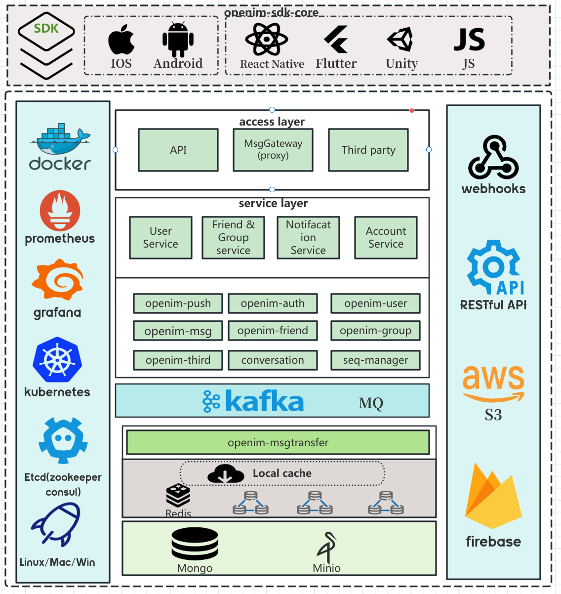

    

  <a href="../../README.md">English</a> · 
  <a href="../../README_zh_CN.md">中文</a> · 
  <a href="./README_uk.md">Українська</a> · 
  <a href="./README_cs.md">Česky</a> · 
  <a href="./README_hu.md">Magyar</a> · 
  <a href="./README_es.md">Español</a> · 
  <a href="./README_fa.md">فارسی</a> · 
  <a href="./README_fr.md">Français</a> · 
  <a href="./README_de.md">Deutsch</a> · 
  <a href="./README_pl.md">Polski</a> · 
  <a href="./README_id.md">Indonesian</a> · 
  <a href="./README_fi.md">Suomi</a> · 
  <a href="./README_ml.md">മലയാളം</a> · 
  <a href="./README_ja.md">日本語</a> · 
  <a href="./README_nl.md">Nederlands</a> · 
  <a href="./README_it.md">Italiano</a> · 
  <a href="./README_ru.md">Русский</a> · 
  <a href="./README_pt_BR.md">Português (Brasil)</a> · 
  <a href="./README_eo.md">Esperanto</a> · 
  <a href="./README_ko.md">한국어</a> · 
  <a href="./README_ar.md">العربي</a> · 
  <a href="./README_vi.md">Tiếng Việt</a> · 
  <a href="./README_da.md">Dansk</a> · 
  <a href="./README_el.md">Ελληνικά</a> · 
  <a href="./README_tr.md">Türkçe</a>

## Ⓜ️ OpenIM Hakkında

OpenIM, uygulamalara sohbet, sesli-görüntülü aramalar, bildirimler ve AI sohbet robotları entegre etmek için özel olarak tasarlanmış bir hizmet platformudur. Güçlü API'ler ve Webhook'lar sunarak, geliştiricilerin bu etkileşimli özellikleri uygulamalarına kolayca dahil etmelerini sağlar. OpenIM bağımsız bir sohbet uygulaması değildir, ancak zengin iletişim işlevselliği sağlama amacıyla diğer uygulamaları destekleyen bir platform olarak hizmet verir. Aşağıdaki diyagram, AppServer, AppClient, OpenIMServer ve OpenIMSDK arasındaki etkileşimi detaylandırmak için açıklar.

## 🚀 OpenIMSDK Hakkında

**OpenIMSDK**, müşteri uygulamalarına gömülmek üzere özel olarak oluşturulan **OpenIMServer** için tasarlanmış bir IM SDK'sıdır. Ana özellikleri ve modülleri aşağıdaki gibidir:

- 🌟 Ana Özellikler:

  - 📦 Yerel depolama
  - 🔔 Dinleyici geri çağırmaları
  - 🛡️ API sarımı
  - 🌐 Bağlantı yönetimi

  ## 📚 Ana Modüller:

  1. 🚀 Başlatma ve Giriş
  2. 👤 Kullanıcı Yönetimi
  3. 👫 Arkadaş Yönetimi
  4. 🤖 Grup Fonksiyonları
  5. 💬 Konuşma Yönetimi

Golang kullanılarak inşa edilmiş ve tüm platformlarda tutarlı bir erişim deneyimi sağlayacak şekilde çapraz platform dağıtımını destekler.

👉 **[GO SDK Keşfet](https://github.com/openimsdk/openim-sdk-core)**

## 🌐 OpenIMServer Hakkında

- **OpenIMServer** aşağıdaki özelliklere sahiptir:
  - 🌐 Mikroservis mimarisi: Bir kapı ve çoklu rpc servisleri içeren küme modunu destekler.
  - 🚀 Çeşitli dağıtım yöntemleri: Kaynak kodu, Kubernetes veya Docker aracılığıyla dağıtımı destekler.
  - Büyük kullanıcı tabanı desteği: Yüz binlerce kullanıcısı olan süper büyük gruplar, on milyonlarca kullanıcı ve milyarlarca mesaj.

### Geliştirilmiş İşlevsellik:

- **REST API**：OpenIMServer, işletmeleri gruplar oluşturma ve arka plan arayüzleri aracılığıyla itme mesajları gönderme gibi daha fazla işlevsellikle güçlendirmeyi amaçlayan iş sistemleri için REST API'leri sunar.
- **Webhooks**：OpenIMServer, daha fazla iş formunu genişletme yetenekleri sağlayan geri çağırma özellikleri sunar. Geri çağırma, OpenIMServer'ın belirli bir olaydan önce veya sonra, örneğin bir mesaj göndermeden önce veya sonra iş sunucusuna bir istek göndermesi anlamına gelir.

👉 **[Daha fazla bilgi edinin](https://docs.openim.io/guides/introduction/product)**

## :building_construction: Genel Mimarisi

Mimari diyagramımızla Open-IM-Server'ın işlevselliğinin kalbine dalın.

## :rocket: Hızlı Başlangıç

Birçok platformu destekliyoruz. Web tarafında hızlı deneyim için adresler şunlardır:

👉 **[OpenIM online demo](https://www.openim.io/zh/commercial)**

🤲 Kullanıcı deneyimini kolaylaştırmak için çeşitli dağıtım çözümleri sunuyoruz. Aşağıdaki listeden dağıtım yönteminizi seçebilirsiniz:

- **[Kaynak Kodu Dağıtım Kılavuzu](https://docs.openim.io/guides/gettingStarted/imSourceCodeDeployment)**
- **[Docker Dağıtım Kılavuzu](https://docs.openim.io/guides/gettingStarted/dockerCompose)**
- **[Kubernetes Dağıtım Kılavuzu](https://docs.openim.io/guides/gettingStarted/k8s-deployment)**
- **[Mac Geliştirici Dağıtım Kılavuzu](https://docs.openim.io/guides/gettingstarted/mac-deployment-guide)**

## :hammer_and_wrench: OpenIM Geliştirmeye Başlamak

OpenIM Amacımız, üst düzey bir açık kaynak topluluğu oluşturmaktır. [Topluluk deposunda](https://github.com/OpenIMSDK/community) bir dizi standartımız var.

Bu Open-IM-Server deposuna katkıda bulunmak istiyorsanız, lütfen katkıda bulunanlar için [dokümantasyonumuzu](https://github.com/openimsdk/open-im-server/blob/main/CONTRIBUTING.md) okuyun.

Başlamadan önce, lütfen değişikliklerinizin talep edildiğinden emin olun. Bunun için en iyisi, [yeni bir tartışma OLUŞTURMAK](https://github.com/openimsdk/open-im-server/discussions/new/choose) veya [Slack İletişimi](https://join.slack.com/t/openimsdk/shared_invite/zt-2ijy1ys1f-O0aEDCr7ExRZ7mwsHAVg9A) kurmak, ya da bir sorun bulursanız, önce bunu [rapor](https://github.com/openimsdk/open-im-server/issues/new/choose) etmektir.

- [OpenIM API Referansı](https://github.com/openimsdk/open-im-server/tree/main/docs/contrib/api.md)
- [OpenIM Bash Günlüğü](https://github.com/openimsdk/open-im-server/tree/main/docs/contrib/bash-log.md)
- [OpenIM CI/CD İşlemleri](https://github.com/openimsdk/open-im-server/tree/main/docs/contrib/cicd-actions.md)
- [OpenIM Kod Kuralları](https://github.com/openimsdk/open-im-server/tree/main/docs/contrib/code-conventions.md)
- [OpenIM Taahhüt Kuralları](https://github.com/openimsdk/open-im-server/tree/main/docs/contrib/commit.md)
- [OpenIM Geliştirme Kılavuzu](https://github.com/openimsdk/open-im-server/tree/main/docs/contrib/development.md)
- [OpenIM Dizin Yapısı](https://github.com/openimsdk/open-im-server/tree/main/docs/contrib/directory.md)
- [OpenIM Ortam Kurulumu](https://github.com/openimsdk/open-im-server/tree/main/docs/contrib/environment.md)
- [OpenIM Hata Kodu Referansı](https://github.com/openimsdk/open-im-server/tree/main/docs/contrib/error-code.md)
- [OpenIM Git İş Akışı](https://github.com/openimsdk/open-im-server/tree/main/docs/contrib/git-workflow.md)
- [OpenIM Git Cherry Pick Kılavuzu](https://github.com/openimsdk/open-im-server/tree/main/docs/contrib/gitcherry-pick.md)
- [OpenIM GitHub İş Akışı](https://github.com/openimsdk/open-im-server/tree/main/docs/contrib/github-workflow.md)
- [OpenIM Go Kod Standartları](https://github.com/openimsdk/open-im-server/tree/main/docs/contrib/go-code.md)
- [OpenIM Görüntü Kuralları](https://github.com/openimsdk/open-im-server/tree/main/docs/contrib/images.md)
- [OpenIM İlk Yapılandırma](https://github.com/openimsdk/open-im-server/tree/main/docs/contrib/init-config.md)
- [OpenIM Docker Kurulum Kılavuzu](https://github.com/openimsdk/open-im-server/tree/main/docs/contrib/install-docker.md)
- [OpenIM Linux Sistem Kurulumu](https://github.com/openimsdk/open-im-server/tree/main/docs/contrib/install-openim-linux-system.md)
- [OpenIM Linux Geliştirme Kılavuzu](https://github.com/openimsdk/open-im-server/tree/main/docs/contrib/linux-development.md)
- [OpenIM Yerel İşlemler Kılavuzu](https://github.com/openimsdk/open-im-server/tree/main/docs/contrib/local-actions.md)
- [OpenIM Günlük Kuralları](https://github.com/openimsdk/open-im-server/tree/main/docs/contrib/logging.md)
- [OpenIM Çevrimdışı Dağıtım](https://github.com/openimsdk/open-im-server/tree/main/docs/contrib/offline-deployment.md)
- [OpenIM Protoc Araçları](https://github.com/openimsdk/open-im-server/tree/main/docs/contrib/protoc-tools.md)
- [OpenIM Test Kılavuzu](https://github.com/openimsdk/open-im-server/tree/main/docs/contrib/test.md)
- [OpenIM Yardımcı Go](https://github.com/openimsdk/open-im-server/tree/main/docs/contrib/util-go.md)
- [OpenIM Makefile Yardımcı Programları](https://github.com/openimsdk/open-im-server/tree/main/docs/contrib/util-makefile.md)
- [OOpenIM Betik Yardımcı Programları](https://github.com/openimsdk/open-im-server/tree/main/docs/contrib/util-scripts.md)
- [OpenIM Sürümleme](https://github.com/openimsdk/open-im-server/tree/main/docs/contrib/version.md)
- [Arka uç yönetimi ve izleme dağıtımı](https://github.com/openimsdk/open-im-server/tree/main/docs/contrib/prometheus-grafana.md)
- [Mac Geliştirici Dağıtım Kılavuzu for OpenIM](https://github.com/openimsdk/open-im-server/tree/main/docs/contrib/mac-developer-deployment-guide.md)

## :busts_in_silhouette: Topluluk

- 📚 [OpenIM Topluluğu](https://github.com/OpenIMSDK/community)
- 💕 [OpenIM İlgi Grubu](https://github.com/Openim-sigs)
- 🚀 [Slack topluluğumuza katılın](https://join.slack.com/t/openimsdk/shared_invite/zt-2ijy1ys1f-O0aEDCr7ExRZ7mwsHAVg9A)
- :eyes: [Wechat grubumuza katılın (微信群)](https://openim-1253691595.cos.ap-nanjing.myqcloud.com/WechatIMG20.jpeg)

## :calendar: Topluluk Toplantıları

Topluluğumuza herkesin katılmasını ve kod katkısında bulunmasını istiyoruz, hediyeler ve ödüller sunuyoruz ve sizi her Perşembe gecesi bize katılmaya davet ediyoruz.

Konferansımız [OpenIM Slack'te](https://join.slack.com/t/openimsdk/shared_invite/zt-2ijy1ys1f-O0aEDCr7ExRZ7mwsHAVg9A) 🎯, ardından Open-IM-Server boru hattını arayıp katılabilirsiniz.

İki haftada bir yapılan toplantının [notlarını](https://github.com/orgs/OpenIMSDK/discussions/categories/meeting) [GitHub tartışmalarında alıyoruz](https://github.com/openimsdk/open-im-server/discussions/categories/meeting), Tarihi toplantı notlarımız ve toplantıların tekrarları [Google Docs'ta](https://docs.google.com/document/d/1nx8MDpuG74NASx081JcCpxPgDITNTpIIos0DS6Vr9GU/edit?usp=sharing) 📑 mevcut.

## :eyes: Kimler OpenIM Kullanıyor

Proje kullanıcılarının bir listesi için [kullanıcı vaka çalışmaları](https://github.com/OpenIMSDK/community/blob/main/ADOPTERS.md) sayfamıza göz atın. Bir 📝[yorum](https://github.com/openimsdk/open-im-server/issues/379) bırakmaktan ve kullanım durumunuzu paylaşmaktan çekinmeyin.

## :page_facing_up: Lisans

OpenIM, Apache 2.0 lisansı altında lisanslanmıştır. Tam lisans metni için [LICENSE'ı](https://github.com/openimsdk/open-im-server/tree/main/LICENSE) görün.

Bu depoda, [assets/logo](../../assets/logo) ve [assets/logo-gif](../../assets/logo-gif) dizinlerinde görüntülenen [OpenIM](https://github.com/openimsdk/open-im-server) logosu, çeşitleri ve animasyonlu versiyonları, telif hakkı yasaları tarafından korunmaktadır.

## 🔮 Katkıda bulunanlarımıza teşekkürler!

