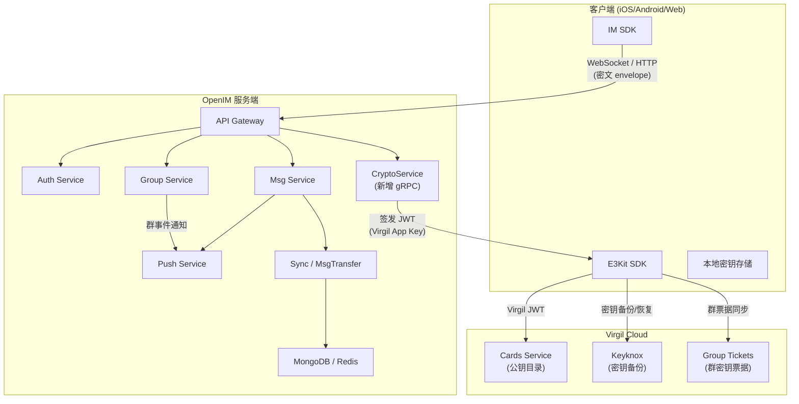
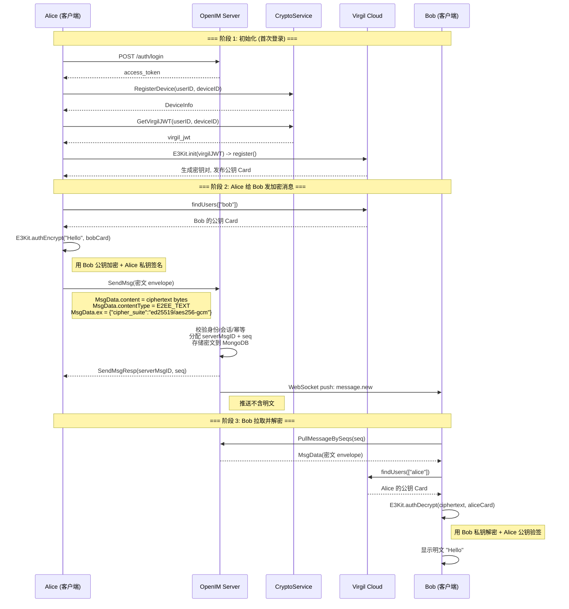
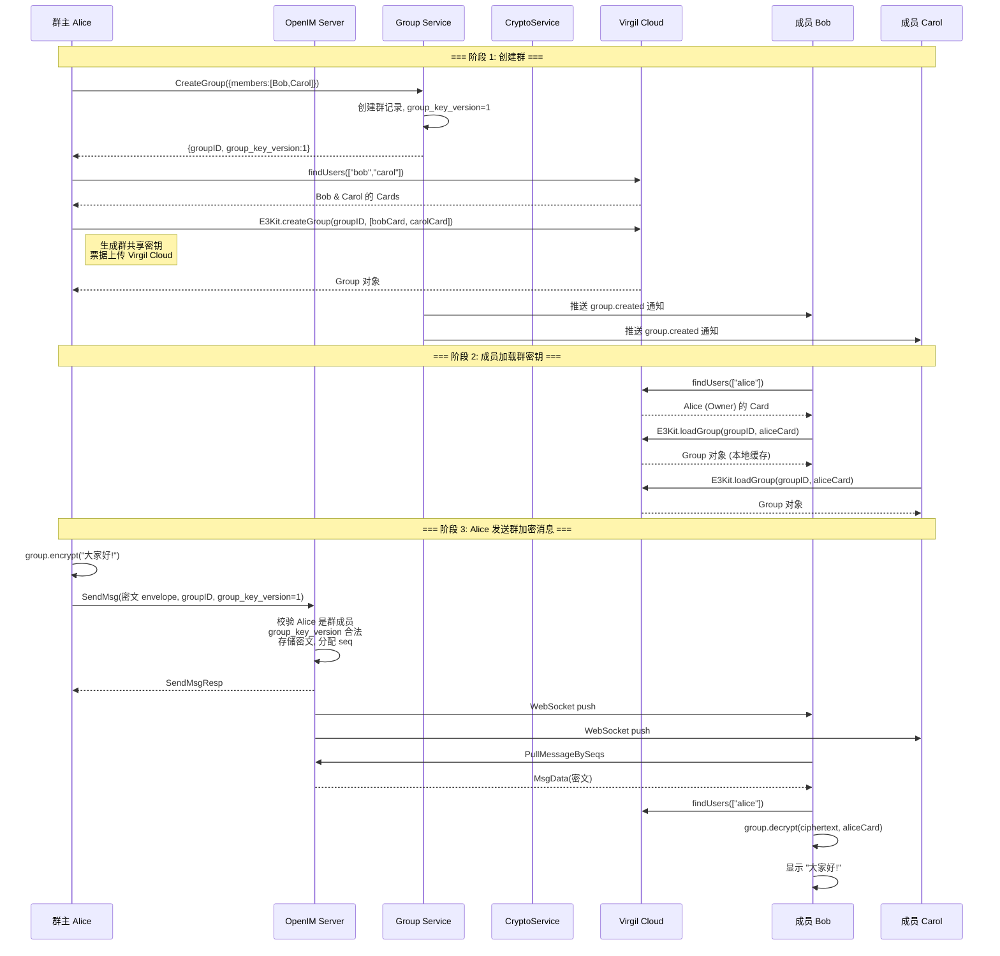
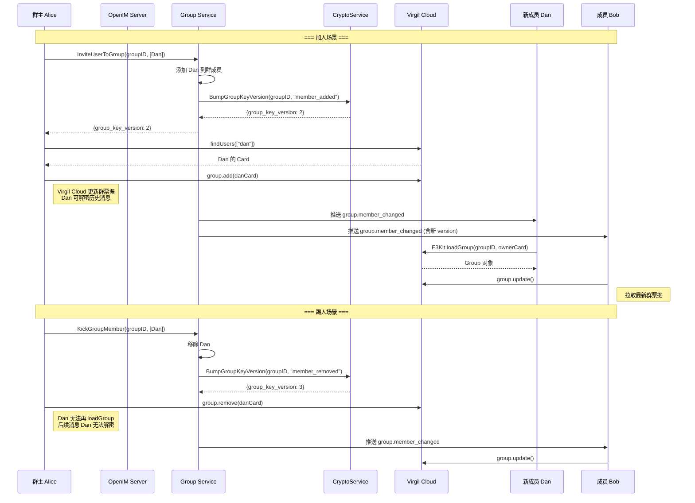
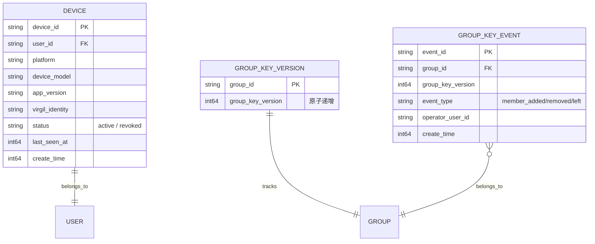

# 基于 Virgil Security E3Kit 的单聊 & 群聊最小落地方案

## 一、核心设计原则

| 原则 | 说明 |
|---|---|
| **服务端零知情** | 服务端只接触密文、元数据与业务控制，永远不触碰明文、私钥 |
| **客户端加解密** | 所有加密/解密/签名/验签均在客户端完成，使用 Virgil E3Kit SDK |
| **Virgil Cloud 托管公钥** | 用户公钥（Virgil Card）存储在 Virgil Cloud，服务端不保存 |
| **JWT 桥接认证** | 服务端用 Virgil App Key 签发 Virgil JWT，客户端持 JWT 与 Virgil Cloud 交互 |

## 二、整体架构图



**图意说明：**

1. 客户端持有 E3Kit SDK（负责加解密）和 IM SDK（负责业务通信），私钥存储在设备本地。
2. 服务端新增 `CryptoService` gRPC 服务，核心职责是签发 Virgil JWT 和管理群密钥版本号。
3. Virgil Cloud 承担公钥目录、密钥备份、群加密票据的托管。
4. 消息流：客户端加密 -> 密文 envelope 经 WebSocket/HTTP 到服务端 -> 服务端存储密文+路由 -> 接收端拉取密文 -> 客户端解密。
5. 服务端全程不接触明文，只处理密文 bytes 和元数据。

## 三、单聊方案

### 3.1 单聊加密模型

单聊使用 E3Kit 的 **Default Encryption**（最小 MVP）或 **Double Ratchet**（增强版，提供前向保密）。

MVP 阶段推荐 Default Encryption：

| 特性 | Default Encryption | Double Ratchet |
|---|---|---|
| 前向保密 | 否 | 是 |
| 实现复杂度 | 低 | 中 |
| 平台支持 | JS/Swift/Kotlin | Swift/Kotlin（JS 暂不支持） |
| 适用场景 | MVP 快速落地 | 安全性要求高的正式版 |

### 3.2 单聊时序图



**关键说明：**

- 边界条件：`findUsers` 结果应在客户端缓存，避免每条消息都查询 Virgil Cloud。
- 异常路径：若 Bob 的 Card 不存在（未注册 E3Kit），消息无法加密，客户端应提示“对方尚未启用加密”。
- 幂等性：消息幂等键 = `sendID + deviceID + clientMsgID`，服务端去重。
- 性能：E3Kit 加密单条消息主要是本地计算，通常瓶颈在网络链路而非加密。

### 3.3 单聊消息 Envelope 结构

消息体复用 OpenIM 现有的 `sdkws.MsgData`，加密信息通过现有字段承载：

```protobuf
message MsgData {
  string sendID = 1;
  string recvID = 2;
  string clientMsgID = 4;
  int32  sessionType = 9;     // 1=单聊
  int32  contentType = 11;    // 新增: 2001=E2EE_TEXT, 2002=E2EE_IMAGE, ...
  bytes  content = 12;        // 密文 ciphertext (E3Kit 加密输出)
  string ex = 23;             // JSON: {"envelope_version":1, "cipher_suite":"ed25519/aes256-gcm"}
  // ... 其余字段不变
}
```

不需要修改 proto 定义，只需约定 `contentType` 新值和 `ex` 字段的 JSON schema。

## 四、群聊方案

### 4.1 群聊加密模型

群聊使用 E3Kit 的 **Group Encryption**：

- 群主创建群时通过 `E3Kit.createGroup(groupId, members)` 生成群共享密钥票据。
- 票据存储在 Virgil Cloud，群成员通过 `E3Kit.loadGroup(groupId, ownerCard)` 加载。
- 新成员加入后通过 `group.add(newMemberCard)` 获得访问历史消息的能力。
- 成员移除后通过 `group.remove(memberCard)` 撤销访问权限，群密钥自动轮转。

### 4.2 群聊时序图 — 建群与首条消息



### 4.3 群成员变更与密钥轮转时序图



**关键说明：**

- 群密钥版本：每次成员变更，服务端 `group_key_version` +1，客户端据此判断是否需要 `group.update()`。
- 加人：新成员可解密加入前的历史消息（E3Kit Group 设计）。
- 踢人：被踢成员无法解密踢出后的新消息，但仍可解密踢出前已获取的消息（E2EE 的固有限制）。
- 并发：多个管理员同时操作成员时，`BumpGroupKeyVersion` 使用数据库原子递增保证版本一致。
- 性能：`group.update()` 涉及一次 Virgil Cloud 请求，建议客户端在收到 `group.member_changed` 通知后异步执行。

## 五、服务端接口清单

### 5.1 CryptoService（新增 gRPC 服务）

基于已有 `protocol/crypto/crypto.proto` 定义：

| RPC 接口 | 请求 | 响应 | 职责说明 |
|---|---|---|---|
| `RegisterDevice` | `RegisterDeviceReq` | `RegisterDeviceResp` | 注册设备，建立 `userID -> deviceID -> virgilIdentity` 映射 |
| `GetDevices` | `GetDevicesReq` | `GetDevicesResp` | 查询用户所有已注册设备 |
| `RevokeDevice` | `RevokeDeviceReq` | `RevokeDeviceResp` | 吊销设备，标记为 inactive |
| `GetVirgilJWT` | `GetVirgilJWTReq` | `GetVirgilJWTResp` | 为合法设备签发 Virgil JWT（核心接口） |
| `GetGroupKeyVersion` | `GetGroupKeyVersionReq` | `GetGroupKeyVersionResp` | 查询群当前密钥版本号 |
| `BumpGroupKeyVersion` | `BumpGroupKeyVersionReq` | `BumpGroupKeyVersionResp` | 群成员变更时递增密钥版本（Group Service 内部调用） |
| `GetGroupKeyEvents` | `GetGroupKeyEventsReq` | `GetGroupKeyEventsResp` | 查询密钥版本变更历史（客户端增量同步） |
| `SecurityPrecheck` | `SecurityPrecheckReq` | `SecurityPrecheckResp` | 安全前置校验（设备状态/风控） |
| `IntegrityReport` | `IntegrityReportReq` | `IntegrityReportResp` | 设备完整性上报 |

### 5.2 现有服务需要的改动

#### Auth Service

| 改动点 | 说明 |
|---|---|
| 登录响应增加字段 | 在 `ex` 或扩展字段中返回 `e2ee_enabled: true`，提示客户端初始化 E3Kit |

#### Msg Service

| 改动点 | 说明 |
|---|---|
| `SendMsg` 校验逻辑 | 当 `contentType` 位于 E2EE 区间时，跳过明文内容校验，仅校验 ciphertext 长度上限 |
| 消息存储 | `content` 字段直接存储密文 bytes，沿用现有存储路径 |
| 推送通知 | 推送 payload 中不携带 `content`，仅携带 `conversationID`、`senderNickname`、占位提示 |

#### Group Service

| 改动点 | 说明 |
|---|---|
| `CreateGroup` | 创建群时初始化 `group_key_version = 1` |
| `InviteUserToGroup` | 成功后调用 `CryptoService.BumpGroupKeyVersion(eventType="member_added")` |
| `KickGroupMember` | 成功后调用 `CryptoService.BumpGroupKeyVersion(eventType="member_removed")` |
| `QuitGroup` | 成功后调用 `CryptoService.BumpGroupKeyVersion(eventType="member_left")` |
| 通知 payload | `group.member_changed` 通知中携带最新 `group_key_version` |

### 5.3 服务端 HTTP API（Gateway 暴露）

```text
POST   /api/v1/crypto/device/register       -> CryptoService.RegisterDevice
GET    /api/v1/crypto/devices                -> CryptoService.GetDevices
POST   /api/v1/crypto/device/revoke          -> CryptoService.RevokeDevice
POST   /api/v1/crypto/virgil-jwt             -> CryptoService.GetVirgilJWT
GET    /api/v1/crypto/group-key-version      -> CryptoService.GetGroupKeyVersion
POST   /api/v1/crypto/group-key-version/bump -> CryptoService.BumpGroupKeyVersion
GET    /api/v1/crypto/group-key-events       -> CryptoService.GetGroupKeyEvents
POST   /api/v1/crypto/security-precheck      -> CryptoService.SecurityPrecheck
POST   /api/v1/crypto/integrity-report       -> CryptoService.IntegrityReport
```

## 六、客户端接口清单

### 6.1 E3Kit 封装层接口

| 接口 | 输入 | 输出 | 说明 |
|---|---|---|---|
| `initialize(tokenCallback)` | JWT 获取回调 | void | 初始化 E3Kit，设置 JWT 刷新回调 |
| `register()` | - | void | 首次注册：生成密钥对，发布 Virgil Card |
| `restorePrivateKey(password)` | 备份密码 | void | 从 Virgil Keyknox 恢复私钥（换设备场景） |
| `backupPrivateKey(password)` | 备份密码 | void | 备份私钥到 Virgil Keyknox |
| `findUsers(userIDs)` | 用户 ID 列表 | Map<ID, Card> | 批量查找用户公钥，结果缓存 |
| `cleanup()` | - | void | 登出时清理本地私钥 |
| `rotatePrivateKey()` | - | void | 私钥泄露时轮换密钥对 |

### 6.2 单聊加解密接口

| 接口 | 输入 | 输出 | 说明 |
|---|---|---|---|
| `encryptForUser(plaintext, recipientCard)` | 明文 + 接收者 Card | 密文 string | 用接收者公钥加密 + 发送者私钥签名 |
| `decryptFromUser(ciphertext, senderCard)` | 密文 + 发送者 Card | 明文 string | 用本地私钥解密 + 发送者公钥验签 |
| `encryptFileForUser(inputStream, recipientCard)` | 文件流 + Card | 加密流 | 大文件加密 |
| `decryptFileFromUser(inputStream, senderCard)` | 加密流 + Card | 明文流 | 大文件解密 |

### 6.3 群聊加解密接口

| 接口 | 输入 | 输出 | 说明 |
|---|---|---|---|
| `createGroup(groupID, memberCards)` | 群 ID + 成员 Cards | Group 对象 | 群主创建群加密上下文 |
| `loadGroup(groupID, ownerCard)` | 群 ID + 群主 Card | Group 对象 | 非群主加载群加密上下文 |
| `getGroup(groupID)` | 群 ID | Group / null | 从本地缓存获取群对象 |
| `updateGroup(groupID)` | 群 ID | void | 拉取最新群票据（成员变更后调用） |
| `addGroupMember(groupID, newMemberCard)` | 群 ID + 新成员 Card | void | 群主添加成员到加密上下文 |
| `removeGroupMember(groupID, memberCard)` | 群 ID + 成员 Card | void | 群主从加密上下文移除成员 |
| `deleteGroup(groupID)` | 群 ID | void | 群主删除群加密上下文 |
| `encryptForGroup(plaintext, group)` | 明文 + Group | 密文 string | 群消息加密 |
| `decryptFromGroup(ciphertext, senderCard, group)` | 密文 + 发送者 Card + Group | 明文 string | 群消息解密 + 验签 |

### 6.4 IM SDK 业务层接口

| 接口 | 说明 |
|---|---|
| `requestVirgilJWT()` | 调用服务端 `/crypto/virgil-jwt`，获取并缓存 Virgil JWT |
| `registerDevice()` | 调用服务端 `/crypto/device/register` |
| `sendEncryptedMessage(conversationID, plaintext)` | 加密 -> 构造 `MsgData`(E2EE contentType) -> `SendMsg` |
| `onReceiveEncryptedMessage(msgData)` | 判断 contentType -> 查找 senderCard -> 解密 -> 回调 UI |
| `onGroupMemberChanged(groupID, newVersion)` | 收到通知后调用 `updateGroup()` 刷新群票据 |
| `syncGroupKeyVersion(groupID)` | 调用服务端 `/crypto/group-key-version`，对比本地版本决定是否更新 |

## 七、数据模型（服务端新增表）



## 八、contentType 约定

复用 OpenIM 现有 `contentType` 编码空间，为 E2EE 消息分配新区间：

| contentType | 名称 | 说明 |
|---|---|---|
| 2001 | `E2EE_TEXT` | 端到端加密文本 |
| 2002 | `E2EE_IMAGE` | 端到端加密图片（密文 content + 加密缩略图） |
| 2003 | `E2EE_VIDEO` | 端到端加密视频 |
| 2004 | `E2EE_FILE` | 端到端加密文件 |
| 2005 | `E2EE_AUDIO` | 端到端加密语音 |
| 2006 | `E2EE_LOCATION` | 端到端加密位置 |
| 2099 | `E2EE_CUSTOM` | 端到端加密自定义消息 |

`ex` 字段 JSON schema：

```json
{
  "envelope_version": 1,
  "cipher_suite": "ed25519/aes256-gcm",
  "group_key_version": 2,
  "sender_device_id": "ios_a1"
}
```

## 九、实施路线（分两个阶段）

### 阶段 1：单聊 MVP（约 2-3 周）

```text
服务端:
  ├── 实现 CryptoService gRPC (internal/rpc/crypto/)
  │   ├── RegisterDevice / GetDevices / RevokeDevice
  │   ├── GetVirgilJWT (核心: 用 Virgil App Key 签发)
  │   └── SecurityPrecheck
  ├── API Gateway 新增 /crypto/* 路由
  ├── Msg Service: E2EE contentType 跳过明文校验
  └── Push Service: E2EE 消息推送不含 content

客户端:
  ├── 集成 E3Kit SDK
  ├── 实现 E2EEManager (initialize/register/findUsers)
  ├── 实现单聊 encryptForUser / decryptFromUser
  ├── IM SDK 封装 sendEncryptedMessage / onReceiveEncryptedMessage
  └── UI: 加密消息标识 (锁图标)
```

### 阶段 2：群聊（约 2-3 周）

```text
服务端:
  ├── CryptoService 补充: GetGroupKeyVersion / BumpGroupKeyVersion / GetGroupKeyEvents
  ├── Group Service 联动: 成员变更时 BumpGroupKeyVersion
  ├── GROUP_KEY_VERSION / GROUP_KEY_EVENT 表
  └── 通知 payload 携带 group_key_version

客户端:
  ├── E2EEManager 补充群聊接口 (createGroup/loadGroup/addMember/removeMember)
  ├── 实现 encryptForGroup / decryptFromGroup
  ├── onGroupMemberChanged -> group.update()
  └── 群聊 UI: 显示加密状态 / 密钥版本
```

## 十、安全风险与缓解

| 风险 | 影响 | 缓解措施 |
|---|---|---|
| 服务端日志泄露明文 | 破坏 E2EE 边界 | 服务端 `content` 字段日志脱敏，E2EE 类型消息禁止打印 `content` |
| 被吊销设备仍获取 JWT | 安全失控 | `GetVirgilJWT` 必须校验设备 `status=active` |
| 推送携带明文 | 绕过加密 | Push payload 仅含 `conversationID` + 占位提示 |
| 群成员变更后未更新群票据 | 用旧密钥加密 | 客户端发送前 `syncGroupKeyVersion`，版本不一致先 `update` |
| 私钥丢失 | 无法解密历史 | 引导用户 `backupPrivateKey`，换设备时 `restorePrivateKey` |

## 参考资料

- [Virgil Security Documentation](https://developer.virgilsecurity.com/)
- [E3Kit Quickstart](https://developer.virgilsecurity.com/docs/e3kit/get-started/quickstart)
- [Generate Client Tokens](https://developer.virgilsecurity.com/docs/e3kit/get-started/generate-client-tokens)
- [User Authentication](https://developer.virgilsecurity.com/docs/e3kit/user-authentication/)
- [Group Encryption](https://developer.virgilsecurity.com/docs/e3kit/end-to-end-encryption/group-chat)
- [Double Ratchet Encryption](https://developer.virgilsecurity.com/docs/e3kit/end-to-end-encryption/double-ratchet)
