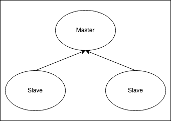
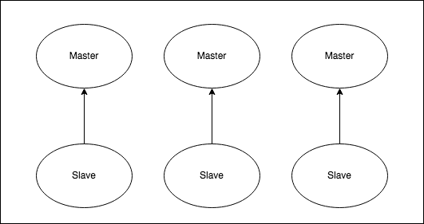

<!--- app-name: Redis&reg; -->

# Bitnami package for Redis(R)

Redis(R) is an open source, advanced key-value store. It is often referred to as a data structure server since keys can contain strings, hashes, lists, sets and sorted sets.

[Overview of Redis&reg;](http://redis.io)

Disclaimer: Redis is a registered trademark of Redis Ltd. Any rights therein are reserved to Redis Ltd. Any use by Bitnami is for referential purposes only and does not indicate any sponsorship, endorsement, or affiliation between Redis Ltd.

## TL;DR

```console
helm install my-release oci://registry-1.docker.io/bitnamicharts/redis
```

## Introduction

This chart bootstraps a [Redis&reg;](https://github.com/bitnami/containers/tree/main/bitnami/redis) deployment on a [Kubernetes](https://kubernetes.io) cluster using the [Helm](https://helm.sh) package manager.

Bitnami charts can be used with [Kubeapps](https://kubeapps.dev/) for deployment and management of Helm Charts in clusters.

### Choose between Redis&reg; Helm Chart and Redis&reg; Cluster Helm Chart

You can choose any of the two Redis&reg; Helm charts for deploying a Redis&reg; cluster.

1. [Redis&reg; Helm Chart](https://github.com/bitnami/charts/tree/main/bitnami/redis) will deploy a master-replica cluster, with the [option](https://github.com/bitnami/charts/tree/main/bitnami/redis#redis-sentinel-configuration-parameters) of enabling using Redis&reg; Sentinel.
2. [Redis&reg; Cluster Helm Chart](https://github.com/bitnami/charts/tree/main/bitnami/redis-cluster) will deploy a Redis&reg; Cluster topology with sharding.

The main features of each chart are the following:

| Redis&reg;                                     | Redis&reg; Cluster                                             |
|--------------------------------------------------------|------------------------------------------------------------------------|
| Supports multiple databases                            | Supports only one database. Better if you have a big dataset           |
| Single write point (single master)                     | Multiple write points (multiple masters)                               |
|  |  |

Looking to use Redisreg; in production? Try [VMware Application Catalog](https://bitnami.com/enterprise), the enterprise edition of Bitnami Application Catalog.

## Prerequisites

- Kubernetes 1.19+
- Helm 3.2.0+
- PV provisioner support in the underlying infrastructure

## Installing the Chart

To install the chart with the release name `my-release`:

```console
helm install my-release oci://registry-1.docker.io/bitnamicharts/redis
```

The command deploys Redis&reg; on the Kubernetes cluster in the default configuration. The [Parameters](#parameters) section lists the parameters that can be configured during installation.

> **Tip**: List all releases using `helm list`

## Uninstalling the Chart

To uninstall/delete the `my-release` deployment:

```console
helm delete my-release
```

The command removes all the Kubernetes components associated with the chart and deletes the release.

## Parameters

### Global parameters

| Name                      | Description                                            | Value |
| ------------------------- | ------------------------------------------------------ | ----- |
| `global.imageRegistry`    | Global Docker image registry                           | `""`  |
| `global.imagePullSecrets` | Global Docker registry secret names as an array        | `[]`  |
| `global.storageClass`     | Global StorageClass for Persistent Volume(s)           | `""`  |
| `global.redis.password`   | Global Redis&reg; password (overrides `auth.password`) | `""`  |

### Common parameters

| Name                      | Description                                                                                                    | Value           |
| ------------------------- | -------------------------------------------------------------------------------------------------------------- | --------------- |
| `kubeVersion`             | Override Kubernetes version                                                                                    | `""`            |
| `nameOverride`            | String to partially override common.names.fullname                                                             | `""`            |
| `fullnameOverride`        | String to fully override common.names.fullname                                                                 | `""`            |
| `commonLabels`            | Labels to add to all deployed objects                                                                          | `{}`            |
| `commonAnnotations`       | Annotations to add to all deployed objects                                                                     | `{}`            |
| `secretAnnotations`       | Annotations to add to secret                                                                                   | `{}`            |
| `clusterDomain`           | Kubernetes cluster domain name                                                                                 | `cluster.local` |
| `extraDeploy`             | Array of extra objects to deploy with the release                                                              | `[]`            |
| `useHostnames`            | Use hostnames internally when announcing replication. If false, the hostname will be resolved to an IP address | `true`          |
| `nameResolutionThreshold` | Failure threshold for internal hostnames resolution                                                            | `5`             |
| `nameResolutionTimeout`   | Timeout seconds between probes for internal hostnames resolution                                               | `5`             |
| `diagnosticMode.enabled`  | Enable diagnostic mode (all probes will be disabled and the command will be overridden)                        | `false`         |
| `diagnosticMode.command`  | Command to override all containers in the deployment                                                           | `["sleep"]`     |
| `diagnosticMode.args`     | Args to override all containers in the deployment                                                              | `["infinity"]`  |

### Redis&reg; Image parameters

| Name                | Description                                                                                                | Value                |
| ------------------- | ---------------------------------------------------------------------------------------------------------- | -------------------- |
| `image.registry`    | Redis&reg; image registry                                                                                  | `docker.io`          |
| `image.repository`  | Redis&reg; image repository                                                                                | `bitnami/redis`      |
| `image.tag`         | Redis&reg; image tag (immutable tags are recommended)                                                      | `7.2.1-debian-11-r0` |
| `image.digest`      | Redis&reg; image digest in the way sha256:aa.... Please note this parameter, if set, will override the tag | `""`                 |
| `image.pullPolicy`  | Redis&reg; image pull policy                                                                               | `IfNotPresent`       |
| `image.pullSecrets` | Redis&reg; image pull secrets                                                                              | `[]`                 |
| `image.debug`       | Enable image debug mode                                                                                    | `false`              |

### Redis&reg; common configuration parameters

| Name                             | Description                                                                           | Value         |
| -------------------------------- | ------------------------------------------------------------------------------------- | ------------- |
| `architecture`                   | Redis&reg; architecture. Allowed values: `standalone` or `replication`                | `replication` |
| `auth.enabled`                   | Enable password authentication                                                        | `true`        |
| `auth.sentinel`                  | Enable password authentication on sentinels too                                       | `true`        |
| `auth.password`                  | Redis&reg; password                                                                   | `""`          |
| `auth.existingSecret`            | The name of an existing secret with Redis&reg; credentials                            | `""`          |
| `auth.existingSecretPasswordKey` | Password key to be retrieved from existing secret                                     | `""`          |
| `auth.usePasswordFiles`          | Mount credentials as files instead of using an environment variable                   | `false`       |
| `commonConfiguration`            | Common configuration to be added into the ConfigMap                                   | `""`          |
| `existingConfigmap`              | The name of an existing ConfigMap with your custom configuration for Redis&reg; nodes | `""`          |

### Redis&reg; master configuration parameters

| Name                                                       | Description                                                                                           | Value                    |
| ---------------------------------------------------------- | ----------------------------------------------------------------------------------------------------- | ------------------------ |
| `master.count`                                             | Number of Redis&reg; master instances to deploy (experimental, requires additional configuration)     | `1`                      |
| `master.configuration`                                     | Configuration for Redis&reg; master nodes                                                             | `""`                     |
| `master.disableCommands`                                   | Array with Redis&reg; commands to disable on master nodes                                             | `["FLUSHDB","FLUSHALL"]` |
| `master.command`                                           | Override default container command (useful when using custom images)                                  | `[]`                     |
| `master.args`                                              | Override default container args (useful when using custom images)                                     | `[]`                     |
| `master.enableServiceLinks`                                | Whether information about services should be injected into pod's environment variable                 | `true`                   |
| `master.preExecCmds`                                       | Additional commands to run prior to starting Redis&reg; master                                        | `[]`                     |
| `master.extraFlags`                                        | Array with additional command line flags for Redis&reg; master                                        | `[]`                     |
| `master.extraEnvVars`                                      | Array with extra environment variables to add to Redis&reg; master nodes                              | `[]`                     |
| `master.extraEnvVarsCM`                                    | Name of existing ConfigMap containing extra env vars for Redis&reg; master nodes                      | `""`                     |
| `master.extraEnvVarsSecret`                                | Name of existing Secret containing extra env vars for Redis&reg; master nodes                         | `""`                     |
| `master.containerPorts.redis`                              | Container port to open on Redis&reg; master nodes                                                     | `6379`                   |
| `master.startupProbe.enabled`                              | Enable startupProbe on Redis&reg; master nodes                                                        | `false`                  |
| `master.startupProbe.initialDelaySeconds`                  | Initial delay seconds for startupProbe                                                                | `20`                     |
| `master.startupProbe.periodSeconds`                        | Period seconds for startupProbe                                                                       | `5`                      |
| `master.startupProbe.timeoutSeconds`                       | Timeout seconds for startupProbe                                                                      | `5`                      |
| `master.startupProbe.failureThreshold`                     | Failure threshold for startupProbe                                                                    | `5`                      |
| `master.startupProbe.successThreshold`                     | Success threshold for startupProbe                                                                    | `1`                      |
| `master.livenessProbe.enabled`                             | Enable livenessProbe on Redis&reg; master nodes                                                       | `true`                   |
| `master.livenessProbe.initialDelaySeconds`                 | Initial delay seconds for livenessProbe                                                               | `20`                     |
| `master.livenessProbe.periodSeconds`                       | Period seconds for livenessProbe                                                                      | `5`                      |
| `master.livenessProbe.timeoutSeconds`                      | Timeout seconds for livenessProbe                                                                     | `5`                      |
| `master.livenessProbe.failureThreshold`                    | Failure threshold for livenessProbe                                                                   | `5`                      |
| `master.livenessProbe.successThreshold`                    | Success threshold for livenessProbe                                                                   | `1`                      |
| `master.readinessProbe.enabled`                            | Enable readinessProbe on Redis&reg; master nodes                                                      | `true`                   |
| `master.readinessProbe.initialDelaySeconds`                | Initial delay seconds for readinessProbe                                                              | `20`                     |
| `master.readinessProbe.periodSeconds`                      | Period seconds for readinessProbe                                                                     | `5`                      |
| `master.readinessProbe.timeoutSeconds`                     | Timeout seconds for readinessProbe                                                                    | `1`                      |
| `master.readinessProbe.failureThreshold`                   | Failure threshold for readinessProbe                                                                  | `5`                      |
| `master.readinessProbe.successThreshold`                   | Success threshold for readinessProbe                                                                  | `1`                      |
| `master.customStartupProbe`                                | Custom startupProbe that overrides the default one                                                    | `{}`                     |
| `master.customLivenessProbe`                               | Custom livenessProbe that overrides the default one                                                   | `{}`                     |
| `master.customReadinessProbe`                              | Custom readinessProbe that overrides the default one                                                  | `{}`                     |
| `master.resources.limits`                                  | The resources limits for the Redis&reg; master containers                                             | `{}`                     |
| `master.resources.requests`                                | The requested resources for the Redis&reg; master containers                                          | `{}`                     |
| `master.podSecurityContext.enabled`                        | Enabled Redis&reg; master pods' Security Context                                                      | `true`                   |
| `master.podSecurityContext.fsGroup`                        | Set Redis&reg; master pod's Security Context fsGroup                                                  | `1001`                   |
| `master.containerSecurityContext.enabled`                  | Enabled Redis&reg; master containers' Security Context                                                | `true`                   |
| `master.containerSecurityContext.runAsUser`                | Set Redis&reg; master containers' Security Context runAsUser                                          | `1001`                   |
| `master.containerSecurityContext.runAsGroup`               | Set Redis&reg; master containers' Security Context runAsGroup                                         | `0`                      |
| `master.containerSecurityContext.runAsNonRoot`             | Set Redis&reg; master containers' Security Context runAsNonRoot                                       | `true`                   |
| `master.containerSecurityContext.allowPrivilegeEscalation` | Is it possible to escalate Redis&reg; pod(s) privileges                                               | `false`                  |
| `master.containerSecurityContext.seccompProfile.type`      | Set Redis&reg; master containers' Security Context seccompProfile                                     | `RuntimeDefault`         |
| `master.containerSecurityContext.capabilities.drop`        | Set Redis&reg; master containers' Security Context capabilities to drop                               | `["ALL"]`                |
| `master.kind`                                              | Use either Deployment or StatefulSet (default)                                                        | `StatefulSet`            |
| `master.schedulerName`                                     | Alternate scheduler for Redis&reg; master pods                                                        | `""`                     |
| `master.updateStrategy.type`                               | Redis&reg; master statefulset strategy type                                                           | `RollingUpdate`          |
| `master.minReadySeconds`                                   | How many seconds a pod needs to be ready before killing the next, during update                       | `0`                      |
| `master.priorityClassName`                                 | Redis&reg; master pods' priorityClassName                                                             | `""`                     |
| `master.hostAliases`                                       | Redis&reg; master pods host aliases                                                                   | `[]`                     |
| `master.podLabels`                                         | Extra labels for Redis&reg; master pods                                                               | `{}`                     |
| `master.podAnnotations`                                    | Annotations for Redis&reg; master pods                                                                | `{}`                     |
| `master.shareProcessNamespace`                             | Share a single process namespace between all of the containers in Redis&reg; master pods              | `false`                  |
| `master.podAffinityPreset`                                 | Pod affinity preset. Ignored if `master.affinity` is set. Allowed values: `soft` or `hard`            | `""`                     |
| `master.podAntiAffinityPreset`                             | Pod anti-affinity preset. Ignored if `master.affinity` is set. Allowed values: `soft` or `hard`       | `soft`                   |
| `master.nodeAffinityPreset.type`                           | Node affinity preset type. Ignored if `master.affinity` is set. Allowed values: `soft` or `hard`      | `""`                     |
| `master.nodeAffinityPreset.key`                            | Node label key to match. Ignored if `master.affinity` is set                                          | `""`                     |
| `master.nodeAffinityPreset.values`                         | Node label values to match. Ignored if `master.affinity` is set                                       | `[]`                     |
| `master.affinity`                                          | Affinity for Redis&reg; master pods assignment                                                        | `{}`                     |
| `master.nodeSelector`                                      | Node labels for Redis&reg; master pods assignment                                                     | `{}`                     |
| `master.tolerations`                                       | Tolerations for Redis&reg; master pods assignment                                                     | `[]`                     |
| `master.topologySpreadConstraints`                         | Spread Constraints for Redis&reg; master pod assignment                                               | `[]`                     |
| `master.dnsPolicy`                                         | DNS Policy for Redis&reg; master pod                                                                  | `""`                     |
| `master.dnsConfig`                                         | DNS Configuration for Redis&reg; master pod                                                           | `{}`                     |
| `master.lifecycleHooks`                                    | for the Redis&reg; master container(s) to automate configuration before or after startup              | `{}`                     |
| `master.extraVolumes`                                      | Optionally specify extra list of additional volumes for the Redis&reg; master pod(s)                  | `[]`                     |
| `master.extraVolumeMounts`                                 | Optionally specify extra list of additional volumeMounts for the Redis&reg; master container(s)       | `[]`                     |
| `master.sidecars`                                          | Add additional sidecar containers to the Redis&reg; master pod(s)                                     | `[]`                     |
| `master.initContainers`                                    | Add additional init containers to the Redis&reg; master pod(s)                                        | `[]`                     |
| `master.persistence.enabled`                               | Enable persistence on Redis&reg; master nodes using Persistent Volume Claims                          | `true`                   |
| `master.persistence.medium`                                | Provide a medium for `emptyDir` volumes.                                                              | `""`                     |
| `master.persistence.sizeLimit`                             | Set this to enable a size limit for `emptyDir` volumes.                                               | `""`                     |
| `master.persistence.path`                                  | The path the volume will be mounted at on Redis&reg; master containers                                | `/data`                  |
| `master.persistence.subPath`                               | The subdirectory of the volume to mount on Redis&reg; master containers                               | `""`                     |
| `master.persistence.subPathExpr`                           | Used to construct the subPath subdirectory of the volume to mount on Redis&reg; master containers     | `""`                     |
| `master.persistence.storageClass`                          | Persistent Volume storage class                                                                       | `""`                     |
| `master.persistence.accessModes`                           | Persistent Volume access modes                                                                        | `["ReadWriteOnce"]`      |
| `master.persistence.size`                                  | Persistent Volume size                                                                                | `8Gi`                    |
| `master.persistence.annotations`                           | Additional custom annotations for the PVC                                                             | `{}`                     |
| `master.persistence.labels`                                | Additional custom labels for the PVC                                                                  | `{}`                     |
| `master.persistence.selector`                              | Additional labels to match for the PVC                                                                | `{}`                     |
| `master.persistence.dataSource`                            | Custom PVC data source                                                                                | `{}`                     |
| `master.persistence.existingClaim`                         | Use a existing PVC which must be created manually before bound                                        | `""`                     |
| `master.service.type`                                      | Redis&reg; master service type                                                                        | `ClusterIP`              |
| `master.service.ports.redis`                               | Redis&reg; master service port                                                                        | `6379`                   |
| `master.service.nodePorts.redis`                           | Node port for Redis&reg; master                                                                       | `""`                     |
| `master.service.externalTrafficPolicy`                     | Redis&reg; master service external traffic policy                                                     | `Cluster`                |
| `master.service.extraPorts`                                | Extra ports to expose (normally used with the `sidecar` value)                                        | `[]`                     |
| `master.service.internalTrafficPolicy`                     | Redis&reg; master service internal traffic policy (requires Kubernetes v1.22 or greater to be usable) | `Cluster`                |
| `master.service.clusterIP`                                 | Redis&reg; master service Cluster IP                                                                  | `""`                     |
| `master.service.loadBalancerIP`                            | Redis&reg; master service Load Balancer IP                                                            | `""`                     |
| `master.service.loadBalancerSourceRanges`                  | Redis&reg; master service Load Balancer sources                                                       | `[]`                     |
| `master.service.externalIPs`                               | Redis&reg; master service External IPs                                                                | `[]`                     |
| `master.service.annotations`                               | Additional custom annotations for Redis&reg; master service                                           | `{}`                     |
| `master.service.sessionAffinity`                           | Session Affinity for Kubernetes service, can be "None" or "ClientIP"                                  | `None`                   |
| `master.service.sessionAffinityConfig`                     | Additional settings for the sessionAffinity                                                           | `{}`                     |
| `master.terminationGracePeriodSeconds`                     | Integer setting the termination grace period for the redis-master pods                                | `30`                     |
| `master.serviceAccount.create`                             | Specifies whether a ServiceAccount should be created                                                  | `false`                  |
| `master.serviceAccount.name`                               | The name of the ServiceAccount to use.                                                                | `""`                     |
| `master.serviceAccount.automountServiceAccountToken`       | Whether to auto mount the service account token                                                       | `true`                   |
| `master.serviceAccount.annotations`                        | Additional custom annotations for the ServiceAccount                                                  | `{}`                     |

### Redis&reg; replicas configuration parameters

| Name                                                        | Description                                                                                             | Value                    |
| ----------------------------------------------------------- | ------------------------------------------------------------------------------------------------------- | ------------------------ |
| `replica.replicaCount`                                      | Number of Redis&reg; replicas to deploy                                                                 | `3`                      |
| `replica.configuration`                                     | Configuration for Redis&reg; replicas nodes                                                             | `""`                     |
| `replica.disableCommands`                                   | Array with Redis&reg; commands to disable on replicas nodes                                             | `["FLUSHDB","FLUSHALL"]` |
| `replica.command`                                           | Override default container command (useful when using custom images)                                    | `[]`                     |
| `replica.args`                                              | Override default container args (useful when using custom images)                                       | `[]`                     |
| `replica.enableServiceLinks`                                | Whether information about services should be injected into pod's environment variable                   | `true`                   |
| `replica.preExecCmds`                                       | Additional commands to run prior to starting Redis&reg; replicas                                        | `[]`                     |
| `replica.extraFlags`                                        | Array with additional command line flags for Redis&reg; replicas                                        | `[]`                     |
| `replica.extraEnvVars`                                      | Array with extra environment variables to add to Redis&reg; replicas nodes                              | `[]`                     |
| `replica.extraEnvVarsCM`                                    | Name of existing ConfigMap containing extra env vars for Redis&reg; replicas nodes                      | `""`                     |
| `replica.extraEnvVarsSecret`                                | Name of existing Secret containing extra env vars for Redis&reg; replicas nodes                         | `""`                     |
| `replica.externalMaster.enabled`                            | Use external master for bootstrapping                                                                   | `false`                  |
| `replica.externalMaster.host`                               | External master host to bootstrap from                                                                  | `""`                     |
| `replica.externalMaster.port`                               | Port for Redis service external master host                                                             | `6379`                   |
| `replica.containerPorts.redis`                              | Container port to open on Redis&reg; replicas nodes                                                     | `6379`                   |
| `replica.startupProbe.enabled`                              | Enable startupProbe on Redis&reg; replicas nodes                                                        | `true`                   |
| `replica.startupProbe.initialDelaySeconds`                  | Initial delay seconds for startupProbe                                                                  | `10`                     |
| `replica.startupProbe.periodSeconds`                        | Period seconds for startupProbe                                                                         | `10`                     |
| `replica.startupProbe.timeoutSeconds`                       | Timeout seconds for startupProbe                                                                        | `5`                      |
| `replica.startupProbe.failureThreshold`                     | Failure threshold for startupProbe                                                                      | `22`                     |
| `replica.startupProbe.successThreshold`                     | Success threshold for startupProbe                                                                      | `1`                      |
| `replica.livenessProbe.enabled`                             | Enable livenessProbe on Redis&reg; replicas nodes                                                       | `true`                   |
| `replica.livenessProbe.initialDelaySeconds`                 | Initial delay seconds for livenessProbe                                                                 | `20`                     |
| `replica.livenessProbe.periodSeconds`                       | Period seconds for livenessProbe                                                                        | `5`                      |
| `replica.livenessProbe.timeoutSeconds`                      | Timeout seconds for livenessProbe                                                                       | `5`                      |
| `replica.livenessProbe.failureThreshold`                    | Failure threshold for livenessProbe                                                                     | `5`                      |
| `replica.livenessProbe.successThreshold`                    | Success threshold for livenessProbe                                                                     | `1`                      |
| `replica.readinessProbe.enabled`                            | Enable readinessProbe on Redis&reg; replicas nodes                                                      | `true`                   |
| `replica.readinessProbe.initialDelaySeconds`                | Initial delay seconds for readinessProbe                                                                | `20`                     |
| `replica.readinessProbe.periodSeconds`                      | Period seconds for readinessProbe                                                                       | `5`                      |
| `replica.readinessProbe.timeoutSeconds`                     | Timeout seconds for readinessProbe                                                                      | `1`                      |
| `replica.readinessProbe.failureThreshold`                   | Failure threshold for readinessProbe                                                                    | `5`                      |
| `replica.readinessProbe.successThreshold`                   | Success threshold for readinessProbe                                                                    | `1`                      |
| `replica.customStartupProbe`                                | Custom startupProbe that overrides the default one                                                      | `{}`                     |
| `replica.customLivenessProbe`                               | Custom livenessProbe that overrides the default one                                                     | `{}`                     |
| `replica.customReadinessProbe`                              | Custom readinessProbe that overrides the default one                                                    | `{}`                     |
| `replica.resources.limits`                                  | The resources limits for the Redis&reg; replicas containers                                             | `{}`                     |
| `replica.resources.requests`                                | The requested resources for the Redis&reg; replicas containers                                          | `{}`                     |
| `replica.podSecurityContext.enabled`                        | Enabled Redis&reg; replicas pods' Security Context                                                      | `true`                   |
| `replica.podSecurityContext.fsGroup`                        | Set Redis&reg; replicas pod's Security Context fsGroup                                                  | `1001`                   |
| `replica.containerSecurityContext.enabled`                  | Enabled Redis&reg; replicas containers' Security Context                                                | `true`                   |
| `replica.containerSecurityContext.runAsUser`                | Set Redis&reg; replicas containers' Security Context runAsUser                                          | `1001`                   |
| `replica.containerSecurityContext.runAsGroup`               | Set Redis&reg; replicas containers' Security Context runAsGroup                                         | `0`                      |
| `replica.containerSecurityContext.runAsNonRoot`             | Set Redis&reg; replicas containers' Security Context runAsNonRoot                                       | `true`                   |
| `replica.containerSecurityContext.allowPrivilegeEscalation` | Set Redis&reg; replicas pod's Security Context allowPrivilegeEscalation                                 | `false`                  |
| `replica.containerSecurityContext.seccompProfile.type`      | Set Redis&reg; replicas containers' Security Context seccompProfile                                     | `RuntimeDefault`         |
| `replica.containerSecurityContext.capabilities.drop`        | Set Redis&reg; replicas containers' Security Context capabilities to drop                               | `["ALL"]`                |
| `replica.schedulerName`                                     | Alternate scheduler for Redis&reg; replicas pods                                                        | `""`                     |
| `replica.updateStrategy.type`                               | Redis&reg; replicas statefulset strategy type                                                           | `RollingUpdate`          |
| `replica.minReadySeconds`                                   | How many seconds a pod needs to be ready before killing the next, during update                         | `0`                      |
| `replica.priorityClassName`                                 | Redis&reg; replicas pods' priorityClassName                                                             | `""`                     |
| `replica.podManagementPolicy`                               | podManagementPolicy to manage scaling operation of %%MAIN_CONTAINER_NAME%% pods                         | `""`                     |
| `replica.hostAliases`                                       | Redis&reg; replicas pods host aliases                                                                   | `[]`                     |
| `replica.podLabels`                                         | Extra labels for Redis&reg; replicas pods                                                               | `{}`                     |
| `replica.podAnnotations`                                    | Annotations for Redis&reg; replicas pods                                                                | `{}`                     |
| `replica.shareProcessNamespace`                             | Share a single process namespace between all of the containers in Redis&reg; replicas pods              | `false`                  |
| `replica.podAffinityPreset`                                 | Pod affinity preset. Ignored if `replica.affinity` is set. Allowed values: `soft` or `hard`             | `""`                     |
| `replica.podAntiAffinityPreset`                             | Pod anti-affinity preset. Ignored if `replica.affinity` is set. Allowed values: `soft` or `hard`        | `soft`                   |
| `replica.nodeAffinityPreset.type`                           | Node affinity preset type. Ignored if `replica.affinity` is set. Allowed values: `soft` or `hard`       | `""`                     |
| `replica.nodeAffinityPreset.key`                            | Node label key to match. Ignored if `replica.affinity` is set                                           | `""`                     |
| `replica.nodeAffinityPreset.values`                         | Node label values to match. Ignored if `replica.affinity` is set                                        | `[]`                     |
| `replica.affinity`                                          | Affinity for Redis&reg; replicas pods assignment                                                        | `{}`                     |
| `replica.nodeSelector`                                      | Node labels for Redis&reg; replicas pods assignment                                                     | `{}`                     |
| `replica.tolerations`                                       | Tolerations for Redis&reg; replicas pods assignment                                                     | `[]`                     |
| `replica.topologySpreadConstraints`                         | Spread Constraints for Redis&reg; replicas pod assignment                                               | `[]`                     |
| `replica.dnsPolicy`                                         | DNS Policy for Redis&reg; replica pods                                                                  | `""`                     |
| `replica.dnsConfig`                                         | DNS Configuration for Redis&reg; replica pods                                                           | `{}`                     |
| `replica.lifecycleHooks`                                    | for the Redis&reg; replica container(s) to automate configuration before or after startup               | `{}`                     |
| `replica.extraVolumes`                                      | Optionally specify extra list of additional volumes for the Redis&reg; replicas pod(s)                  | `[]`                     |
| `replica.extraVolumeMounts`                                 | Optionally specify extra list of additional volumeMounts for the Redis&reg; replicas container(s)       | `[]`                     |
| `replica.sidecars`                                          | Add additional sidecar containers to the Redis&reg; replicas pod(s)                                     | `[]`                     |
| `replica.initContainers`                                    | Add additional init containers to the Redis&reg; replicas pod(s)                                        | `[]`                     |
| `replica.persistence.enabled`                               | Enable persistence on Redis&reg; replicas nodes using Persistent Volume Claims                          | `true`                   |
| `replica.persistence.medium`                                | Provide a medium for `emptyDir` volumes.                                                                | `""`                     |
| `replica.persistence.sizeLimit`                             | Set this to enable a size limit for `emptyDir` volumes.                                                 | `""`                     |
| `replica.persistence.path`                                  | The path the volume will be mounted at on Redis&reg; replicas containers                                | `/data`                  |
| `replica.persistence.subPath`                               | The subdirectory of the volume to mount on Redis&reg; replicas containers                               | `""`                     |
| `replica.persistence.subPathExpr`                           | Used to construct the subPath subdirectory of the volume to mount on Redis&reg; replicas containers     | `""`                     |
| `replica.persistence.storageClass`                          | Persistent Volume storage class                                                                         | `""`                     |
| `replica.persistence.accessModes`                           | Persistent Volume access modes                                                                          | `["ReadWriteOnce"]`      |
| `replica.persistence.size`                                  | Persistent Volume size                                                                                  | `8Gi`                    |
| `replica.persistence.annotations`                           | Additional custom annotations for the PVC                                                               | `{}`                     |
| `replica.persistence.labels`                                | Additional custom labels for the PVC                                                                    | `{}`                     |
| `replica.persistence.selector`                              | Additional labels to match for the PVC                                                                  | `{}`                     |
| `replica.persistence.dataSource`                            | Custom PVC data source                                                                                  | `{}`                     |
| `replica.persistence.existingClaim`                         | Use a existing PVC which must be created manually before bound                                          | `""`                     |
| `replica.service.type`                                      | Redis&reg; replicas service type                                                                        | `ClusterIP`              |
| `replica.service.ports.redis`                               | Redis&reg; replicas service port                                                                        | `6379`                   |
| `replica.service.nodePorts.redis`                           | Node port for Redis&reg; replicas                                                                       | `""`                     |
| `replica.service.externalTrafficPolicy`                     | Redis&reg; replicas service external traffic policy                                                     | `Cluster`                |
| `replica.service.internalTrafficPolicy`                     | Redis&reg; replicas service internal traffic policy (requires Kubernetes v1.22 or greater to be usable) | `Cluster`                |
| `replica.service.extraPorts`                                | Extra ports to expose (normally used with the `sidecar` value)                                          | `[]`                     |
| `replica.service.clusterIP`                                 | Redis&reg; replicas service Cluster IP                                                                  | `""`                     |
| `replica.service.loadBalancerIP`                            | Redis&reg; replicas service Load Balancer IP                                                            | `""`                     |
| `replica.service.loadBalancerSourceRanges`                  | Redis&reg; replicas service Load Balancer sources                                                       | `[]`                     |
| `replica.service.annotations`                               | Additional custom annotations for Redis&reg; replicas service                                           | `{}`                     |
| `replica.service.sessionAffinity`                           | Session Affinity for Kubernetes service, can be "None" or "ClientIP"                                    | `None`                   |
| `replica.service.sessionAffinityConfig`                     | Additional settings for the sessionAffinity                                                             | `{}`                     |
| `replica.terminationGracePeriodSeconds`                     | Integer setting the termination grace period for the redis-replicas pods                                | `30`                     |
| `replica.autoscaling.enabled`                               | Enable replica autoscaling settings                                                                     | `false`                  |
| `replica.autoscaling.minReplicas`                           | Minimum replicas for the pod autoscaling                                                                | `1`                      |
| `replica.autoscaling.maxReplicas`                           | Maximum replicas for the pod autoscaling                                                                | `11`                     |
| `replica.autoscaling.targetCPU`                             | Percentage of CPU to consider when autoscaling                                                          | `""`                     |
| `replica.autoscaling.targetMemory`                          | Percentage of Memory to consider when autoscaling                                                       | `""`                     |
| `replica.serviceAccount.create`                             | Specifies whether a ServiceAccount should be created                                                    | `false`                  |
| `replica.serviceAccount.name`                               | The name of the ServiceAccount to use.                                                                  | `""`                     |
| `replica.serviceAccount.automountServiceAccountToken`       | Whether to auto mount the service account token                                                         | `true`                   |
| `replica.serviceAccount.annotations`                        | Additional custom annotations for the ServiceAccount                                                    | `{}`                     |

### Redis&reg; Sentinel configuration parameters

| Name                                                         | Description                                                                                                                                 | Value                    |
| ------------------------------------------------------------ | ------------------------------------------------------------------------------------------------------------------------------------------- | ------------------------ |
| `sentinel.enabled`                                           | Use Redis&reg; Sentinel on Redis&reg; pods.                                                                                                 | `false`                  |
| `sentinel.image.registry`                                    | Redis&reg; Sentinel image registry                                                                                                          | `docker.io`              |
| `sentinel.image.repository`                                  | Redis&reg; Sentinel image repository                                                                                                        | `bitnami/redis-sentinel` |
| `sentinel.image.tag`                                         | Redis&reg; Sentinel image tag (immutable tags are recommended)                                                                              | `7.2.1-debian-11-r0`     |
| `sentinel.image.digest`                                      | Redis&reg; Sentinel image digest in the way sha256:aa.... Please note this parameter, if set, will override the tag                         | `""`                     |
| `sentinel.image.pullPolicy`                                  | Redis&reg; Sentinel image pull policy                                                                                                       | `IfNotPresent`           |
| `sentinel.image.pullSecrets`                                 | Redis&reg; Sentinel image pull secrets                                                                                                      | `[]`                     |
| `sentinel.image.debug`                                       | Enable image debug mode                                                                                                                     | `false`                  |
| `sentinel.annotations`                                       | Additional custom annotations for Redis&reg; Sentinel resource                                                                              | `{}`                     |
| `sentinel.masterSet`                                         | Master set name                                                                                                                             | `mymaster`               |
| `sentinel.quorum`                                            | Sentinel Quorum                                                                                                                             | `2`                      |
| `sentinel.getMasterTimeout`                                  | Amount of time to allow before get_sentinel_master_info() times out.                                                                        | `99`                     |
| `sentinel.automateClusterRecovery`                           | Automate cluster recovery in cases where the last replica is not considered a good replica and Sentinel won't automatically failover to it. | `false`                  |
| `sentinel.redisShutdownWaitFailover`                         | Whether the Redis&reg; master container waits for the failover at shutdown (in addition to the Redis&reg; Sentinel container).              | `true`                   |
| `sentinel.downAfterMilliseconds`                             | Timeout for detecting a Redis&reg; node is down                                                                                             | `60000`                  |
| `sentinel.failoverTimeout`                                   | Timeout for performing a election failover                                                                                                  | `180000`                 |
| `sentinel.parallelSyncs`                                     | Number of replicas that can be reconfigured in parallel to use the new master after a failover                                              | `1`                      |
| `sentinel.configuration`                                     | Configuration for Redis&reg; Sentinel nodes                                                                                                 | `""`                     |
| `sentinel.command`                                           | Override default container command (useful when using custom images)                                                                        | `[]`                     |
| `sentinel.args`                                              | Override default container args (useful when using custom images)                                                                           | `[]`                     |
| `sentinel.enableServiceLinks`                                | Whether information about services should be injected into pod's environment variable                                                       | `true`                   |
| `sentinel.preExecCmds`                                       | Additional commands to run prior to starting Redis&reg; Sentinel                                                                            | `[]`                     |
| `sentinel.extraEnvVars`                                      | Array with extra environment variables to add to Redis&reg; Sentinel nodes                                                                  | `[]`                     |
| `sentinel.extraEnvVarsCM`                                    | Name of existing ConfigMap containing extra env vars for Redis&reg; Sentinel nodes                                                          | `""`                     |
| `sentinel.extraEnvVarsSecret`                                | Name of existing Secret containing extra env vars for Redis&reg; Sentinel nodes                                                             | `""`                     |
| `sentinel.externalMaster.enabled`                            | Use external master for bootstrapping                                                                                                       | `false`                  |
| `sentinel.externalMaster.host`                               | External master host to bootstrap from                                                                                                      | `""`                     |
| `sentinel.externalMaster.port`                               | Port for Redis service external master host                                                                                                 | `6379`                   |
| `sentinel.containerPorts.sentinel`                           | Container port to open on Redis&reg; Sentinel nodes                                                                                         | `26379`                  |
| `sentinel.startupProbe.enabled`                              | Enable startupProbe on Redis&reg; Sentinel nodes                                                                                            | `true`                   |
| `sentinel.startupProbe.initialDelaySeconds`                  | Initial delay seconds for startupProbe                                                                                                      | `10`                     |
| `sentinel.startupProbe.periodSeconds`                        | Period seconds for startupProbe                                                                                                             | `10`                     |
| `sentinel.startupProbe.timeoutSeconds`                       | Timeout seconds for startupProbe                                                                                                            | `5`                      |
| `sentinel.startupProbe.failureThreshold`                     | Failure threshold for startupProbe                                                                                                          | `22`                     |
| `sentinel.startupProbe.successThreshold`                     | Success threshold for startupProbe                                                                                                          | `1`                      |
| `sentinel.livenessProbe.enabled`                             | Enable livenessProbe on Redis&reg; Sentinel nodes                                                                                           | `true`                   |
| `sentinel.livenessProbe.initialDelaySeconds`                 | Initial delay seconds for livenessProbe                                                                                                     | `20`                     |
| `sentinel.livenessProbe.periodSeconds`                       | Period seconds for livenessProbe                                                                                                            | `10`                     |
| `sentinel.livenessProbe.timeoutSeconds`                      | Timeout seconds for livenessProbe                                                                                                           | `5`                      |
| `sentinel.livenessProbe.failureThreshold`                    | Failure threshold for livenessProbe                                                                                                         | `6`                      |
| `sentinel.livenessProbe.successThreshold`                    | Success threshold for livenessProbe                                                                                                         | `1`                      |
| `sentinel.readinessProbe.enabled`                            | Enable readinessProbe on Redis&reg; Sentinel nodes                                                                                          | `true`                   |
| `sentinel.readinessProbe.initialDelaySeconds`                | Initial delay seconds for readinessProbe                                                                                                    | `20`                     |
| `sentinel.readinessProbe.periodSeconds`                      | Period seconds for readinessProbe                                                                                                           | `5`                      |
| `sentinel.readinessProbe.timeoutSeconds`                     | Timeout seconds for readinessProbe                                                                                                          | `1`                      |
| `sentinel.readinessProbe.failureThreshold`                   | Failure threshold for readinessProbe                                                                                                        | `6`                      |
| `sentinel.readinessProbe.successThreshold`                   | Success threshold for readinessProbe                                                                                                        | `1`                      |
| `sentinel.customStartupProbe`                                | Custom startupProbe that overrides the default one                                                                                          | `{}`                     |
| `sentinel.customLivenessProbe`                               | Custom livenessProbe that overrides the default one                                                                                         | `{}`                     |
| `sentinel.customReadinessProbe`                              | Custom readinessProbe that overrides the default one                                                                                        | `{}`                     |
| `sentinel.persistence.enabled`                               | Enable persistence on Redis&reg; sentinel nodes using Persistent Volume Claims (Experimental)                                               | `false`                  |
| `sentinel.persistence.storageClass`                          | Persistent Volume storage class                                                                                                             | `""`                     |
| `sentinel.persistence.accessModes`                           | Persistent Volume access modes                                                                                                              | `["ReadWriteOnce"]`      |
| `sentinel.persistence.size`                                  | Persistent Volume size                                                                                                                      | `100Mi`                  |
| `sentinel.persistence.annotations`                           | Additional custom annotations for the PVC                                                                                                   | `{}`                     |
| `sentinel.persistence.labels`                                | Additional custom labels for the PVC                                                                                                        | `{}`                     |
| `sentinel.persistence.selector`                              | Additional labels to match for the PVC                                                                                                      | `{}`                     |
| `sentinel.persistence.dataSource`                            | Custom PVC data source                                                                                                                      | `{}`                     |
| `sentinel.persistence.medium`                                | Provide a medium for `emptyDir` volumes.                                                                                                    | `""`                     |
| `sentinel.persistence.sizeLimit`                             | Set this to enable a size limit for `emptyDir` volumes.                                                                                     | `""`                     |
| `sentinel.resources.limits`                                  | The resources limits for the Redis&reg; Sentinel containers                                                                                 | `{}`                     |
| `sentinel.resources.requests`                                | The requested resources for the Redis&reg; Sentinel containers                                                                              | `{}`                     |
| `sentinel.containerSecurityContext.enabled`                  | Enabled Redis&reg; Sentinel containers' Security Context                                                                                    | `true`                   |
| `sentinel.containerSecurityContext.runAsUser`                | Set Redis&reg; Sentinel containers' Security Context runAsUser                                                                              | `1001`                   |
| `sentinel.containerSecurityContext.runAsGroup`               | Set Redis&reg; Sentinel containers' Security Context runAsGroup                                                                             | `0`                      |
| `sentinel.containerSecurityContext.runAsNonRoot`             | Set Redis&reg; Sentinel containers' Security Context runAsNonRoot                                                                           | `true`                   |
| `sentinel.containerSecurityContext.allowPrivilegeEscalation` | Set Redis&reg; Sentinel containers' Security Context allowPrivilegeEscalation                                                               | `false`                  |
| `sentinel.containerSecurityContext.seccompProfile.type`      | Set Redis&reg; Sentinel containers' Security Context seccompProfile                                                                         | `RuntimeDefault`         |
| `sentinel.containerSecurityContext.capabilities.drop`        | Set Redis&reg; Sentinel containers' Security Context capabilities to drop                                                                   | `["ALL"]`                |
| `sentinel.lifecycleHooks`                                    | for the Redis&reg; sentinel container(s) to automate configuration before or after startup                                                  | `{}`                     |
| `sentinel.extraVolumes`                                      | Optionally specify extra list of additional volumes for the Redis&reg; Sentinel                                                             | `[]`                     |
| `sentinel.extraVolumeMounts`                                 | Optionally specify extra list of additional volumeMounts for the Redis&reg; Sentinel container(s)                                           | `[]`                     |
| `sentinel.service.type`                                      | Redis&reg; Sentinel service type                                                                                                            | `ClusterIP`              |
| `sentinel.service.ports.redis`                               | Redis&reg; service port for Redis&reg;                                                                                                      | `6379`                   |
| `sentinel.service.ports.sentinel`                            | Redis&reg; service port for Redis&reg; Sentinel                                                                                             | `26379`                  |
| `sentinel.service.nodePorts.redis`                           | Node port for Redis&reg;                                                                                                                    | `""`                     |
| `sentinel.service.nodePorts.sentinel`                        | Node port for Sentinel                                                                                                                      | `""`                     |
| `sentinel.service.externalTrafficPolicy`                     | Redis&reg; Sentinel service external traffic policy                                                                                         | `Cluster`                |
| `sentinel.service.extraPorts`                                | Extra ports to expose (normally used with the `sidecar` value)                                                                              | `[]`                     |
| `sentinel.service.clusterIP`                                 | Redis&reg; Sentinel service Cluster IP                                                                                                      | `""`                     |
| `sentinel.service.loadBalancerIP`                            | Redis&reg; Sentinel service Load Balancer IP                                                                                                | `""`                     |
| `sentinel.service.loadBalancerSourceRanges`                  | Redis&reg; Sentinel service Load Balancer sources                                                                                           | `[]`                     |
| `sentinel.service.annotations`                               | Additional custom annotations for Redis&reg; Sentinel service                                                                               | `{}`                     |
| `sentinel.service.sessionAffinity`                           | Session Affinity for Kubernetes service, can be "None" or "ClientIP"                                                                        | `None`                   |
| `sentinel.service.sessionAffinityConfig`                     | Additional settings for the sessionAffinity                                                                                                 | `{}`                     |
| `sentinel.service.headless.annotations`                      | Annotations for the headless service.                                                                                                       | `{}`                     |
| `sentinel.terminationGracePeriodSeconds`                     | Integer setting the termination grace period for the redis-node pods                                                                        | `30`                     |

### Other Parameters

| Name                                            | Description                                                                                                                                 | Value   |
| ----------------------------------------------- | ------------------------------------------------------------------------------------------------------------------------------------------- | ------- |
| `serviceBindings.enabled`                       | Create secret for service binding (Experimental)                                                                                            | `false` |
| `networkPolicy.enabled`                         | Enable creation of NetworkPolicy resources                                                                                                  | `false` |
| `networkPolicy.allowExternal`                   | Don't require client label for connections                                                                                                  | `true`  |
| `networkPolicy.extraIngress`                    | Add extra ingress rules to the NetworkPolicy                                                                                                | `[]`    |
| `networkPolicy.extraEgress`                     | Add extra egress rules to the NetworkPolicy                                                                                                 | `[]`    |
| `networkPolicy.ingressNSMatchLabels`            | Labels to match to allow traffic from other namespaces                                                                                      | `{}`    |
| `networkPolicy.ingressNSPodMatchLabels`         | Pod labels to match to allow traffic from other namespaces                                                                                  | `{}`    |
| `networkPolicy.metrics.allowExternal`           | Don't require client label for connections for metrics endpoint                                                                             | `true`  |
| `networkPolicy.metrics.ingressNSMatchLabels`    | Labels to match to allow traffic from other namespaces to metrics endpoint                                                                  | `{}`    |
| `networkPolicy.metrics.ingressNSPodMatchLabels` | Pod labels to match to allow traffic from other namespaces to metrics endpoint                                                              | `{}`    |
| `podSecurityPolicy.create`                      | Whether to create a PodSecurityPolicy. WARNING: PodSecurityPolicy is deprecated in Kubernetes v1.21 or later, unavailable in v1.25 or later | `false` |
| `podSecurityPolicy.enabled`                     | Enable PodSecurityPolicy's RBAC rules                                                                                                       | `false` |
| `rbac.create`                                   | Specifies whether RBAC resources should be created                                                                                          | `false` |
| `rbac.rules`                                    | Custom RBAC rules to set                                                                                                                    | `[]`    |
| `serviceAccount.create`                         | Specifies whether a ServiceAccount should be created                                                                                        | `true`  |
| `serviceAccount.name`                           | The name of the ServiceAccount to use.                                                                                                      | `""`    |
| `serviceAccount.automountServiceAccountToken`   | Whether to auto mount the service account token                                                                                             | `true`  |
| `serviceAccount.annotations`                    | Additional custom annotations for the ServiceAccount                                                                                        | `{}`    |
| `pdb.create`                                    | Specifies whether a PodDisruptionBudget should be created                                                                                   | `false` |
| `pdb.minAvailable`                              | Min number of pods that must still be available after the eviction                                                                          | `1`     |
| `pdb.maxUnavailable`                            | Max number of pods that can be unavailable after the eviction                                                                               | `""`    |
| `tls.enabled`                                   | Enable TLS traffic                                                                                                                          | `false` |
| `tls.authClients`                               | Require clients to authenticate                                                                                                             | `true`  |
| `tls.autoGenerated`                             | Enable autogenerated certificates                                                                                                           | `false` |
| `tls.existingSecret`                            | The name of the existing secret that contains the TLS certificates                                                                          | `""`    |
| `tls.certificatesSecret`                        | DEPRECATED. Use existingSecret instead.                                                                                                     | `""`    |
| `tls.certFilename`                              | Certificate filename                                                                                                                        | `""`    |
| `tls.certKeyFilename`                           | Certificate Key filename                                                                                                                    | `""`    |
| `tls.certCAFilename`                            | CA Certificate filename                                                                                                                     | `""`    |
| `tls.dhParamsFilename`                          | File containing DH params (in order to support DH based ciphers)                                                                            | `""`    |

### Metrics Parameters

| Name                                                        | Description                                                                                                         | Value                    |
| ----------------------------------------------------------- | ------------------------------------------------------------------------------------------------------------------- | ------------------------ |
| `metrics.enabled`                                           | Start a sidecar prometheus exporter to expose Redis&reg; metrics                                                    | `false`                  |
| `metrics.image.registry`                                    | Redis&reg; Exporter image registry                                                                                  | `docker.io`              |
| `metrics.image.repository`                                  | Redis&reg; Exporter image repository                                                                                | `bitnami/redis-exporter` |
| `metrics.image.tag`                                         | Redis&reg; Exporter image tag (immutable tags are recommended)                                                      | `1.54.0-debian-11-r0`    |
| `metrics.image.digest`                                      | Redis&reg; Exporter image digest in the way sha256:aa.... Please note this parameter, if set, will override the tag | `""`                     |
| `metrics.image.pullPolicy`                                  | Redis&reg; Exporter image pull policy                                                                               | `IfNotPresent`           |
| `metrics.image.pullSecrets`                                 | Redis&reg; Exporter image pull secrets                                                                              | `[]`                     |
| `metrics.startupProbe.enabled`                              | Enable startupProbe on Redis&reg; replicas nodes                                                                    | `false`                  |
| `metrics.startupProbe.initialDelaySeconds`                  | Initial delay seconds for startupProbe                                                                              | `10`                     |
| `metrics.startupProbe.periodSeconds`                        | Period seconds for startupProbe                                                                                     | `10`                     |
| `metrics.startupProbe.timeoutSeconds`                       | Timeout seconds for startupProbe                                                                                    | `5`                      |
| `metrics.startupProbe.failureThreshold`                     | Failure threshold for startupProbe                                                                                  | `5`                      |
| `metrics.startupProbe.successThreshold`                     | Success threshold for startupProbe                                                                                  | `1`                      |
| `metrics.livenessProbe.enabled`                             | Enable livenessProbe on Redis&reg; replicas nodes                                                                   | `true`                   |
| `metrics.livenessProbe.initialDelaySeconds`                 | Initial delay seconds for livenessProbe                                                                             | `10`                     |
| `metrics.livenessProbe.periodSeconds`                       | Period seconds for livenessProbe                                                                                    | `10`                     |
| `metrics.livenessProbe.timeoutSeconds`                      | Timeout seconds for livenessProbe                                                                                   | `5`                      |
| `metrics.livenessProbe.failureThreshold`                    | Failure threshold for livenessProbe                                                                                 | `5`                      |
| `metrics.livenessProbe.successThreshold`                    | Success threshold for livenessProbe                                                                                 | `1`                      |
| `metrics.readinessProbe.enabled`                            | Enable readinessProbe on Redis&reg; replicas nodes                                                                  | `true`                   |
| `metrics.readinessProbe.initialDelaySeconds`                | Initial delay seconds for readinessProbe                                                                            | `5`                      |
| `metrics.readinessProbe.periodSeconds`                      | Period seconds for readinessProbe                                                                                   | `10`                     |
| `metrics.readinessProbe.timeoutSeconds`                     | Timeout seconds for readinessProbe                                                                                  | `1`                      |
| `metrics.readinessProbe.failureThreshold`                   | Failure threshold for readinessProbe                                                                                | `3`                      |
| `metrics.readinessProbe.successThreshold`                   | Success threshold for readinessProbe                                                                                | `1`                      |
| `metrics.customStartupProbe`                                | Custom startupProbe that overrides the default one                                                                  | `{}`                     |
| `metrics.customLivenessProbe`                               | Custom livenessProbe that overrides the default one                                                                 | `{}`                     |
| `metrics.customReadinessProbe`                              | Custom readinessProbe that overrides the default one                                                                | `{}`                     |
| `metrics.command`                                           | Override default metrics container init command (useful when using custom images)                                   | `[]`                     |
| `metrics.redisTargetHost`                                   | A way to specify an alternative Redis&reg; hostname                                                                 | `localhost`              |
| `metrics.extraArgs`                                         | Extra arguments for Redis&reg; exporter, for example:                                                               | `{}`                     |
| `metrics.extraEnvVars`                                      | Array with extra environment variables to add to Redis&reg; exporter                                                | `[]`                     |
| `metrics.containerSecurityContext.enabled`                  | Enabled Redis&reg; exporter containers' Security Context                                                            | `true`                   |
| `metrics.containerSecurityContext.runAsUser`                | Set Redis&reg; exporter containers' Security Context runAsUser                                                      | `1001`                   |
| `metrics.containerSecurityContext.runAsGroup`               | Set Redis&reg; exporter containers' Security Context runAsGroup                                                     | `0`                      |
| `metrics.containerSecurityContext.runAsNonRoot`             | Set Redis&reg; exporter containers' Security Context runAsNonRoot                                                   | `true`                   |
| `metrics.containerSecurityContext.allowPrivilegeEscalation` | Set Redis&reg; exporter containers' Security Context allowPrivilegeEscalation                                       | `false`                  |
| `metrics.containerSecurityContext.seccompProfile.type`      | Set Redis&reg; exporter containers' Security Context seccompProfile                                                 | `RuntimeDefault`         |
| `metrics.containerSecurityContext.capabilities.drop`        | Set Redis&reg; exporter containers' Security Context capabilities to drop                                           | `["ALL"]`                |
| `metrics.extraVolumes`                                      | Optionally specify extra list of additional volumes for the Redis&reg; metrics sidecar                              | `[]`                     |
| `metrics.extraVolumeMounts`                                 | Optionally specify extra list of additional volumeMounts for the Redis&reg; metrics sidecar                         | `[]`                     |
| `metrics.resources.limits`                                  | The resources limits for the Redis&reg; exporter container                                                          | `{}`                     |
| `metrics.resources.requests`                                | The requested resources for the Redis&reg; exporter container                                                       | `{}`                     |
| `metrics.podLabels`                                         | Extra labels for Redis&reg; exporter pods                                                                           | `{}`                     |
| `metrics.podAnnotations`                                    | Annotations for Redis&reg; exporter pods                                                                            | `{}`                     |
| `metrics.service.type`                                      | Redis&reg; exporter service type                                                                                    | `ClusterIP`              |
| `metrics.service.port`                                      | Redis&reg; exporter service port                                                                                    | `9121`                   |
| `metrics.service.externalTrafficPolicy`                     | Redis&reg; exporter service external traffic policy                                                                 | `Cluster`                |
| `metrics.service.extraPorts`                                | Extra ports to expose (normally used with the `sidecar` value)                                                      | `[]`                     |
| `metrics.service.loadBalancerIP`                            | Redis&reg; exporter service Load Balancer IP                                                                        | `""`                     |
| `metrics.service.loadBalancerSourceRanges`                  | Redis&reg; exporter service Load Balancer sources                                                                   | `[]`                     |
| `metrics.service.annotations`                               | Additional custom annotations for Redis&reg; exporter service                                                       | `{}`                     |
| `metrics.service.clusterIP`                                 | Redis&reg; exporter service Cluster IP                                                                              | `""`                     |
| `metrics.serviceMonitor.enabled`                            | Create ServiceMonitor resource(s) for scraping metrics using PrometheusOperator                                     | `false`                  |
| `metrics.serviceMonitor.namespace`                          | The namespace in which the ServiceMonitor will be created                                                           | `""`                     |
| `metrics.serviceMonitor.interval`                           | The interval at which metrics should be scraped                                                                     | `30s`                    |
| `metrics.serviceMonitor.scrapeTimeout`                      | The timeout after which the scrape is ended                                                                         | `""`                     |
| `metrics.serviceMonitor.relabellings`                       | Metrics RelabelConfigs to apply to samples before scraping.                                                         | `[]`                     |
| `metrics.serviceMonitor.metricRelabelings`                  | Metrics RelabelConfigs to apply to samples before ingestion.                                                        | `[]`                     |
| `metrics.serviceMonitor.honorLabels`                        | Specify honorLabels parameter to add the scrape endpoint                                                            | `false`                  |
| `metrics.serviceMonitor.additionalLabels`                   | Additional labels that can be used so ServiceMonitor resource(s) can be discovered by Prometheus                    | `{}`                     |
| `metrics.serviceMonitor.podTargetLabels`                    | Labels from the Kubernetes pod to be transferred to the created metrics                                             | `[]`                     |
| `metrics.serviceMonitor.sampleLimit`                        | Limit of how many samples should be scraped from every Pod                                                          | `false`                  |
| `metrics.serviceMonitor.targetLimit`                        | Limit of how many targets should be scraped                                                                         | `false`                  |
| `metrics.prometheusRule.enabled`                            | Create a custom prometheusRule Resource for scraping metrics using PrometheusOperator                               | `false`                  |
| `metrics.prometheusRule.namespace`                          | The namespace in which the prometheusRule will be created                                                           | `""`                     |
| `metrics.prometheusRule.additionalLabels`                   | Additional labels for the prometheusRule                                                                            | `{}`                     |
| `metrics.prometheusRule.rules`                              | Custom Prometheus rules                                                                                             | `[]`                     |

### Init Container Parameters

| Name                                                   | Description                                                                                                        | Value              |
| ------------------------------------------------------ | ------------------------------------------------------------------------------------------------------------------ | ------------------ |
| `volumePermissions.enabled`                            | Enable init container that changes the owner/group of the PV mount point to `runAsUser:fsGroup`                    | `false`            |
| `volumePermissions.image.registry`                     | OS Shell + Utility image registry                                                                                  | `docker.io`        |
| `volumePermissions.image.repository`                   | OS Shell + Utility image repository                                                                                | `bitnami/os-shell` |
| `volumePermissions.image.tag`                          | OS Shell + Utility image tag (immutable tags are recommended)                                                      | `11-debian-11-r60` |
| `volumePermissions.image.digest`                       | OS Shell + Utility image digest in the way sha256:aa.... Please note this parameter, if set, will override the tag | `""`               |
| `volumePermissions.image.pullPolicy`                   | OS Shell + Utility image pull policy                                                                               | `IfNotPresent`     |
| `volumePermissions.image.pullSecrets`                  | OS Shell + Utility image pull secrets                                                                              | `[]`               |
| `volumePermissions.resources.limits`                   | The resources limits for the init container                                                                        | `{}`               |
| `volumePermissions.resources.requests`                 | The requested resources for the init container                                                                     | `{}`               |
| `volumePermissions.containerSecurityContext.runAsUser` | Set init container's Security Context runAsUser                                                                    | `0`                |
| `sysctl.enabled`                                       | Enable init container to modify Kernel settings                                                                    | `false`            |
| `sysctl.image.registry`                                | OS Shell + Utility image registry                                                                                  | `docker.io`        |
| `sysctl.image.repository`                              | OS Shell + Utility image repository                                                                                | `bitnami/os-shell` |
| `sysctl.image.tag`                                     | OS Shell + Utility image tag (immutable tags are recommended)                                                      | `11-debian-11-r60` |
| `sysctl.image.digest`                                  | OS Shell + Utility image digest in the way sha256:aa.... Please note this parameter, if set, will override the tag | `""`               |
| `sysctl.image.pullPolicy`                              | OS Shell + Utility image pull policy                                                                               | `IfNotPresent`     |
| `sysctl.image.pullSecrets`                             | OS Shell + Utility image pull secrets                                                                              | `[]`               |
| `sysctl.command`                                       | Override default init-sysctl container command (useful when using custom images)                                   | `[]`               |
| `sysctl.mountHostSys`                                  | Mount the host `/sys` folder to `/host-sys`                                                                        | `false`            |
| `sysctl.resources.limits`                              | The resources limits for the init container                                                                        | `{}`               |
| `sysctl.resources.requests`                            | The requested resources for the init container                                                                     | `{}`               |

### useExternalDNS Parameters

| Name                                   | Description                                                                                                                              | Value                               |
| -------------------------------------- | ---------------------------------------------------------------------------------------------------------------------------------------- | ----------------------------------- |
| `useExternalDNS.enabled`               | Enable various syntax that would enable external-dns to work.  Note this requires a working installation of `external-dns` to be usable. | `false`                             |
| `useExternalDNS.additionalAnnotations` | Extra annotations to be utilized when `external-dns` is enabled.                                                                         | `{}`                                |
| `useExternalDNS.annotationKey`         | The annotation key utilized when `external-dns` is enabled. Setting this to `false` will disable annotations.                            | `external-dns.alpha.kubernetes.io/` |
| `useExternalDNS.suffix`                | The DNS suffix utilized when `external-dns` is enabled.  Note that we prepend the suffix with the full name of the release.              | `""`                                |

Specify each parameter using the `--set key=value[,key=value]` argument to `helm install`. For example,

```console
helm install my-release \
  --set auth.password=secretpassword \
    oci://registry-1.docker.io/bitnamicharts/redis
```

The above command sets the Redis&reg; server password to `secretpassword`.

> NOTE: Once this chart is deployed, it is not possible to change the application's access credentials, such as usernames or passwords, using Helm. To change these application credentials after deployment, delete any persistent volumes (PVs) used by the chart and re-deploy it, or use the application's built-in administrative tools if available.

Alternatively, a YAML file that specifies the values for the parameters can be provided while installing the chart. For example,

```console
helm install my-release -f values.yaml oci://registry-1.docker.io/bitnamicharts/redis
```

> **Tip**: You can use the default [values.yaml](values.yaml)

## Configuration and installation details

### [Rolling VS Immutable tags](https://docs.bitnami.com/containers/how-to/understand-rolling-tags-containers/)

It is strongly recommended to use immutable tags in a production environment. This ensures your deployment does not change automatically if the same tag is updated with a different image.

Bitnami will release a new chart updating its containers if a new version of the main container, significant changes, or critical vulnerabilities exist.

### Use a different Redis&reg; version

To modify the application version used in this chart, specify a different version of the image using the `image.tag` parameter and/or a different repository using the `image.repository` parameter. Refer to the [chart documentation for more information on these parameters and how to use them with images from a private registry](https://docs.bitnami.com/kubernetes/infrastructure/redis/configuration/change-image-version/).

### Bootstrapping with an External Cluster

This chart is equipped with the ability to bring online a set of Pods that connect to an existing Redis deployment that lies outside of Kubernetes.  This effectively creates a hybrid Redis Deployment where both Pods in Kubernetes and Instances such as Virtual Machines can partake in a single Redis Deployment. This is helpful in situations where one may be migrating Redis from Virtual Machines into Kubernetes, for example.  To take advantage of this, use the following as an example configuration:

```yaml
replica:
  externalMaster:
    enabled: true
    host: external-redis-0.internal
sentinel:
  externalMaster:
    enabled: true
    host: external-redis-0.internal
```

:warning: This is currently limited to clusters in which Sentinel and Redis run on the same node! :warning:

Please also note that the external sentinel must be listening on port `26379`, and this is currently not configurable.

Once the Kubernetes Redis Deployment is online and confirmed to be working with the existing cluster, the configuration can then be removed and the cluster will remain connected.

### External DNS

This chart is equipped to allow leveraging the ExternalDNS project. Doing so will enable ExternalDNS to publish the FQDN for each instance, in the format of `<pod-name>.<release-name>.<dns-suffix>`.
Example, when using the following configuration:

```yaml
useExternalDNS:
  enabled: true
  suffix: prod.example.org
  additionalAnnotations:
    ttl: 10
```

On a cluster where the name of the Helm release is `a`, the hostname of a Pod is generated as: `a-redis-node-0.a-redis.prod.example.org`. The IP of that FQDN will match that of the associated Pod. This modifies the following parameters of the Redis/Sentinel configuration using this new FQDN:

- `replica-announce-ip`
- `known-sentinel`
- `known-replica`
- `announce-ip`

:warning: This requires a working installation of `external-dns` to be fully functional. :warning:

See the [official ExternalDNS documentation](https://github.com/kubernetes-sigs/external-dns) for additional configuration options.

### Cluster topologies

#### Default: Master-Replicas

When installing the chart with `architecture=replication`, it will deploy a Redis&reg; master StatefulSet and a Redis&reg; replicas StatefulSet. The replicas will be read-replicas of the master. Two services will be exposed:

- Redis&reg; Master service: Points to the master, where read-write operations can be performed
- Redis&reg; Replicas service: Points to the replicas, where only read operations are allowed by default.

In case the master crashes, the replicas will wait until the master node is respawned again by the Kubernetes Controller Manager.

#### Standalone

When installing the chart with `architecture=standalone`, it will deploy a standalone Redis&reg; StatefulSet. A single service will be exposed:

- Redis&reg; Master service: Points to the master, where read-write operations can be performed

#### Master-Replicas with Sentinel

When installing the chart with `architecture=replication` and `sentinel.enabled=true`, it will deploy a Redis&reg; master StatefulSet (only one master allowed) and a Redis&reg; replicas StatefulSet. In this case, the pods will contain an extra container with Redis&reg; Sentinel. This container will form a cluster of Redis&reg; Sentinel nodes, which will promote a new master in case the actual one fails.

On graceful termination of the Redis&reg; master pod, a failover of the master is initiated to promote a new master. The Redis&reg; Sentinel container in this pod will wait for the failover to occur before terminating. If `sentinel.redisShutdownWaitFailover=true` is set (the default), the Redis&reg; container will wait for the failover as well before terminating. This increases availability for reads during failover, but may cause stale reads until all clients have switched to the new master.

In addition to this, only one service is exposed:

- Redis&reg; service: Exposes port 6379 for Redis&reg; read-only operations and port 26379 for accessing Redis&reg; Sentinel.

For read-only operations, access the service using port 6379. For write operations, it's necessary to access the Redis&reg; Sentinel cluster and query the current master using the command below (using redis-cli or similar):

```console
SENTINEL get-master-addr-by-name <name of your MasterSet. e.g: mymaster>
```

This command will return the address of the current master, which can be accessed from inside the cluster.

In case the current master crashes, the Sentinel containers will elect a new master node.

`master.count` greater than `1` is not designed for use when `sentinel.enabled=true`.

### Multiple masters (experimental)

When `master.count` is greater than `1`, special care must be taken to create a consistent setup.

An example of use case is the creation of a redundant set of standalone masters or master-replicas per Kubernetes node where you must ensure:

- No more than `1` master can be deployed per Kubernetes node
- Replicas and writers can only see the single master of their own Kubernetes node

One way of achieving this is by setting `master.service.internalTrafficPolicy=Local` in combination with a `master.affinity.podAntiAffinity` spec to never schedule more than one master per Kubernetes node.

It's recommended to only change `master.count` if you know what you are doing.
`master.count` greater than `1` is not designed for use when `sentinel.enabled=true`.

### Using a password file

To use a password file for Redis&reg; you need to create a secret containing the password and then deploy the chart using that secret.

Refer to the chart documentation for more information on [using a password file for Redis&reg;](https://docs.bitnami.com/kubernetes/infrastructure/redis/administration/use-password-file/).

### Securing traffic using TLS

TLS support can be enabled in the chart by specifying the `tls.` parameters while creating a release. The following parameters should be configured to properly enable the TLS support in the chart:

- `tls.enabled`: Enable TLS support. Defaults to `false`
- `tls.existingSecret`: Name of the secret that contains the certificates. No defaults.
- `tls.certFilename`: Certificate filename. No defaults.
- `tls.certKeyFilename`: Certificate key filename. No defaults.
- `tls.certCAFilename`: CA Certificate filename. No defaults.

Refer to the chart documentation for more information on [creating the secret and a TLS deployment example](https://docs.bitnami.com/kubernetes/infrastructure/redis/administration/enable-tls/).

### Metrics

The chart optionally can start a metrics exporter for [prometheus](https://prometheus.io). The metrics endpoint (port 9121) is exposed in the service. Metrics can be scraped from within the cluster using something similar as the described in the [example Prometheus scrape configuration](https://github.com/prometheus/prometheus/blob/master/documentation/examples/prometheus-kubernetes.yml). If metrics are to be scraped from outside the cluster, the Kubernetes API proxy can be utilized to access the endpoint.

If you have enabled TLS by specifying `tls.enabled=true` you also need to specify TLS option to the metrics exporter. You can do that via `metrics.extraArgs`. You can find the metrics exporter CLI flags for TLS [here](https://github.com/oliver006/redis_exporter#command-line-flags). For example:

You can either specify `metrics.extraArgs.skip-tls-verification=true` to skip TLS verification or providing the following values under `metrics.extraArgs` for TLS client authentication:

```console
tls-client-key-file
tls-client-cert-file
tls-ca-cert-file
```

### Host Kernel Settings

Redis&reg; may require some changes in the kernel of the host machine to work as expected, in particular increasing the `somaxconn` value and disabling transparent huge pages.

Refer to the chart documentation for more information on [configuring host kernel settings with an example](https://docs.bitnami.com/kubernetes/infrastructure/redis/administration/configure-kernel-settings/).

## Persistence

By default, the chart mounts a [Persistent Volume](https://kubernetes.io/docs/concepts/storage/persistent-volumes/) at the `/data` path. The volume is created using dynamic volume provisioning. If a Persistent Volume Claim already exists, specify it during installation.

### Existing PersistentVolumeClaim

1. Create the PersistentVolume
2. Create the PersistentVolumeClaim
3. Install the chart

```console
helm install my-release --set master.persistence.existingClaim=PVC_NAME oci://registry-1.docker.io/bitnamicharts/redis
```

## Backup and restore

Refer to the chart documentation for more information on [backing up and restoring Redis&reg; deployments](https://docs.bitnami.com/kubernetes/infrastructure/redis/administration/backup-restore/).

## NetworkPolicy

To enable network policy for Redis&reg;, install [a networking plugin that implements the Kubernetes NetworkPolicy spec](https://kubernetes.io/docs/tasks/administer-cluster/declare-network-policy#before-you-begin), and set `networkPolicy.enabled` to `true`.

Refer to the chart documenation for more information on [enabling the network policy in Redis&reg; deployments](https://docs.bitnami.com/kubernetes/infrastructure/redis/administration/enable-network-policy/).

### Setting Pod's affinity

This chart allows you to set your custom affinity using the `XXX.affinity` parameter(s). Find more information about Pod's affinity in the [Kubernetes documentation](https://kubernetes.io/docs/concepts/configuration/assign-pod-node/#affinity-and-anti-affinity).

As an alternative, you can use of the preset configurations for pod affinity, pod anti-affinity, and node affinity available at the [bitnami/common](https://github.com/bitnami/charts/tree/main/bitnami/common#affinities) chart. To do so, set the `XXX.podAffinityPreset`, `XXX.podAntiAffinityPreset`, or `XXX.nodeAffinityPreset` parameters.

## Troubleshooting

Find more information about how to deal with common errors related to Bitnami's Helm charts in [this troubleshooting guide](https://docs.bitnami.com/general/how-to/troubleshoot-helm-chart-issues).

## Upgrading

A major chart version change (like v1.2.3 -> v2.0.0) indicates that there is an incompatible breaking change needing manual actions.

### RDB compatibility

It's common to have RDB format changes across Redis&reg; releases where we see backward compatibility but no forward compatibility. For example, v7.0 can load an RDB created by v6.2 , but the opposite is not true.
When that's the case, the rolling update can cause replicas to temporarily stop synchronizing while they are running a lower version than master.
For example, on a rolling update `master-0` and `replica-2` are updated first from version v6.2 to v7.0; `replica-0` and `replica-1` won't be able to start a full sync with `master-0` because they are still running v6.2 and can't support the RDB format from version 7.0 that master is now using.
This issue can be mitigated by splitting the upgrade into two stages: one for all replicas and another for any master.

- Stage 1 (replicas only, as there's no master with an ordinal higher than 99):
`helm upgrade oci://registry-1.docker.io/bitnamicharts/redis --set master.updateStrategy.rollingUpdate.partition=99`
- Stage 2 (anything else that is not up to date, in this case only master):
`helm upgrade oci://registry-1.docker.io/bitnamicharts/redis`

### To 18.0.0

This major version updates the Redis&reg; docker image version used from `7.0` to `7.2`, the new stable version. There are no major changes in the chart, but we recommend checking the [Redis&reg; 7.2 release notes](https://raw.githubusercontent.com/redis/redis/7.2/00-RELEASENOTES) before upgrading.

NOTE: Due to an error in our release process, versions higher or equal than 17.15.4 already use 7.2 by default.

### To 17.0.0

This major version updates the Redis&reg; docker image version used from `6.2` to `7.0`, the new stable version. There are no major changes in the chart, but we recommend checking the [Redis&reg; 7.0 release notes](https://raw.githubusercontent.com/redis/redis/7.0/00-RELEASENOTES) before upgrading.

### To 16.0.0

This major release renames several values in this chart and adds missing features, in order to be inline with the rest of assets in the Bitnami charts repository.

Affected values:

- `master.service.port` renamed as `master.service.ports.redis`.
- `master.service.nodePort` renamed as `master.service.nodePorts.redis`.
- `replica.service.port` renamed as `replica.service.ports.redis`.
- `replica.service.nodePort` renamed as `replica.service.nodePorts.redis`.
- `sentinel.service.port` renamed as `sentinel.service.ports.redis`.
- `sentinel.service.sentinelPort` renamed as `sentinel.service.ports.sentinel`.
- `master.containerPort` renamed as `master.containerPorts.redis`.
- `replica.containerPort` renamed as `replica.containerPorts.redis`.
- `sentinel.containerPort` renamed as `sentinel.containerPorts.sentinel`.
- `master.spreadConstraints` renamed as `master.topologySpreadConstraints`
- `replica.spreadConstraints` renamed as `replica.topologySpreadConstraints`

### To 15.0.0

The parameter to enable the usage of StaticIDs was removed. The behavior is to [always use StaticIDs](https://github.com/bitnami/charts/pull/7278).

### To 14.8.0

The Redis&reg; sentinel exporter was removed in this version because the upstream project was deprecated. The regular Redis&reg; exporter is included in the sentinel scenario as usual.

### To 14.0.0

- Several parameters were renamed or disappeared in favor of new ones on this major version:
  - The term *slave* has been replaced by the term *replica*. Therefore, parameters prefixed with `slave` are now prefixed with `replicas`.
  - Credentials parameter are reorganized under the `auth` parameter.
  - `cluster.enabled` parameter is deprecated in favor of `architecture` parameter that accepts two values: `standalone` and `replication`.
  - `securityContext.*` is deprecated in favor of `XXX.podSecurityContext` and `XXX.containerSecurityContext`.
  - `sentinel.metrics.*` parameters are deprecated in favor of `metrics.sentinel.*` ones.
- New parameters to add custom command, environment variables, sidecars, init containers, etc. were added.
- Chart labels were adapted to follow the [Helm charts standard labels](https://helm.sh/docs/chart_best_practices/labels/#standard-labels).
- values.yaml metadata was adapted to follow the format supported by [Readme Generator for Helm](https://github.com/bitnami-labs/readme-generator-for-helm).

Consequences:

Backwards compatibility is not guaranteed. To upgrade to `14.0.0`, install a new release of the Redis&reg; chart, and migrate the data from your previous release. You have 2 alternatives to do so:

- Create a backup of the database, and restore it on the new release as explained in the [Backup and restore](#backup-and-restore) section.
- Reuse the PVC used to hold the master data on your previous release. To do so, use the `master.persistence.existingClaim` parameter. The following example assumes that the release name is `redis`:

```console
helm install redis oci://registry-1.docker.io/bitnamicharts/redis --set auth.password=[PASSWORD] --set master.persistence.existingClaim=[EXISTING_PVC]
```

| Note: you need to substitute the placeholder *[EXISTING_PVC]* with the name of the PVC used on your previous release, and *[PASSWORD]* with the password used in your previous release.

### To 13.0.0

This major version updates the Redis&reg; docker image version used from `6.0` to `6.2`, the new stable version. There are no major changes in the chart and there shouldn't be any breaking changes in it as `6.2` is basically a stricter superset of `6.0`. For more information, please refer to [Redis&reg; 6.2 release notes](https://raw.githubusercontent.com/redis/redis/6.2/00-RELEASENOTES).

### To 12.3.0

This version also introduces `bitnami/common`, a [library chart](https://helm.sh/docs/topics/library_charts/#helm) as a dependency. More documentation about this new utility could be found [here](https://github.com/bitnami/charts/tree/main/bitnami/common#bitnami-common-library-chart). Please, make sure that you have updated the chart dependencies before executing any upgrade.

### To 12.0.0

[On November 13, 2020, Helm v2 support was formally finished](https://github.com/helm/charts#status-of-the-project), this major version is the result of the required changes applied to the Helm Chart to be able to incorporate the different features added in Helm v3 and to be consistent with the Helm project itself regarding the Helm v2 EOL.

#### What changes were introduced in this major version?

- Previous versions of this Helm Chart use `apiVersion: v1` (installable by both Helm 2 and 3), this Helm Chart was updated to `apiVersion: v2` (installable by Helm 3 only). [Here](https://helm.sh/docs/topics/charts/#the-apiversion-field) you can find more information about the `apiVersion` field.
- The different fields present in the *Chart.yaml* file has been ordered alphabetically in a homogeneous way for all the Bitnami Helm Charts

#### Considerations when upgrading to this version

- If you want to upgrade to this version from a previous one installed with Helm v3, you shouldn't face any issues
- If you want to upgrade to this version using Helm v2, this scenario is not supported as this version doesn't support Helm v2 anymore
- If you installed the previous version with Helm v2 and wants to upgrade to this version with Helm v3, please refer to the [official Helm documentation](https://helm.sh/docs/topics/v2_v3_migration/#migration-use-cases) about migrating from Helm v2 to v3

#### Useful links

- <https://docs.bitnami.com/tutorials/resolve-helm2-helm3-post-migration-issues/>
- <https://helm.sh/docs/topics/v2_v3_migration/>
- <https://helm.sh/blog/migrate-from-helm-v2-to-helm-v3/>

### To 11.0.0

When using sentinel, a new statefulset called `-node` was introduced. This will break upgrading from a previous version where the statefulsets are called master and slave. Hence the PVC will not match the new naming and won't be reused. If you want to keep your data, you will need to perform a backup and then a restore the data in this new version.

When deployed with sentinel enabled, only a group of nodes is deployed and the master/slave role is handled in the group. To avoid breaking the compatibility, the settings for this nodes are given through the `slave.xxxx` parameters in `values.yaml`

### To 10.0.0

For releases with `usePassword: true`, the value `sentinel.usePassword` controls whether the password authentication also applies to the sentinel port. This defaults to `true` for a secure configuration, however it is possible to disable to account for the following cases:

- Using a version of redis-sentinel prior to `5.0.1` where the authentication feature was introduced.
- Where redis clients need to be updated to support sentinel authentication.

If using a master/slave topology, or with `usePassword: false`, no action is required.

### To 9.0.0

The metrics exporter has been changed from a separate deployment to a sidecar container, due to the latest changes in the Redis&reg; exporter code. Check the [official page](https://github.com/oliver006/redis_exporter/) for more information. The metrics container image was changed from oliver006/redis_exporter to bitnami/redis-exporter (Bitnami's maintained package of oliver006/redis_exporter).

### To 8.0.18

For releases with `metrics.enabled: true` the default tag for the exporter image is now `v1.x.x`. This introduces many changes including metrics names. You'll want to use [this dashboard](https://github.com/oliver006/redis_exporter/blob/master/contrib/grafana_prometheus_redis_dashboard.json) now. Please see the [redis_exporter github page](https://github.com/oliver006/redis_exporter#upgrading-from-0x-to-1x) for more details.

### To 7.0.0

This version causes a change in the Redis&reg; Master StatefulSet definition, so the command helm upgrade would not work out of the box. As an alternative, one of the following could be done:

- Recommended: Create a clone of the Redis&reg; Master PVC (for example, using projects like [this one](https://github.com/edseymour/pvc-transfer)). Then launch a fresh release reusing this cloned PVC.

```console
helm install my-release oci://registry-1.docker.io/bitnamicharts/redis --set persistence.existingClaim=<NEW PVC>
```

- Alternative (not recommended, do at your own risk): `helm delete --purge` does not remove the PVC assigned to the Redis&reg; Master StatefulSet. As a consequence, the following commands can be done to upgrade the release

```console
helm delete --purge <RELEASE>
helm install <RELEASE> oci://registry-1.docker.io/bitnamicharts/redis
```

Previous versions of the chart were not using persistence in the slaves, so this upgrade would add it to them. Another important change is that no values are inherited from master to slaves. For example, in 6.0.0 `slaves.readinessProbe.periodSeconds`, if empty, would be set to `master.readinessProbe.periodSeconds`. This approach lacked transparency and was difficult to maintain. From now on, all the slave parameters must be configured just as it is done with the masters.

Some values have changed as well:

- `master.port` and `slave.port` have been changed to `redisPort` (same value for both master and slaves)
- `master.securityContext` and `slave.securityContext` have been changed to `securityContext`(same values for both master and slaves)

By default, the upgrade will not change the cluster topology. In case you want to use Redis&reg; Sentinel, you must explicitly set `sentinel.enabled` to `true`.

### To 6.0.0

Previous versions of the chart were using an init-container to change the permissions of the volumes. This was done in case the `securityContext` directive in the template was not enough for that (for example, with cephFS). In this new version of the chart, this container is disabled by default (which should not affect most of the deployments). If your installation still requires that init container, execute `helm upgrade` with the `--set volumePermissions.enabled=true`.

### To 5.0.0

The default image in this release may be switched out for any image containing the `redis-server`
and `redis-cli` binaries. If `redis-server` is not the default image ENTRYPOINT, `master.command`
must be specified.

#### Breaking changes

- `master.args` and `slave.args` are removed. Use `master.command` or `slave.command` instead in order to override the image entrypoint, or `master.extraFlags` to pass additional flags to `redis-server`.
- `disableCommands` is now interpreted as an array of strings instead of a string of comma separated values.
- `master.persistence.path` now defaults to `/data`.

### To 4.0.0

This version removes the `chart` label from the `spec.selector.matchLabels`
which is immutable since `StatefulSet apps/v1beta2`. It has been inadvertently
added, causing any subsequent upgrade to fail. See <https://github.com/helm/charts/issues/7726>.

It also fixes <https://github.com/helm/charts/issues/7726> where a deployment `extensions/v1beta1` can not be upgraded if `spec.selector` is not explicitly set.

Finally, it fixes <https://github.com/helm/charts/issues/7803> by removing mutable labels in `spec.VolumeClaimTemplate.metadata.labels` so that it is upgradable.

In order to upgrade, delete the Redis&reg; StatefulSet before upgrading:

```console
kubectl delete statefulsets.apps --cascade=false my-release-redis-master
```

And edit the Redis&reg; slave (and metrics if enabled) deployment:

```console
kubectl patch deployments my-release-redis-slave --type=json -p='[{"op": "remove", "path": "/spec/selector/matchLabels/chart"}]'
kubectl patch deployments my-release-redis-metrics --type=json -p='[{"op": "remove", "path": "/spec/selector/matchLabels/chart"}]'
```

## License

Copyright &copy; 2023 VMware, Inc.

Licensed under the Apache License, Version 2.0 (the "License");
you may not use this file except in compliance with the License.
You may obtain a copy of the License at

<http://www.apache.org/licenses/LICENSE-2.0>

Unless required by applicable law or agreed to in writing, software
distributed under the License is distributed on an "AS IS" BASIS,
WITHOUT WARRANTIES OR CONDITIONS OF ANY KIND, either express or implied.
See the License for the specific language governing permissions and
limitations under the License.
