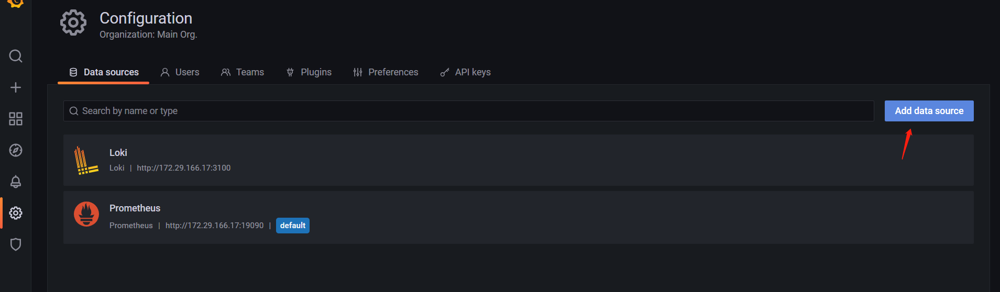
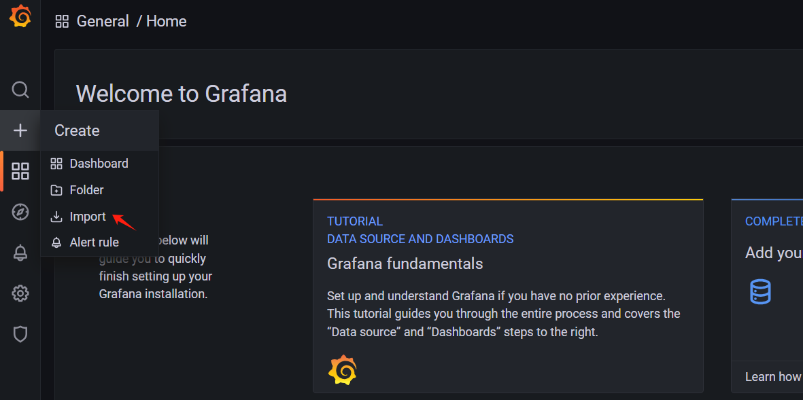
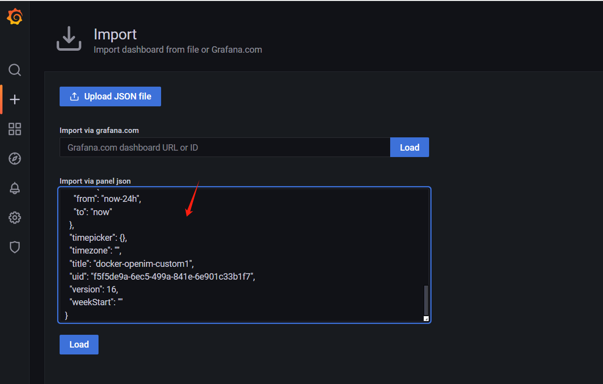

## prometheus 使用

通过docker-compose安装完Prometheus，node_exporter和grafana,默认grafana的对外端口号是3000，
打开grafana，
默认账户密码是admin:admin，
然后配置grafana的Prometheus数据源，在如下界面配置，

注意ip地址和端口号是服务器局域网ip和Prometheus端口，比如172.29.166.17:19090。
然后在如下页面导入dashboard，dashboard的yaml在config文件中,分别为promethues-dashboard.yaml,node-exporter-dashboard.yaml，
表示openimserver应用服务dashboard和node-exporterdashboard

