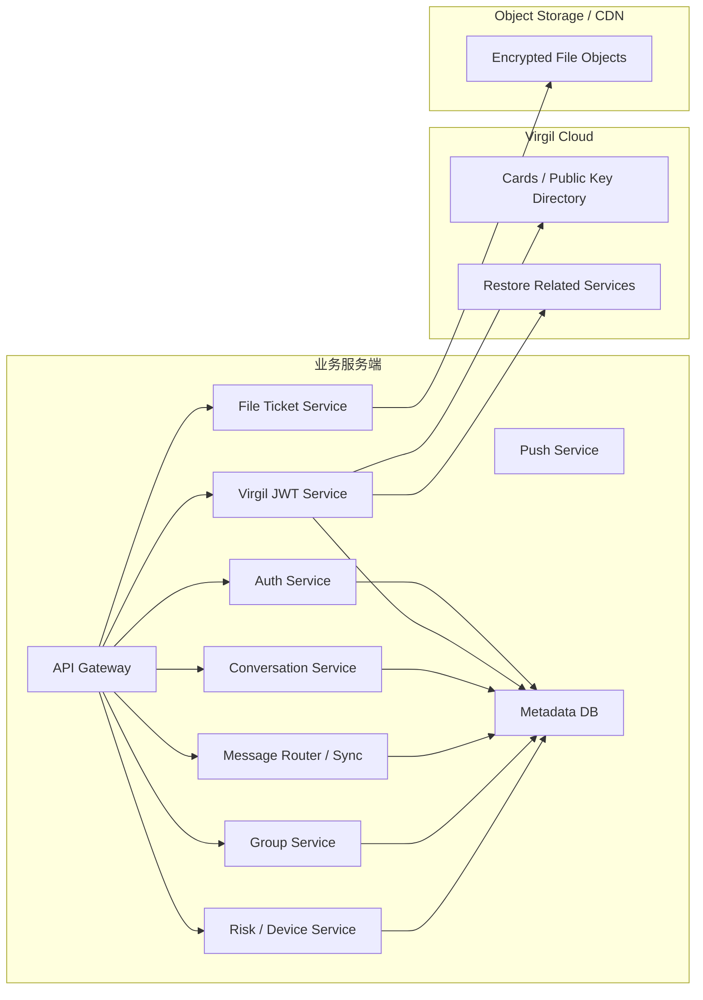
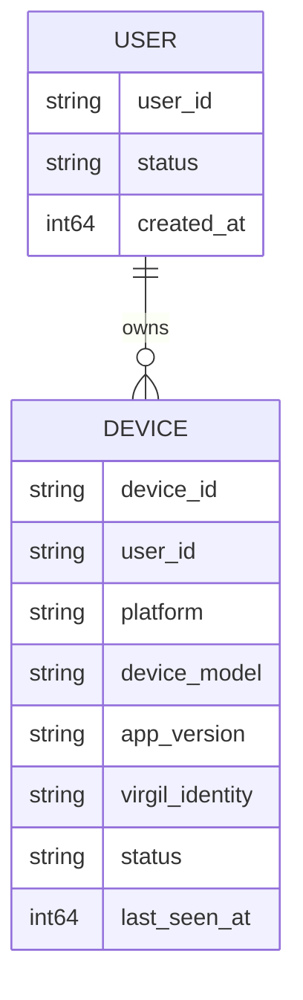
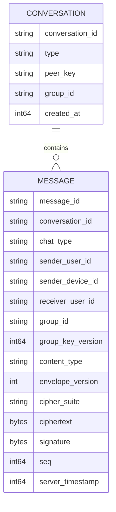
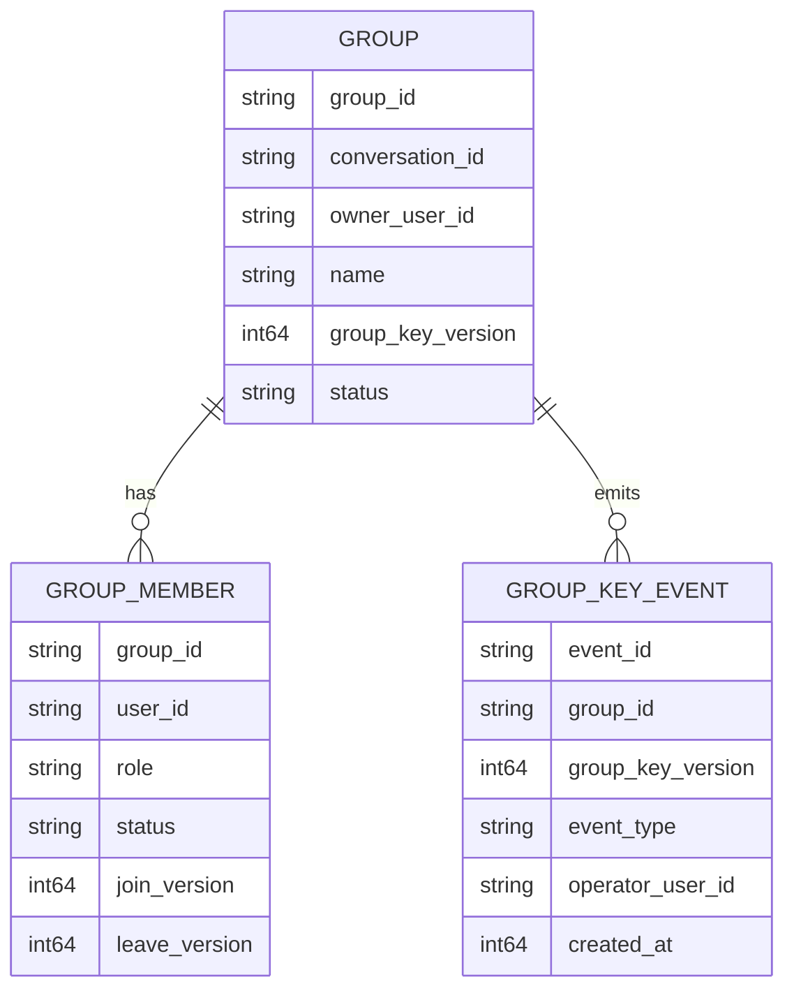
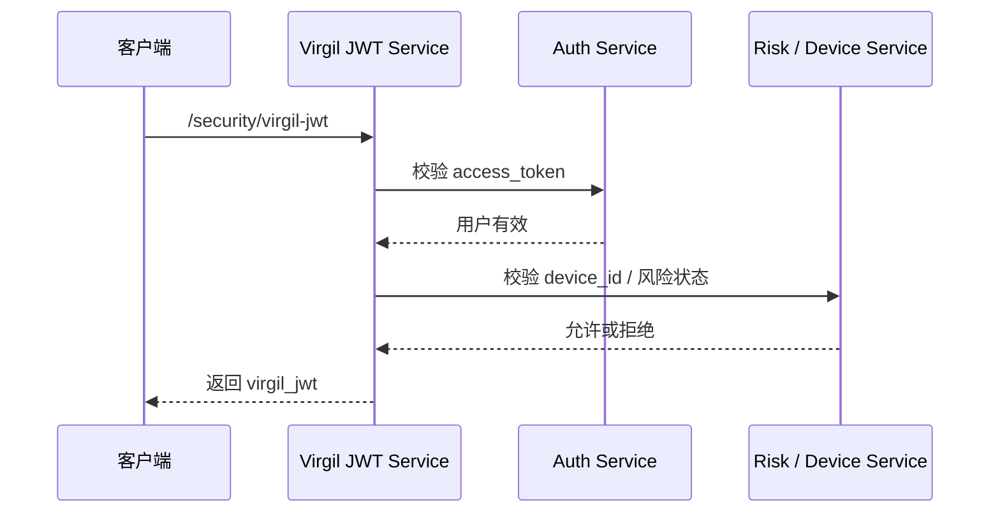
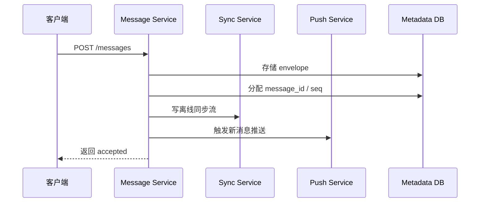
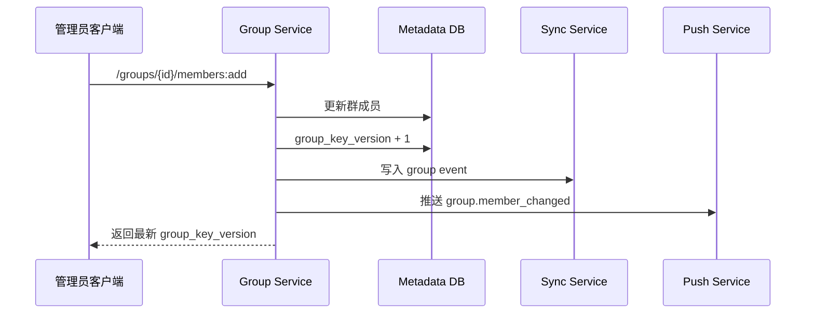

# Virgil Security 接入到聊天系统设计方案（服务器）

## 1. 服务器设计目标

服务端的目标不是参与解密，而是提供 **业务承载层**：

- 业务身份认证
- 设备管理
- Virgil JWT 签发
- 单聊/群聊会话管理
- 密文消息接入与路由
- 离线同步
- 文件上传/下载票据
- 群成员关系与群密钥版本索引
- 风控与设备吊销

---

## 2. 服务器总体架构



---

## 3. 服务器职责边界

## 3.1 服务端应该负责什么

- 用户登录与 token
- 设备注册与吊销
- Virgil JWT 签发
- 会话与群组元数据
- 密文消息存储
- 消息序列号与游标
- 离线消息投递
- 已读/已送达状态
- 文件票据
- 群成员变更事件
- 风控控制

## 3.2 服务端不应该负责什么

- 私钥保存
- 文本明文解析
- 文件明文解析
- 群密钥管理的明文操作
- 替客户端做消息加解密

---

## 4. 推荐服务拆分

```text
api-gateway
auth-service
virgil-jwt-service
conversation-service
message-service
group-service
sync-service
push-service
file-ticket-service
risk-device-service
```

### 各服务说明

#### api-gateway
- 统一入口
- 鉴权
- 请求限流
- trace 注入

#### auth-service
- 登录
- refresh
- logout

#### virgil-jwt-service
- 生成 Virgil JWT
- user/device 到 virgil identity 的映射
- 风控前置校验

#### conversation-service
- 单聊会话
- 会话设置
- 会话列表

#### message-service
- 接收密文 envelope
- 分配 message_id / seq
- 存储与 fanout

#### group-service
- 创建群
- 加人/踢人/退群
- 群资料
- 维护 group_key_version

#### sync-service
- bootstrap
- 增量消息
- 群事件同步

#### push-service
- message.new
- message.recall
- group.member_changed
- device.revoked

#### file-ticket-service
- 上传票据
- 下载票据
- 文件元信息

#### risk-device-service
- 设备状态
- 完整性校验
- 风险拦截

---

## 5. 服务端数据模型

## 5.1 用户与设备



## 5.2 会话与消息



## 5.3 群与群事件



---

## 6. 服务端接口设计

## 6.1 认证与设备

### 登录
```http
POST /api/v1/auth/login
```

### 刷新 token
```http
POST /api/v1/auth/refresh
```

### 登出
```http
POST /api/v1/auth/logout
```

### 注册设备
```http
POST /api/v1/devices/register
```

### 查询设备列表
```http
GET /api/v1/devices
```

### 吊销设备
```http
POST /api/v1/devices/{device_id}:revoke
```

---

## 6.2 Virgil JWT

### 获取 Virgil JWT
```http
POST /api/v1/security/virgil-jwt
```

请求：
```json
{
  "device_id": "ios_a1"
}
```

响应：
```json
{
  "virgil_jwt": "virgil_jwt_xxx",
  "expires_in": 3600,
  "virgil_identity": "u_1001:ios_a1"
}
```

---

## 6.3 会话

### 创建/获取单聊
```http
POST /api/v1/conversations/single
```

### 会话列表
```http
GET /api/v1/conversations
```

### 会话详情
```http
GET /api/v1/conversations/{conversation_id}
```

### 会话设置
```http
POST /api/v1/conversations/{conversation_id}/settings
```

---

## 6.4 消息

### 发送消息
```http
POST /api/v1/messages
```

### 批量发送
```http
POST /api/v1/messages:batchSend
```

### 拉取指定消息
```http
GET /api/v1/messages/{message_id}
```

### 撤回消息
```http
POST /api/v1/messages/{message_id}:recall
```

### 仅自己删除
```http
POST /api/v1/messages/{message_id}:deleteForMe
```

---

## 6.5 群组

### 创建群
```http
POST /api/v1/groups
```

### 群详情
```http
GET /api/v1/groups/{group_id}
```

### 群上下文
```http
GET /api/v1/groups/{group_id}/context
```

### 群成员列表
```http
GET /api/v1/groups/{group_id}/members
```

### 加人
```http
POST /api/v1/groups/{group_id}/members:add
```

### 移除成员
```http
POST /api/v1/groups/{group_id}/members:remove
```

### 退群
```http
POST /api/v1/groups/{group_id}:leave
```

### 解散群
```http
POST /api/v1/groups/{group_id}:dismiss
```

### 修改群资料
```http
POST /api/v1/groups/{group_id}/profile
```

---

## 6.6 文件

### 申请上传票据
```http
POST /api/v1/files/upload-ticket
```

### 上传完成
```http
POST /api/v1/files/{file_id}:complete
```

### 获取下载票据
```http
POST /api/v1/files/{file_id}/download-ticket
```

### 获取文件元信息
```http
GET /api/v1/files/{file_id}
```

---

## 6.7 同步

### 冷启动 bootstrap
```http
GET /api/v1/sync/bootstrap
```

### 增量消息同步
```http
GET /api/v1/sync/messages
```

### 群事件同步
```http
GET /api/v1/sync/group-events
```

---

## 6.8 回执与状态

### 已送达/已读
```http
POST /api/v1/messages/ack
```

### 批量已读
```http
POST /api/v1/conversations/{conversation_id}:markRead
```

### 输入中
```http
POST /api/v1/conversations/{conversation_id}/typing
```

---

## 6.9 风控与安全

### 预检查
```http
POST /api/v1/security/precheck
```

### 设备完整性上报
```http
POST /api/v1/security/integrity-report
```

---

## 7. 服务端核心流程

## 7.1 签发 Virgil JWT



## 7.2 消息接收与路由



## 7.3 群成员变更



---

## 8. 服务端幂等与校验

## 8.1 幂等设计

### 发消息幂等键

推荐：

```text
sender_user_id + sender_device_id + client_message_id
```

### 创建群幂等

推荐使用：

```http
Idempotency-Key: <uuid>
```

## 8.2 消息接口校验项

- 当前用户是会话参与者
- `sender_device_id` 属于当前用户
- 单聊的 `receiver_user_id` 与会话匹配
- 群聊的 `group_id` 与会话匹配
- 当前用户是群成员
- `group_key_version` 合法
- `ciphertext` 长度不超过限制

## 8.3 Virgil JWT 接口校验项

- 业务 token 有效
- `device_id` 属于当前用户
- 设备状态为 active
- 未被吊销
- 风控未阻断

---

## 9. WebSocket / 推送事件建议

### WebSocket 事件

- `message.new`
- `message.recall`
- `message.ack`
- `group.member_changed`
- `group.profile_changed`
- `device.revoked`
- `security.force_logout`

### 推送原则

推送中不要放消息明文，建议只放：

- 会话 ID
- 发送方昵称
- 占位提示

---

## 10. 服务端风险点

- 若服务端误记录明文日志，会破坏 E2EE 边界
- 若文件下载链接长期有效，文件密文泄露面会扩大
- 若群成员变更后未提升 `group_key_version`，客户端可能使用旧上下文
- 若被吊销设备仍可获取 Virgil JWT，会造成安全失控
- 若推送带明文，会绕过加密链路

---

## 11. 推荐实施路径

## 阶段 1：单聊 MVP

实现：

- 登录
- Virgil JWT
- 单聊消息发送
- 增量同步
- 已读回执

## 阶段 2：群聊

实现：

- 创建群
- 群成员管理
- group_key_version
- 群事件同步

## 阶段 3：文件与恢复

实现：

- 文件票据
- 加密文件上传下载
- 新设备恢复
- 风控增强

---

## 12. 服务器总结

服务器在 Virgil Security 接入中的核心定位是：

- 不参与消息解密
- 不保存私钥
- 只处理密文、元数据和业务控制逻辑

具体来说，服务器负责：

- 身份认证
- 设备管理
- Virgil JWT 签发
- 密文消息接入、存储、路由
- 会话与群成员关系
- 文件票据
- 同步与推送
- 风控和设备吊销

这样才能既保留现有聊天系统的业务能力，又维持端到端加密的安全边界。
